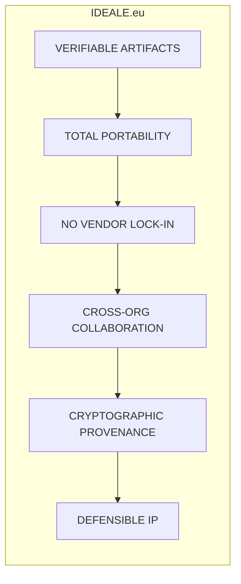

# 🇪🇺 IDEALE.eu — Verifiable Evidence & Portability for Critical Systems

**We don't build aircraft. We build the infrastructure for Europe to collaborate on critical projects with verifiable evidence, total portability, and no vendor lock-in.**

[](LICENSE)
[](standards/v0.1/)
[](standards/v0.1/provenance-chain.md)
[](standards/v0.1/artifact-portability-spec.yaml)

---

## 🔑 The Essence



### Artifact properties (what "good" looks like)

```yaml
artifact_properties:
  portable: true           # Moves across CAD/CAE/CAM/ERP/PLM
  verifiable: true         # Cryptographic hash + signature
  traceable: true          # Full change history, immutable
  vendor_neutral: true     # No tool lock-in (Dassault/Siemens/etc.)
  legally_defensible: true # Chain of custody for IP & disputes
```

---

## 🎯 What IDEALE.eu Enables

* **Any tool → Portable artifact → Any tool** (no information loss)
* **Every change → Cryptographically recorded** (court-admissible evidence)
* **Every contribution → Attributed** (optional incentives & settlements)
* **Cross-org collaboration → Safe by default** (IP protected, provenance preserved)

**Real example**

> Airbus designs in CATIA → exports IDEALE artifact (IEF).
> Safran opens in NX → modifies → signs → returns.
> Entire provenance on-chain; both IPs protected.

---

## 🧠 Architecture (what's in this repo)

```
IDEALE.eu/
├─ standards/v0.1/            # IDEALE Evidence Framework (IEF) specs
│  ├─ artifact-portability-spec.yaml
│  ├─ cryptographic-signing.md
│  ├─ cross-tool-schema.json
│  └─ provenance-chain.md
├─ evidence-engine/           # Reference implementation
│  ├─ artifact-generator/     # create/sign/verify artifacts
│  ├─ portability-layer/      # CATIA/NX ↔ neutral ↔ any
│  ├─ provenance-tracker/     # blockchain anchor, history
│  └─ ip-defender/            # ownership & legal export
├─ generative-design/         # High-fidelity outputs with provenance
│  ├─ ai-models/
│  ├─ cryptographic-binding/
│  └─ output-generation/
├─ tokenomics/                # Optional incentives & settlements
└─ integration-demos/         # Airbus↔Safran, ESA multi-contractor, defense consortium
```

> The **8 programs** live here as **demonstrations** that the infrastructure scales to extreme complexity (e.g., complete aerospace programs). They are *not* manufacturing projects — they are **evidence and portability showcases**.

---

## 🔐 Cryptographic Generative Design (pipeline)

```yaml
generative_design_pipeline:
  input:
    requirements: "<hash>"
    constraints: "<hash>"
    models: "<hash>"
  process:
    ai_generation: "cryptographically_signed"
    human_approval: "digitally_signed"
    modifications: "blockchain_recorded"
  output:
    high_fidelity_graphics: "bound-to-inputs"
    provenance_chain: "auto-generated"
    legal_defensibility: "court_admissible"
```

---

## 🤝 Collaboration Models (optional token layer)

* **Team** (single org), **Cross-org** (OEM–Tier1–Tier2), **Ad-hoc** (temporary consortia)
* Each contribution can mint **verifiable evidence, attribution, and optional compensation**.

---

## 🚀 Quickstart (for adopters)

1. **Adopt the spec**

   * Read: `standards/v0.1/artifact-portability-spec.yaml`
   * Implement your tool adapter (or use provided portability-layer stubs)

2. **Generate a verifiable artifact**

   ```bash
   python evidence-engine/artifact-generator/create-verifiable-artifact.py \
     --input path/to/your_model \
     --out build/your_model.ief.json
   python evidence-engine/artifact-generator/sign-artifact.py \
     --in build/your_model.ief.json --key your-signing-key
   ```

3. **Verify and exchange**

   ```bash
   python evidence-engine/artifact-generator/verify-artifact.py \
     --in build/partner_model.ief.json --cert partner-cert.pem
   ```

4. **Anchor provenance (optional)**

   ```bash
   python evidence-engine/provenance-tracker/blockchain-anchor.py \
     --in build/your_model.ief.json
   ```

---

## 🧪 What to Try First (demos)

* `integration-demos/airbus-safran-collaboration/`
  Exchange artifacts across tools; sign, verify, anchor, and round-trip without lock-in.

* `integration-demos/esa-multi-contractor/`
  Requirements → design iterations → approvals with full provenance.

* `integration-demos/defense-consortium/`
  Classified handling, need-to-know artifacts, audit trail.

---

## 📌 Roadmap (high level)

* **v0.1 (now):** Specs + reference engine + integration demos
* **v0.2:** More adapters (Siemens NX, SolidWorks, neutral formats), stronger signing flows
* **v1.0:** Certification profile for trust marks (badge tied to passing conformance)
* **After v1.0:** Managed verification service & evidence hosting

---

## 🏛️ Governance & Contribution

* See [CONTRIBUTING.md](CONTRIBUTING.md) and [GOVERNANCE.md](GOVERNANCE.md)
* We welcome **pilot partners** (OEMs, Tier1/2, agencies, labs).
  Open an issue titled **"Pilot: <ORG> x IDEALE.eu"** describing your toolchain and goals.

---

## 📣 One-liner

> **IDEALE.eu makes engineering artifacts portable, verifiable, and legally defensible across organizations — with cryptographic provenance and zero vendor lock-in.**

---
