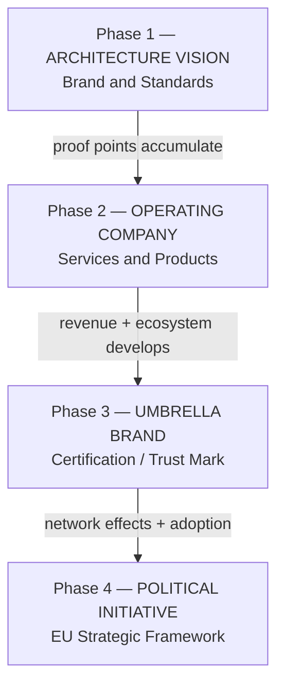
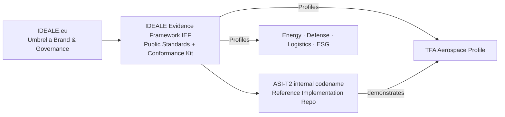

# 🇪🇺 IDEALE.eu — Intelligence · Defense · Energy · Aerospace · Logistics · ESG

**Federated European Infrastructure for Verifiable Critical Systems**

[](LICENSE)
[](standards/v0.1/)
[](./)
[](./)

---

## Purpose

IDEALE.eu is a **federated brand + standards program** for Europe’s strategic sectors.
Public brand: **IDEALE Evidence Framework (IEF)**.
Reference implementation: **ASI-T2** (internal codename).
First sector profile: **TFA** (Aerospace).

---

## Vision → Phases



**Phase-1 KPIs**: IEF v0.1 released, ≥3 pilot repos with passing verification badges.

---

## Positioning — IDEALE ↔ IEF ↔ TFA (with ASI-T2)



---

## IEF v0.1 — Minimum Viable Standards

* `standards/v0.1/context.schema.json` — UTCS/CXP manifest schema (JSON Schema draft-07)
* `standards/v0.1/sbom-baseline.md` — SPDX 2.3 profile requirements
* `standards/v0.1/verify-action.yml` — reference GitHub Action (verify + badge)
* `standards/v0.1/conformance-tests.md` — test suite requirements
* `standards/v0.1/implementers-guide.md` — 30-minute quickstart

**Quickstart**

```bash
pip install "jsonschema>=4,<5" jq
python - <<'PY'
import json
from jsonschema import validate, Draft7Validator
s = json.load(open('standards/v0.1/context.schema.json'))
m = json.load(open('6-BLOCKCHAIN-INTEGRATION/UTCS/context.manifest.json'))
Draft7Validator.check_schema(s); validate(m, s)
print("✓ IEF manifest OK")
PY
```

---

## 📂 COMPLETE REPOSITORY STRUCTURE

```bash
IDEALE.eu/
├── [README.md](./README.md)
├── [README-ROYALTIES.md](./README-ROYALTIES.md)
├── [EXAMPLES-ROYALTIES.md](./EXAMPLES-ROYALTIES.md)
├── [LICENSE](./LICENSE)
├── [.gitignore](./.gitignore)
├── [Makefile](./Makefile)
├── [CONTRIBUTING.md](./CONTRIBUTING.md)
├── [GOVERNANCE.md](./GOVERNANCE.md)
│
├── [config/](./config/)
│   └── [royalties.json](./config/royalties.json)
│
├── [scripts/](./scripts/)
│   └── [accrue_royalty.py](./scripts/accrue_royalty.py)
│
├── [royalties/](./royalties/)
│   └── [ledger.jsonl](./royalties/) (generated)
│
├── [artifacts/](./artifacts/)
│   └── [sample-design/](./artifacts/sample-design/)
│       └── [artifact.json](./artifacts/sample-design/artifact.json)
│
├── [0-STRATEGY/](./0-STRATEGY/)
│   ├── [MISSION-VISION.md](./0-STRATEGY/MISSION-VISION.md)
│   ├── [ROADMAP.md](./0-STRATEGY/ROADMAP.md)
│   ├── [STAKEHOLDERS.md](./0-STRATEGY/STAKEHOLDERS.md)
│   ├── [KPIs/](./0-STRATEGY/KPIs/)
│   └── [BUSINESS-MODELS/](./0-STRATEGY/BUSINESS-MODELS/)
│
├── [1-DIMENSIONS/](./1-DIMENSIONS/)
│   ├── [INTELLIGENCE/](./1-DIMENSIONS/INTELLIGENCE/)
│   │   ├── [README.md](./1-DIMENSIONS/INTELLIGENCE/README.md)
│   │   ├── [dimension-config.yaml](./1-DIMENSIONS/INTELLIGENCE/dimension-config.yaml)
│   │   └── [PROGRAMS/](./1-DIMENSIONS/INTELLIGENCE/PROGRAMS/)
│   ├── [DEFENSE/](./1-DIMENSIONS/DEFENSE/)
│   │   ├── [README.md](./1-DIMENSIONS/DEFENSE/README.md)
│   │   ├── [dimension-config.yaml](./1-DIMENSIONS/DEFENSE/dimension-config.yaml)
│   │   └── [PROGRAMS/](./1-DIMENSIONS/DEFENSE/PROGRAMS/)
│   ├── [ENERGY/](./1-DIMENSIONS/ENERGY/)
│   │   ├── [README.md](./1-DIMENSIONS/ENERGY/README.md)
│   │   ├── [dimension-config.yaml](./1-DIMENSIONS/ENERGY/dimension-config.yaml)
│   │   └── [PROGRAMS/](./1-DIMENSIONS/ENERGY/PROGRAMS/)
│   ├── [AEROSPACE/](./1-DIMENSIONS/AEROSPACE/)
│   │   ├── [README.md](./1-DIMENSIONS/AEROSPACE/README.md)
│   │   ├── [dimension-config.yaml](./1-DIMENSIONS/AEROSPACE/dimension-config.yaml)
│   │   └── [PROGRAMS/](./1-DIMENSIONS/AEROSPACE/PROGRAMS/)
│   ├── [LOGISTICS/](./1-DIMENSIONS/LOGISTICS/)
│   │   ├── [README.md](./1-DIMENSIONS/LOGISTICS/README.md)
│   │   ├── [dimension-config.yaml](./1-DIMENSIONS/LOGISTICS/dimension-config.yaml)
│   │   └── [PROGRAMS/](./1-DIMENSIONS/LOGISTICS/PROGRAMS/)
│   └── [ESG/](./1-DIMENSIONS/ESG/)
│       ├── [README.md](./1-DIMENSIONS/ESG/README.md)
│       ├── [dimension-config.yaml](./1-DIMENSIONS/ESG/dimension-config.yaml)
│       └── [PROGRAMS/](./1-DIMENSIONS/ESG/PROGRAMS/)
│
├── [2-PROGRAM-TEMPLATE/](./2-PROGRAM-TEMPLATE/)
│   ├── [README.md](./2-PROGRAM-TEMPLATE/README.md)
│   ├── [program-config.yaml](./2-PROGRAM-TEMPLATE/program-config.yaml)
│   ├── [program-manifest.json](./2-PROGRAM-TEMPLATE/program-manifest.json)
│   │
│   ├── [TFA/](./2-PROGRAM-TEMPLATE/TFA/)  #Top Final Algorithm/Artifact Structure
│   │   ├── [META.yaml](./2-PROGRAM-TEMPLATE/TFA/META.yaml)
│   │   ├── [VERSION](./2-PROGRAM-TEMPLATE/TFA/VERSION)
│   │   ├── [CHANGELOG.md](./2-PROGRAM-TEMPLATE/TFA/CHANGELOG.md)
│   │   │
│   │   ├── [SYSTEMS/](./2-PROGRAM-TEMPLATE/TFA/SYSTEMS/)
│   │   │   ├── [SI/](./2-PROGRAM-TEMPLATE/TFA/SYSTEMS/SI/)  #System Integration
│   │   │   │   ├── [interfaces.yaml](./2-PROGRAM-TEMPLATE/TFA/SYSTEMS/SI/interfaces.yaml)
│   │   │   │   ├── [orchestration.py](./2-PROGRAM-TEMPLATE/TFA/SYSTEMS/SI/orchestration.py)
│   │   │   │   └── tests/
│   │   │   └── [DI/](./2-PROGRAM-TEMPLATE/TFA/SYSTEMS/DI/)  #Domain Interface
│   │   │       ├── [api-spec.yaml](./2-PROGRAM-TEMPLATE/TFA/SYSTEMS/DI/api-spec.yaml)
│   │   │       ├── [contracts/](./2-PROGRAM-TEMPLATE/TFA/SYSTEMS/DI/contracts/)
│   │   │       └── [validators/](./2-PROGRAM-TEMPLATE/TFA/SYSTEMS/DI/validators/)
│   │   │
│   │   ├── [STATIONS/](./2-PROGRAM-TEMPLATE/TFA/STATIONS/)
│   │   │   └── [SE/](./2-PROGRAM-TEMPLATE/TFA/STATIONS/SE/)  #Station Envelope
│   │   │       ├── [physical-envelope.json](./2-PROGRAM-TEMPLATE/TFA/STATIONS/SE/physical-envelope.json)
│   │   │       ├── [logical-boundaries.yaml](./2-PROGRAM-TEMPLATE/TFA/STATIONS/SE/logical-boundaries.yaml)
│   │   │       └── [constraints/](./2-PROGRAM-TEMPLATE/TFA/STATIONS/SE/constraints/)
│   │   │
│   │   ├── [COMPONENTS/](./2-PROGRAM-TEMPLATE/TFA/COMPONENTS/)
│   │   │   ├── [CV/](./2-PROGRAM-TEMPLATE/TFA/COMPONENTS/CV/)  #Component Vendor
│   │   │   │   ├── [vendor-specs/](./2-PROGRAM-TEMPLATE/TFA/COMPONENTS/CV/vendor-specs/)
│   │   │   │   ├── [qualification/](./2-PROGRAM-TEMPLATE/TFA/COMPONENTS/CV/qualification/)
│   │   │   │   └── [contracts/](./2-PROGRAM-TEMPLATE/TFA/COMPONENTS/CV/contracts/)
│   │   │   ├── [CE/](./2-PROGRAM-TEMPLATE/TFA/COMPONENTS/CE/)  #Component Equipment
│   │   │   │   ├── [equipment-catalog/](./2-PROGRAM-TEMPLATE/TFA/COMPONENTS/CE/equipment-catalog/)
│   │   │   │   ├── [specifications/](./2-PROGRAM-TEMPLATE/TFA/COMPONENTS/CE/specifications/)
│   │   │   │   └── [maintenance/](./2-PROGRAM-TEMPLATE/TFA/COMPONENTS/CE/maintenance/)
│   │   │   ├── [CC/](./2-PROGRAM-TEMPLATE/TFA/COMPONENTS/CC/)  #Component Cell
│   │   │   │   ├── [cell-definitions/](./2-PROGRAM-TEMPLATE/TFA/COMPONENTS/CC/cell-definitions/)
│   │   │   │   ├── [interfaces/](./2-PROGRAM-TEMPLATE/TFA/COMPONENTS/CC/interfaces/)
│   │   │   │   └── [testing/](./2-PROGRAM-TEMPLATE/TFA/COMPONENTS/CC/testing/)
│   │   │   ├── [CI/](./2-PROGRAM-TEMPLATE/TFA/COMPONENTS/CI/)  #Component Item
│   │   │   │   ├── [item-registry/](./2-PROGRAM-TEMPLATE/TFA/COMPONENTS/CI/item-registry/)
│   │   │   │   ├── [tracking/](./2-PROGRAM-TEMPLATE/TFA/COMPONENTS/CI/tracking/)
│   │   │   │   └── [quality/](./2-PROGRAM-TEMPLATE/TFA/COMPONENTS/CI/quality/)
│   │   │   └── [CP/](./2-PROGRAM-TEMPLATE/TFA/COMPONENTS/CP/)  #Component Part
│   │   │       ├── [part-numbers/](./2-PROGRAM-TEMPLATE/TFA/COMPONENTS/CP/part-numbers/)
│   │   │       ├── [specifications/](./2-PROGRAM-TEMPLATE/TFA/COMPONENTS/CP/specifications/)
│   │   │       └── [suppliers/](./2-PROGRAM-TEMPLATE/TFA/COMPONENTS/CP/suppliers/)
│   │   │
│   │   ├── [BITS/](./2-PROGRAM-TEMPLATE/TFA/BITS/)
│   │   │   └── [CB/](./2-PROGRAM-TEMPLATE/TFA/BITS/CB/)  #Classical Bit
│   │   │       ├── [deterministic-compute/](./2-PROGRAM-TEMPLATE/TFA/BITS/CB/deterministic-compute/)
│   │   │       ├── [algorithms/](./2-PROGRAM-TEMPLATE/TFA/BITS/CB/algorithms/)
│   │   │       └── [solvers/](./2-PROGRAM-TEMPLATE/TFA/BITS/CB/solvers/)
│   │   │
│   │   ├── [QUBITS/](./2-PROGRAM-TEMPLATE/TFA/QUBITS/)
│   │   │   └── [QB/](./2-PROGRAM-TEMPLATE/TFA/QUBITS/QB/)  #Quantum Bit
│   │   │       ├── [quantum-circuits/](./2-PROGRAM-TEMPLATE/TFA/QUBITS/QB/quantum-circuits/)
│   │   │       ├── [quantum-algorithms/](./2-PROGRAM-TEMPLATE/TFA/QUBITS/QB/quantum-algorithms/)
│   │   │       └── [quantum-solvers/](./2-PROGRAM-TEMPLATE/TFA/QUBITS/QB/quantum-solvers/)
│   │   │
│   │   ├── [ELEMENTS/](./2-PROGRAM-TEMPLATE/TFA/ELEMENTS/)
│   │   │   ├── [UE/](./2-PROGRAM-TEMPLATE/TFA/ELEMENTS/UE/)  #Unit Element
│   │   │   │   ├── [fundamentals/](./2-PROGRAM-TEMPLATE/TFA/ELEMENTS/UE/fundamentals/)
│   │   │   │   └── [primitives/](./2-PROGRAM-TEMPLATE/TFA/ELEMENTS/UE/primitives/)
│   │   │   └── [FE/](./2-PROGRAM-TEMPLATE/TFA/ELEMENTS/FE/)  #Federation Entanglement
│   │   │       ├── [distributed-orchestration/](./2-PROGRAM-TEMPLATE/TFA/ELEMENTS/FE/distributed-orchestration/)
│   │   │       ├── [consensus/](./2-PROGRAM-TEMPLATE/TFA/ELEMENTS/FE/consensus/)
│   │   │       └── [coordination/](./2-PROGRAM-TEMPLATE/TFA/ELEMENTS/FE/coordination/)
│   │   │
│   │   ├── [WAVES/](./2-PROGRAM-TEMPLATE/TFA/WAVES/)
│   │   │   └── [FWD/](./2-PROGRAM-TEMPLATE/TFA/WAVES/FWD/)  #Future/Waves Dynamics
│   │   │       ├── [predictive-models/](./2-PROGRAM-TEMPLATE/TFA/WAVES/FWD/predictive-models/)
│   │   │       ├── [retrodictive-analysis/](./2-PROGRAM-TEMPLATE/TFA/WAVES/FWD/retrodictive-analysis/)
│   │   │       └── [nowcasts/](./2-PROGRAM-TEMPLATE/TFA/WAVES/FWD/nowcasts/)
│   │   │
│   │   └── [STATES/](./2-PROGRAM-TEMPLATE/TFA/STATES/)
│   │       └── [QS/](./2-PROGRAM-TEMPLATE/TFA/STATES/QS/)  #Quantum State
│   │           ├── [state-management/](./2-PROGRAM-TEMPLATE/TFA/STATES/QS/state-management/)
│   │           ├── [provenance/](./2-PROGRAM-TEMPLATE/TFA/STATES/QS/provenance/)
│   │           └── [immutable-ledger/](./2-PROGRAM-TEMPLATE/TFA/STATES/QS/immutable-ledger/)
│   │
│   ├── [MAP-SERVICES/](./2-PROGRAM-TEMPLATE/MAP-SERVICES/)  #Master Application Programs (one per domain)
│   │   ├── [MAP-AAA/](./2-PROGRAM-TEMPLATE/MAP-SERVICES/MAP-AAA/)
│   │   ├── [MAP-AAP/](./2-PROGRAM-TEMPLATE/MAP-SERVICES/MAP-AAP/)
│   │   ├── [MAP-CCC/](./2-PROGRAM-TEMPLATE/MAP-SERVICES/MAP-CCC/)
│   │   ├── [MAP-CQH/](./2-PROGRAM-TEMPLATE/MAP-SERVICES/MAP-CQH/)
│   │   ├── [MAP-DDD/](./2-PROGRAM-TEMPLATE/MAP-SERVICES/MAP-DDD/)
│   │   ├── [MAP-EDI/](./2-PROGRAM-TEMPLATE/MAP-SERVICES/MAP-EDI/)
│   │   ├── [MAP-EEE/](./2-PROGRAM-TEMPLATE/MAP-SERVICES/MAP-EEE/)
│   │   ├── [MAP-EER/](./2-PROGRAM-TEMPLATE/MAP-SERVICES/MAP-EER/)
│   │   ├── [MAP-IIF/](./2-PROGRAM-TEMPLATE/MAP-SERVICES/MAP-IIF/)
│   │   ├── [MAP-IIS/](./2-PROGRAM-TEMPLATE/MAP-SERVICES/MAP-IIS/)
│   │   ├── [MAP-LCC/](./2-PROGRAM-TEMPLATE/MAP-SERVICES/MAP-LCC/)
│   │   ├── [MAP-LIB/](./2-PROGRAM-TEMPLATE/MAP-SERVICES/MAP-LIB/)
│   │   ├── [MAP-MEC/](./2-PROGRAM-TEMPLATE/MAP-SERVICES/MAP-MEC/)
│   │   ├── [MAP-OOO/](./2-PROGRAM-TEMPLATE/MAP-SERVICES/MAP-OOO/)
│   │   └── [MAP-PPP/](./2-PROGRAM-TEMPLATE/MAP-SERVICES/MAP-PPP/)
│   │
│   ├── [MAL-SERVICES/](./2-PROGRAM-TEMPLATE/MAL-SERVICES/)  #Main Application Layers (horizontal services)
│   │   ├── [MAL-CB/](./2-PROGRAM-TEMPLATE/MAL-SERVICES/MAL-CB/)  #Classical compute service
│   │   ├── [MAL-QB/](./2-PROGRAM-TEMPLATE/MAL-SERVICES/MAL-QB/)  #Quantum compute service
│   │   ├── [MAL-UE/](./2-PROGRAM-TEMPLATE/MAL-SERVICES/MAL-UE/)  #Unit element service
│   │   ├── [MAL-FE/](./2-PROGRAM-TEMPLATE/MAL-SERVICES/MAL-FE/)  #Federation service
│   │   ├── [MAL-FWD/](./2-PROGRAM-TEMPLATE/MAL-SERVICES/MAL-FWD/)  #Wave dynamics service
│   │   └── [MAL-QS/](./2-PROGRAM-TEMPLATE/MAL-SERVICES/MAL-QS/)  #Quantum state service
│   │
│   └── [DOMAINS/](./2-PROGRAM-TEMPLATE/DOMAINS/)  #The 15 Engineering Domains
│       ├── [AAA-AIRFRAMES-AERODYNAMICS-AIRWORTHINESS/](./2-PROGRAM-TEMPLATE/DOMAINS/AAA-AIRFRAMES-AERODYNAMICS-AIRWORTHINESS/)
│       │   ├── [README.md](./2-PROGRAM-TEMPLATE/DOMAINS/AAA-AIRFRAMES-AERODYNAMICS-AIRWORTHINESS/README.md)
│       │   ├── [domain-config.yaml](./2-PROGRAM-TEMPLATE/DOMAINS/AAA-AIRFRAMES-AERODYNAMICS-AIRWORTHINESS/domain-config.yaml)
│       │   ├── [META.json](./2-PROGRAM-TEMPLATE/DOMAINS/AAA-AIRFRAMES-AERODYNAMICS-AIRWORTHINESS/META.json)
│       │   │
│       │   ├── [PLM/](./2-PROGRAM-TEMPLATE/DOMAINS/AAA-AIRFRAMES-AERODYNAMICS-AIRWORTHINESS/PLM/)  #Product Lifecycle Management
│       │   │   ├── [CAO/](./2-PROGRAM-TEMPLATE/DOMAINS/AAA-AIRFRAMES-AERODYNAMICS-AIRWORTHINESS/PLM/CAO/)  #Computer Aided Kick-Off
│       │   │   │   ├── [CON/](./2-PROGRAM-TEMPLATE/DOMAINS/AAA-AIRFRAMES-AERODYNAMICS-AIRWORTHINESS/PLM/CAO/CON/)  #Concept
│       │   │   │   │   ├── [concept-definition.md](./2-PROGRAM-TEMPLATE/DOMAINS/AAA-AIRFRAMES-AERODYNAMICS-AIRWORTHINESS/PLM/CAO/CON/concept-definition.md)
│       │   │   │   │   ├── [stakeholder-requirements.yaml](./2-PROGRAM-TEMPLATE/DOMAINS/AAA-AIRFRAMES-AERODYNAMICS-AIRWORTHINESS/PLM/CAO/CON/stakeholder-requirements.yaml)
│       │   │   │   │   ├── [feasibility-study.pdf](./2-PROGRAM-TEMPLATE/DOMAINS/AAA-AIRFRAMES-AERODYNAMICS-AIRWORTHINESS/PLM/CAO/CON/feasibility-study.pdf)
│       │   │   │   │   ├── [trade-studies/](./2-PROGRAM-TEMPLATE/DOMAINS/AAA-AIRFRAMES-AERODYNAMICS-AIRWORTHINESS/PLM/CAO/CON/trade-studies/)
│       │   │   │   │   ├── [preliminary-design-review/](./2-PROGRAM-TEMPLATE/DOMAINS/AAA-AIRFRAMES-AERODYNAMICS-AIRWORTHINESS/PLM/CAO/CON/preliminary-design-review/)
│       │   │   │   │   └── [concept-validation/](./2-PROGRAM-TEMPLATE/DOMAINS/AAA-AIRFRAMES-AERODYNAMICS-AIRWORTHINESS/PLM/CAO/CON/concept-validation/)
│       │   │   │   ├── [REQ/](./2-PROGRAM-TEMPLATE/DOMAINS/AAA-AIRFRAMES-AERODYNAMICS-AIRWORTHINESS/PLM/CAO/REQ/)  #Requirements
│       │   │   │   │   ├── [requirements-matrix.xlsx](./2-PROGRAM-TEMPLATE/DOMAINS/AAA-AIRFRAMES-AERODYNAMICS-AIRWORTHINESS/PLM/CAO/REQ/requirements-matrix.xlsx)
│       │   │   │   │   ├── [functional-requirements.yaml](./2-PROGRAM-TEMPLATE/DOMAINS/AAA-AIRFRAMES-AERODYNAMICS-AIRWORTHINESS/PLM/CAO/REQ/functional-requirements.yaml)
│       │   │   │   │   ├── [non-functional-requirements.yaml](./2-PROGRAM-TEMPLATE/DOMAINS/AAA-AIRFRAMES-AERODYNAMICS-AIRWORTHINESS/PLM/CAO/REQ/non-functional-requirements.yaml)
│       │   │   │   │   ├── [safety-requirements/](./2-PROGRAM-TEMPLATE/DOMAINS/AAA-AIRFRAMES-AERODYNAMICS-AIRWORTHINESS/PLM/CAO/REQ/safety-requirements/)
│       │   │   │   │   ├── [certification-requirements/](./2-PROGRAM-TEMPLATE/DOMAINS/AAA-AIRFRAMES-AERODYNAMICS-AIRWORTHINESS/PLM/CAO/REQ/certification-requirements/)
│       │   │   │   │   ├── [performance-requirements/](./2-PROGRAM-TEMPLATE/DOMAINS/AAA-AIRFRAMES-AERODYNAMICS-AIRWORTHINESS/PLM/CAO/REQ/performance-requirements/)
│       │   │   │   │   └── [traceability-matrix/](./2-PROGRAM-TEMPLATE/DOMAINS/AAA-AIRFRAMES-AERODYNAMICS-AIRWORTHINESS/PLM/CAO/REQ/traceability-matrix/)
│       │   │   │   └── [SYS/](./2-PROGRAM-TEMPLATE/DOMAINS/AAA-AIRFRAMES-AERODYNAMICS-AIRWORTHINESS/PLM/CAO/SYS/)  #Systems
│       │   │   │       ├── [system-architecture.drawio](./2-PROGRAM-TEMPLATE/DOMAINS/AAA-AIRFRAMES-AERODYNAMICS-AIRWORTHINESS/PLM/CAO/SYS/system-architecture.drawio)
│       │   │   │       ├── [interfaces-definition.yaml](./2-PROGRAM-TEMPLATE/DOMAINS/AAA-AIRFRAMES-AERODYNAMICS-AIRWORTHINESS/PLM/CAO/SYS/interfaces-definition.yaml)
│       │   │   │       ├── [system-breakdown-structure.json](./2-PROGRAM-TEMPLATE/DOMAINS/AAA-AIRFRAMES-AERODYNAMICS-AIRWORTHINESS/PLM/CAO/SYS/system-breakdown-structure.json)
│       │   │   │       ├── [functional-allocation/](./2-PROGRAM-TEMPLATE/DOMAINS/AAA-AIRFRAMES-AERODYNAMICS-AIRWORTHINESS/PLM/CAO/SYS/functional-allocation/)
│       │   │   │       ├── [system-integration-plan/](./2-PROGRAM-TEMPLATE/DOMAINS/AAA-AIRFRAMES-AERODYNAMICS-AIRWORTHINESS/PLM/CAO/SYS/system-integration-plan/)
│       │   │   │       └── [verification-plan/](./2-PROGRAM-TEMPLATE/DOMAINS/AAA-AIRFRAMES-AERODYNAMICS-AIRWORTHINESS/PLM/CAO/SYS/verification-plan/)
│       │   │   │
│       │   │   ├── [CAD/](./2-PROGRAM-TEMPLATE/DOMAINS/AAA-AIRFRAMES-AERODYNAMICS-AIRWORTHINESS/PLM/CAD/)  #Computer Aided Design
│       │   │   │   ├── [ASSY/](./2-PROGRAM-TEMPLATE/DOMAINS/AAA-AIRFRAMES-AERODYNAMICS-AIRWORTHINESS/PLM/CAD/ASSY/)
│       │   │   │   │   ├── [main-assembly.stp](./2-PROGRAM-TEMPLATE/DOMAINS/AAA-AIRFRAMES-AERODYNAMICS-AIRWORTHINESS/PLM/CAD/ASSY/main-assembly.stp)
│       │   │   │   │   ├── [sub-assemblies/](./2-PROGRAM-TEMPLATE/DOMAINS/AAA-AIRFRAMES-AERODYNAMICS-AIRWORTHINESS/PLM/CAD/ASSY/sub-assemblies/)
│       │   │   │   │   ├── [bom.json](./2-PROGRAM-TEMPLATE/DOMAINS/AAA-AIRFRAMES-AERODYNAMICS-AIRWORTHINESS/PLM/CAD/ASSY/bom.json)
│       │   │   │   │   ├── [assembly-sequences/](./2-PROGRAM-TEMPLATE/DOMAINS/AAA-AIRFRAMES-AERODYNAMICS-AIRWORTHINESS/PLM/CAD/ASSY/assembly-sequences/)
│       │   │   │   │   ├── [interference-checks/](./2-PROGRAM-TEMPLATE/DOMAINS/AAA-AIRFRAMES-AERODYNAMICS-AIRWORTHINESS/PLM/CAD/ASSY/interference-checks/)
│       │   │   │   │   └── [kinematics/](./2-PROGRAM-TEMPLATE/DOMAINS/AAA-AIRFRAMES-AERODYNAMICS-AIRWORTHINESS/PLM/CAD/ASSY/kinematics/)
│       │   │   │   ├── [PRT/](./2-PROGRAM-TEMPLATE/DOMAINS/AAA-AIRFRAMES-AERODYNAMICS-AIRWORTHINESS/PLM/CAD/PRT/)
│       │   │   │   │   ├── [parts-library/](./2-PROGRAM-TEMPLATE/DOMAINS/AAA-AIRFRAMES-AERODYNAMICS-AIRWORTHINESS/PLM/CAD/PRT/parts-library/)
│       │   │   │   │   ├── [standard-parts/](./2-PROGRAM-TEMPLATE/DOMAINS/AAA-AIRFRAMES-AERODYNAMICS-AIRWORTHINESS/PLM/CAD/PRT/standard-parts/)
│       │   │   │   │   ├── [custom-parts/](./2-PROGRAM-TEMPLATE/DOMAINS/AAA-AIRFRAMES-AERODYNAMICS-AIRWORTHINESS/PLM/CAD/PRT/custom-parts/)
│       │   │   │   │   ├── [material-specifications/](./2-PROGRAM-TEMPLATE/DOMAINS/AAA-AIRFRAMES-AERODYNAMICS-AIRWORTHINESS/PLM/CAD/PRT/material-specifications/)
│       │   │   │   │   ├── [tolerances/](./2-PROGRAM-TEMPLATE/DOMAINS/AAA-AIRFRAMES-AERODYNAMICS-AIRWORTHINESS/PLM/CAD/PRT/tolerances/)
│       │   │   │   │   └── [surface-finishes/](./2-PROGRAM-TEMPLATE/DOMAINS/AAA-AIRFRAMES-AERODYNAMICS-AIRWORTHINESS/PLM/CAD/PRT/surface-finishes/)
│       │   │   │   └── [DRW/](./2-PROGRAM-TEMPLATE/DOMAINS/AAA-AIRFRAMES-AERODYNAMICS-AIRWORTHINESS/PLM/CAD/DRW/)
│       │   │   │       ├── [2d-drawings/](./2-PROGRAM-TEMPLATE/DOMAINS/AAA-AIRFRAMES-AERODYNAMICS-AIRWORTHINESS/PLM/CAD/DRW/2d-drawings/)
│       │   │   │       ├── [technical-drawings/](./2-PROGRAM-TEMPLATE/DOMAINS/AAA-AIRFRAMES-AERODYNAMICS-AIRWORTHINESS/PLM/CAD/DRW/technical-drawings/)
│       │   │   │       ├── [annotations/](./2-PROGRAM-TEMPLATE/DOMAINS/AAA-AIRFRAMES-AERODYNAMICS-AIRWORTHINESS/PLM/CAD/DRW/annotations/)
│       │   │   │       ├── [gd&t/](./2-PROGRAM-TEMPLATE/DOMAINS/AAA-AIRFRAMES-AERODYNAMICS-AIRWORTHINESS/PLM/CAD/DRW/gd&t/)
│       │   │   │       ├── [assembly-drawings/](./2-PROGRAM-TEMPLATE/DOMAINS/AAA-AIRFRAMES-AERODYNAMICS-AIRWORTHINESS/PLM/CAD/DRW/assembly-drawings/)
│       │   │   │       └── [detail-drawings/](./2-PROGRAM-TEMPLATE/DOMAINS/AAA-AIRFRAMES-AERODYNAMICS-AIRWORTHINESS/PLM/CAD/DRW/detail-drawings/)
│       │   │   │
│       │   │   ├── [CAE/](./2-PROGRAM-TEMPLATE/DOMAINS/AAA-AIRFRAMES-AERODYNAMICS-AIRWORTHINESS/PLM/CAE/)
│       │   │   │   ├── [FEM/](./2-PROGRAM-TEMPLATE/DOMAINS/AAA-AIRFRAMES-AERODYNAMICS-AIRWORTHINESS/PLM/CAE/FEM/)
│       │   │   │   │   ├── [structural-analysis/](./2-PROGRAM-TEMPLATE/DOMAINS/AAA-AIRFRAMES-AERODYNAMICS-AIRWORTHINESS/PLM/CAE/FEM/structural-analysis/)
│       │   │   │   │   │   ├── [static/](./2-PROGRAM-TEMPLATE/DOMAINS/AAA-AIRFRAMES-AERODYNAMICS-AIRWORTHINESS/PLM/CAE/FEM/structural-analysis/static/)
│       │   │   │   │   │   ├── [dynamic/](./2-PROGRAM-TEMPLATE/DOMAINS/AAA-AIRFRAMES-AERODYNAMICS-AIRWORTHINESS/PLM/CAE/FEM/structural-analysis/dynamic/)
│       │   │   │   │   │   ├── [fatigue/](./2-PROGRAM-TEMPLATE/DOMAINS/AAA-AIRFRAMES-AERODYNAMICS-AIRWORTHINESS/PLM/CAE/FEM/structural-analysis/fatigue/)
│       │   │   │   │   │   └── [fracture/](./2-PROGRAM-TEMPLATE/DOMAINS/AAA-AIRFRAMES-AERODYNAMICS-AIRWORTHINESS/PLM/CAE/FEM/structural-analysis/fracture/)
│       │   │   │   │   ├── [thermal-analysis/](./2-PROGRAM-TEMPLATE/DOMAINS/AAA-AIRFRAMES-AERODYNAMICS-AIRWORTHINESS/PLM/CAE/FEM/thermal-analysis/)
│       │   │   │   │   ├── [modal-analysis/](./2-PROGRAM-TEMPLATE/DOMAINS/AAA-AIRFRAMES-AERODYNAMICS-AIRWORTHINESS/PLM/CAE/FEM/modal-analysis/)
│       │   │   │   │   └── [optimization/](./2-PROGRAM-TEMPLATE/DOMAINS/AAA-AIRFRAMES-AERODYNAMICS-AIRWORTHINESS/PLM/CAE/FEM/optimization/)
│       │   │   │   ├── [CFD/](./2-PROGRAM-TEMPLATE/DOMAINS/AAA-AIRFRAMES-AERODYNAMICS-AIRWORTHINESS/PLM/CAE/CFD/)
│       │   │   │   │   ├── [aerodynamics/](./2-PROGRAM-TEMPLATE/DOMAINS/AAA-AIRFRAMES-AERODYNAMICS-AIRWORTHINESS/PLM/CAE/CFD/aerodynamics/)
│       │   │   │   │   │   ├── [subsonic/](./2-PROGRAM-TEMPLATE/DOMAINS/AAA-AIRFRAMES-AERODYNAMICS-AIRWORTHINESS/PLM/CAE/CFD/aerodynamics/subsonic/)
│       │   │   │   │   │   ├── [transonic/](./2-PROGRAM-TEMPLATE/DOMAINS/AAA-AIRFRAMES-AERODYNAMICS-AIRWORTHINESS/PLM/CAE/CFD/aerodynamics/transonic/)
│       │   │   │   │   │   ├── [supersonic/](./2-PROGRAM-TEMPLATE/DOMAINS/AAA-AIRFRAMES-AERODYNAMICS-AIRWORTHINESS/PLM/CAE/CFD/aerodynamics/supersonic/)
│       │   │   │   │   │   └── [hypersonic/](./2-PROGRAM-TEMPLATE/DOMAINS/AAA-AIRFRAMES-AERODYNAMICS-AIRWORTHINESS/PLM/CAE/CFD/aerodynamics/hypersonic/)
│       │   │   │   │   ├── [thermal-flow/](./2-PROGRAM-TEMPLATE/DOMAINS/AAA-AIRFRAMES-AERODYNAMICS-AIRWORTHINESS/PLM/CAE/CFD/thermal-flow/)
│       │   │   │   │   ├── [multiphase/](./2-PROGRAM-TEMPLATE/DOMAINS/AAA-AIRFRAMES-AERODYNAMICS-AIRWORTHINESS/PLM/CAE/CFD/multiphase/)
│       │   │   │   │   └── [turbulence-models/](./2-PROGRAM-TEMPLATE/DOMAINS/AAA-AIRFRAMES-AERODYNAMICS-AIRWORTHINESS/PLM/CAE/CFD/turbulence-models/)
│       │   │   │   ├── [MBD/](./2-PROGRAM-TEMPLATE/DOMAINS/AAA-AIRFRAMES-AERODYNAMICS-AIRWORTHINESS/PLM/CAE/MBD/)
│       │   │   │   │   ├── [kinematics/](./2-PROGRAM-TEMPLATE/DOMAINS/AAA-AIRFRAMES-AERODYNAMICS-AIRWORTHINESS/PLM/CAE/MBD/kinematics/)
│       │   │   │   │   ├── [dynamics/](./2-PROGRAM-TEMPLATE/DOMAINS/AAA-AIRFRAMES-AERODYNAMICS-AIRWORTHINESS/PLM/CAE/MBD/dynamics/)
│       │   │   │   │   ├── [control-systems/](./2-PROGRAM-TEMPLATE/DOMAINS/AAA-AIRFRAMES-AERODYNAMICS-AIRWORTHINESS/PLM/CAE/MBD/control-systems/)
│       │   │   │   │   └── [actuator-models/](./2-PROGRAM-TEMPLATE/DOMAINS/AAA-AIRFRAMES-AERODYNAMICS-AIRWORTHINESS/PLM/CAE/MBD/actuator-models/)
│       │   │   │   └── [EMI/](./2-PROGRAM-TEMPLATE/DOMAINS/AAA-AIRFRAMES-AERODYNAMICS-AIRWORTHINESS/PLM/CAE/EMI/)
│       │   │   │       ├── [emc-analysis/](./2-PROGRAM-TEMPLATE/DOMAINS/AAA-AIRFRAMES-AERODYNAMICS-AIRWORTHINESS/PLM/CAE/EMI/emc-analysis/)
│       │   │   │       ├── [shielding/](./2-PROGRAM-TEMPLATE/DOMAINS/AAA-AIRFRAMES-AERODYNAMICS-AIRWORTHINESS/PLM/CAE/EMI/shielding/)
│       │   │   │       ├── [grounding/](./2-PROGRAM-TEMPLATE/DOMAINS/AAA-AIRFRAMES-AERODYNAMICS-AIRWORTHINESS/PLM/CAE/EMI/grounding/)
│       │   │   │       └── [lightning-protection/](./2-PROGRAM-TEMPLATE/DOMAINS/AAA-AIRFRAMES-AERODYNAMICS-AIRWORTHINESS/PLM/CAE/EMI/lightning-protection/)
│       │   │   │
│       │   │   ├── [CAM/](./2-PROGRAM-TEMPLATE/DOMAINS/AAA-AIRFRAMES-AERODYNAMICS-AIRWORTHINESS/PLM/CAM/)
│       │   │   │   ├── [NC/](./2-PROGRAM-TEMPLATE/DOMAINS/AAA-AIRFRAMES-AERODYNAMICS-AIRWORTHINESS/PLM/CAM/NC/)
│       │   │   │   │   ├── [g-code/](./2-PROGRAM-TEMPLATE/DOMAINS/AAA-AIRFRAMES-AERODYNAMICS-AIRWORTHINESS/PLM/CAM/NC/g-code/)
│       │   │   │   │   ├── [post-processors/](./2-PROGRAM-TEMPLATE/DOMAINS/AAA-AIRFRAMES-AERODYNAMICS-AIRWORTHINESS/PLM/CAM/NC/post-processors/)
│       │   │   │   │   └── [toolpaths/](./2-PROGRAM-TEMPLATE/DOMAINS/AAA-AIRFRAMES-AERODYNAMICS-AIRWORTHINESS/PLM/CAM/NC/toolpaths/)
│       │   │   │   ├── [APT/](./2-PROGRAM-TEMPLATE/DOMAINS/AAA-AIRFRAMES-AERODYNAMICS-AIRWORTHINESS/PLM/CAM/APT/)
│       │   │   │   │   ├── [automation-scripts/](./2-PROGRAM-TEMPLATE/DOMAINS/AAA-AIRFRAMES-AERODYNAMICS-AIRWORTHINESS/PLM/CAM/APT/automation-scripts/)
│       │   │   │   │   ├── [process-optimization/](./2-PROGRAM-TEMPLATE/DOMAINS/AAA-AIRFRAMES-AERODYNAMICS-AIRWORTHINESS/PLM/CAM/APT/process-optimization/)
│       │   │   │   │   └── [cycle-time-analysis/](./2-PROGRAM-TEMPLATE/DOMAINS/AAA-AIRFRAMES-AERODYNAMICS-AIRWORTHINESS/PLM/CAM/APT/cycle-time-analysis/)
│       │   │   │   ├── [OPR/](./2-PROGRAM-TEMPLATE/DOMAINS/AAA-AIRFRAMES-AERODYNAMICS-AIRWORTHINESS/PLM/CAM/OPR/)
│       │   │   │   │   ├── [work-instructions/](./2-PROGRAM-TEMPLATE/DOMAINS/AAA-AIRFRAMES-AERODYNAMICS-AIRWORTHINESS/PLM/CAM/OPR/work-instructions/)
│       │   │   │   │   ├── [process-sheets/](./2-PROGRAM-TEMPLATE/DOMAINS/AAA-AIRFRAMES-AERODYNAMICS-AIRWORTHINESS/PLM/CAM/OPR/process-sheets/)
│       │   │   │   │   └── [quality-plans/](./2-PROGRAM-TEMPLATE/DOMAINS/AAA-AIRFRAMES-AERODYNAMICS-AIRWORTHINESS/PLM/CAM/OPR/quality-plans/)
│       │   │   │   ├── [FIX/](./2-PROGRAM-TEMPLATE/DOMAINS/AAA-AIRFRAMES-AERODYNAMICS-AIRWORTHINESS/PLM/CAM/FIX/)
│       │   │   │   │   ├── [fixture-designs/](./2-PROGRAM-TEMPLATE/DOMAINS/AAA-AIRFRAMES-AERODYNAMICS-AIRWORTHINESS/PLM/CAM/FIX/fixture-designs/)
│       │   │   │   │   ├── [jigs/](./2-PROGRAM-TEMPLATE/DOMAINS/AAA-AIRFRAMES-AERODYNAMICS-AIRWORTHINESS/PLM/CAM/FIX/jigs/)
│       │   │   │   │   └── [templates/](./2-PROGRAM-TEMPLATE/DOMAINS/AAA-AIRFRAMES-AERODYNAMICS-AIRWORTHINESS/PLM/CAM/FIX/templates/)
│       │   │   │   ├── [TOOL/](./2-PROGRAM-TEMPLATE/DOMAINS/AAA-AIRFRAMES-AERODYNAMICS-AIRWORTHINESS/PLM/CAM/TOOL/)
│       │   │   │   │   ├── [tool-library/](./2-PROGRAM-TEMPLATE/DOMAINS/AAA-AIRFRAMES-AERODYNAMICS-AIRWORTHINESS/PLM/CAM/TOOL/tool-library/)
│       │   │   │   │   ├── [cutting-parameters/](./2-PROGRAM-TEMPLATE/DOMAINS/AAA-AIRFRAMES-AERODYNAMICS-AIRWORTHINESS/PLM/CAM/TOOL/cutting-parameters/)
│       │   │   │   │   └── [tool-wear-models/](./2-PROGRAM-TEMPLATE/DOMAINS/AAA-AIRFRAMES-AERODYNAMICS-AIRWORTHINESS/PLM/CAM/TOOL/tool-wear-models/)
│       │   │   │   └── [SET/](./2-PROGRAM-TEMPLATE/DOMAINS/AAA-AIRFRAMES-AERODYNAMICS-AIRWORTHINESS/PLM/CAM/SET/)
│       │   │   │       ├── [setup-sheets/](./2-PROGRAM-TEMPLATE/DOMAINS/AAA-AIRFRAMES-AERODYNAMICS-AIRWORTHINESS/PLM/CAM/SET/setup-sheets/)
│       │   │   │       ├── [machine-configurations/](./2-PROGRAM-TEMPLATE/DOMAINS/AAA-AIRFRAMES-AERODYNAMICS-AIRWORTHINESS/PLM/CAM/SET/machine-configurations/)
│       │   │   │       └── [calibration/](./2-PROGRAM-TEMPLATE/DOMAINS/AAA-AIRFRAMES-AERODYNAMICS-AIRWORTHINESS/PLM/CAM/SET/calibration/)
│       │   │   │
│       │   │   ├── [CAV/](./2-PROGRAM-TEMPLATE/DOMAINS/AAA-AIRFRAMES-AERODYNAMICS-AIRWORTHINESS/PLM/CAV/)  #Quality Verification & Validation
│       │   │   │   ├── [QIP/](./2-PROGRAM-TEMPLATE/DOMAINS/AAA-AIRFRAMES-AERODYNAMICS-AIRWORTHINESS/PLM/CAV/QIP/)
│       │   │   │   │   ├── [inspection-plans/](./2-PROGRAM-TEMPLATE/DOMAINS/AAA-AIRFRAMES-AERODYNAMICS-AIRWORTHINESS/PLM/CAV/QIP/inspection-plans/)
│       │   │   │   │   ├── [sampling-strategies/](./2-PROGRAM-TEMPLATE/DOMAINS/AAA-AIRFRAMES-AERODYNAMICS-AIRWORTHINESS/PLM/CAV/QIP/sampling-strategies/)
│       │   │   │   │   └── [acceptance-criteria/](./2-PROGRAM-TEMPLATE/DOMAINS/AAA-AIRFRAMES-AERODYNAMICS-AIRWORTHINESS/PLM/CAV/QIP/acceptance-criteria/)
│       │   │   │   ├── [QIF/](./2-PROGRAM-TEMPLATE/DOMAINS/AAA-AIRFRAMES-AERODYNAMICS-AIRWORTHINESS/PLM/CAV/QIF/)
│       │   │   │   │   ├── [quality-data-model/](./2-PROGRAM-TEMPLATE/DOMAINS/AAA-AIRFRAMES-AERODYNAMICS-AIRWORTHINESS/PLM/CAV/QIF/quality-data-model/)
│       │   │   │   │   ├── [measurement-resources/](./2-PROGRAM-TEMPLATE/DOMAINS/AAA-AIRFRAMES-AERODYNAMICS-AIRWORTHINESS/PLM/CAV/QIF/measurement-resources/)
│       │   │   │   │   └── [statistics/](./2-PROGRAM-TEMPLATE/DOMAINS/AAA-AIRFRAMES-AERODYNAMICS-AIRWORTHINESS/PLM/CAV/QIF/statistics/)
│       │   │   │   ├── [DMIS/](./2-PROGRAM-TEMPLATE/DOMAINS/AAA-AIRFRAMES-AERODYNAMICS-AIRWORTHINESS/PLM/CAV/DMIS/)
│       │   │   │   │   ├── [cmm-programs/](./2-PROGRAM-TEMPLATE/DOMAINS/AAA-AIRFRAMES-AERODYNAMICS-AIRWORTHINESS/PLM/CAV/DMIS/cmm-programs/)
│       │   │   │   │   ├── [measurement-routines/](./2-PROGRAM-TEMPLATE/DOMAINS/AAA-AIRFRAMES-AERODYNAMICS-AIRWORTHINESS/PLM/CAV/DMIS/measurement-routines/)
│       │   │   │   │   └── [probe-configurations/](./2-PROGRAM-TEMPLATE/DOMAINS/AAA-AIRFRAMES-AERODYNAMICS-AIRWORTHINESS/PLM/CAV/DMIS/probe-configurations/)
│       │   │   │   ├── [MEAS/](./2-PROGRAM-TEMPLATE/DOMAINS/AAA-AIRFRAMES-AERODYNAMICS-AIRWORTHINESS/PLM/CAV/MEAS/)
│       │   │   │   │   ├── [measurement-results/](./2-PROGRAM-TEMPLATE/DOMAINS/AAA-AIRFRAMES-AERODYNAMICS-AIRWORTHINESS/PLM/CAV/MEAS/measurement-results/)
│       │   │   │   │   ├── [deviation-reports/](./2-PROGRAM-TEMPLATE/DOMAINS/AAA-AIRFRAMES-AERODYNAMICS-AIRWORTHINESS/PLM/CAV/MEAS/deviation-reports/)
│       │   │   │   │   └── [trend-analysis/](./2-PROGRAM-TEMPLATE/DOMAINS/AAA-AIRFRAMES-AERODYNAMICS-AIRWORTHINESS/PLM/CAV/MEAS/trend-analysis/)
│       │   │   │   ├── [MSA/](./2-PROGRAM-TEMPLATE/DOMAINS/AAA-AIRFRAMES-AERODYNAMICS-AIRWORTHINESS/PLM/CAV/MSA/)
│       │   │   │   │   ├── [gage-r&r/](./2-PROGRAM-TEMPLATE/DOMAINS/AAA-AIRFRAMES-AERODYNAMICS-AIRWORTHINESS/PLM/CAV/MSA/gage-r&r/)
│       │   │   │   │   ├── [calibration-records/](./2-PROGRAM-TEMPLATE/DOMAINS/AAA-AIRFRAMES-AERODYNAMICS-AIRWORTHINESS/PLM/CAV/MSA/calibration-records/)
│       │   │   │   │   └── [uncertainty-analysis/](./2-PROGRAM-TEMPLATE/DOMAINS/AAA-AIRFRAMES-AERODYNAMICS-AIRWORTHINESS/PLM/CAV/MSA/uncertainty-analysis/)
│       │   │   │   └── [CERT/](./2-PROGRAM-TEMPLATE/DOMAINS/AAA-AIRFRAMES-AERODYNAMICS-AIRWORTHINESS/PLM/CAV/CERT/)
│       │   │   │       ├── [certificates/](./2-PROGRAM-TEMPLATE/DOMAINS/AAA-AIRFRAMES-AERODYNAMICS-AIRWORTHINESS/PLM/CAV/CERT/certificates/)
│       │   │   │       ├── [compliance-matrix/](./2-PROGRAM-TEMPLATE/DOMAINS/AAA-AIRFRAMES-AERODYNAMICS-AIRWORTHINESS/PLM/CAV/CERT/compliance-matrix/)
│       │   │   │       ├── [test-reports/](./2-PROGRAM-TEMPLATE/DOMAINS/AAA-AIRFRAMES-AERODYNAMICS-AIRWORTHINESS/PLM/CAV/CERT/test-reports/)
│       │   │   │       └── [regulatory-approvals/](./2-PROGRAM-TEMPLATE/DOMAINS/AAA-AIRFRAMES-AERODYNAMICS-AIRWORTHINESS/PLM/CAV/CERT/regulatory-approvals/)
│       │   │   │
│       │   │   ├── [CAI/](./2-PROGRAM-TEMPLATE/DOMAINS/AAA-AIRFRAMES-AERODYNAMICS-AIRWORTHINESS/PLM/CAI/)
│       │   │   │   ├── [INS/](./2-PROGRAM-TEMPLATE/DOMAINS/AAA-AIRFRAMES-AERODYNAMICS-AIRWORTHINESS/PLM/CAI/INS/)
│       │   │   │   │   ├── [installation-procedures/](./2-PROGRAM-TEMPLATE/DOMAINS/AAA-AIRFRAMES-AERODYNAMICS-AIRWORTHINESS/PLM/CAI/INS/installation-procedures/)
│       │   │   │   │   ├── [installation-drawings/](./2-PROGRAM-TEMPLATE/DOMAINS/AAA-AIRFRAMES-AERODYNAMICS-AIRWORTHINESS/PLM/CAI/INS/installation-drawings/)
│       │   │   │   │   └── [tooling-requirements/](./2-PROGRAM-TEMPLATE/DOMAINS/AAA-AIRFRAMES-AERODYNAMICS-AIRWORTHINESS/PLM/CAI/INS/tooling-requirements/)
│       │   │   │   ├── [INT/](./2-PROGRAM-TEMPLATE/DOMAINS/AAA-AIRFRAMES-AERODYNAMICS-AIRWORTHINESS/PLM/CAI/INT/)
│       │   │   │   │   ├── [integration-plans/](./2-PROGRAM-TEMPLATE/DOMAINS/AAA-AIRFRAMES-AERODYNAMICS-AIRWORTHINESS/PLM/CAI/INT/integration-plans/)
│       │   │   │   │   ├── [interface-control/](./2-PROGRAM-TEMPLATE/DOMAINS/AAA-AIRFRAMES-AERODYNAMICS-AIRWORTHINESS/PLM/CAI/INT/interface-control/)
│       │   │   │   │   └── [system-testing/](./2-PROGRAM-TEMPLATE/DOMAINS/AAA-AIRFRAMES-AERODYNAMICS-AIRWORTHINESS/PLM/CAI/INT/system-testing/)
│       │   │   │   └── [FIT/](./2-PROGRAM-TEMPLATE/DOMAINS/AAA-AIRFRAMES-AERODYNAMICS-AIRWORTHINESS/PLM/CAI/FIT/)
│       │   │   │       ├── [fit-checks/](./2-PROGRAM-TEMPLATE/DOMAINS/AAA-AIRFRAMES-AERODYNAMICS-AIRWORTHINESS/PLM/CAI/FIT/fit-checks/)
│       │   │   │       ├── [shimming-plans/](./2-PROGRAM-TEMPLATE/DOMAINS/AAA-AIRFRAMES-AERODYNAMICS-AIRWORTHINESS/PLM/CAI/FIT/shimming-plans/)
│       │   │   │       └── [alignment-procedures/](./2-PROGRAM-TEMPLATE/DOMAINS/AAA-AIRFRAMES-AERODYNAMICS-AIRWORTHINESS/PLM/CAI/FIT/alignment-procedures/)
│       │   │   │
│       │   │   ├── [CAS/](./2-PROGRAM-TEMPLATE/DOMAINS/AAA-AIRFRAMES-AERODYNAMICS-AIRWORTHINESS/PLM/CAS/)
│       │   │   │   ├── [AMM/](./2-PROGRAM-TEMPLATE/DOMAINS/AAA-AIRFRAMES-AERODYNAMICS-AIRWORTHINESS/PLM/CAS/AMM/)
│       │   │   │   │   ├── [scheduled-maintenance/](./2-PROGRAM-TEMPLATE/DOMAINS/AAA-AIRFRAMES-AERODYNAMICS-AIRWORTHINESS/PLM/CAS/AMM/scheduled-maintenance/)
│       │   │   │   │   ├── [unscheduled-maintenance/](./2-PROGRAM-TEMPLATE/DOMAINS/AAA-AIRFRAMES-AERODYNAMICS-AIRWORTHINESS/PLM/CAS/AMM/unscheduled-maintenance/)
│       │   │   │   │   └── [troubleshooting/](./2-PROGRAM-TEMPLATE/DOMAINS/AAA-AIRFRAMES-AERODYNAMICS-AIRWORTHINESS/PLM/CAS/AMM/troubleshooting/)
│       │   │   │   ├── [SRM/](./2-PROGRAM-TEMPLATE/DOMAINS/AAA-AIRFRAMES-AERODYNAMICS-AIRWORTHINESS/PLM/CAS/SRM/)
│       │   │   │   │   ├── [repair-schemes/](./2-PROGRAM-TEMPLATE/DOMAINS/AAA-AIRFRAMES-AERODYNAMICS-AIRWORTHINESS/PLM/CAS/SRM/repair-schemes/)
│       │   │   │   │   ├── [damage-assessment/](./2-PROGRAM-TEMPLATE/DOMAINS/AAA-AIRFRAMES-AERODYNAMICS-AIRWORTHINESS/PLM/CAS/SRM/damage-assessment/)
│       │   │   │   │   └── [repair-instructions/](./2-PROGRAM-TEMPLATE/DOMAINS/AAA-AIRFRAMES-AERODYNAMICS-AIRWORTHINESS/PLM/CAS/SRM/repair-instructions/)
│       │   │   │   ├── [IPD/](./2-PROGRAM-TEMPLATE/DOMAINS/AAA-AIRFRAMES-AERODYNAMICS-AIRWORTHINESS/PLM/CAS/IPD/)
│       │   │   │   │   ├── [parts-catalog/](./2-PROGRAM-TEMPLATE/DOMAINS/AAA-AIRFRAMES-AERODYNAMICS-AIRWORTHINESS/PLM/CAS/IPD/parts-catalog/)
│       │   │   │   │   ├── [exploded-views/](./2-PROGRAM-TEMPLATE/DOMAINS/AAA-AIRFRAMES-AERODYNAMICS-AIRWORTHINESS/PLM/CAS/IPD/exploded-views/)
│       │   │   │   │   └── [spare-parts-lists/](./2-PROGRAM-TEMPLATE/DOMAINS/AAA-AIRFRAMES-AERODYNAMICS-AIRWORTHINESS/PLM/CAS/IPD/spare-parts-lists/)
│       │   │   │   └── [EIS/](./2-PROGRAM-TEMPLATE/DOMAINS/AAA-AIRFRAMES-AERODYNAMICS-AIRWORTHINESS/PLM/CAS/EIS/)
│       │   │   │       ├── [service-bulletins/](./2-PROGRAM-TEMPLATE/DOMAINS/AAA-AIRFRAMES-AERODYNAMICS-AIRWORTHINESS/PLM/CAS/EIS/service-bulletins/)
│       │   │   │       ├── [fleet-data/](./2-PROGRAM-TEMPLATE/DOMAINS/AAA-AIRFRAMES-AERODYNAMICS-AIRWORTHINESS/PLM/CAS/EIS/fleet-data/)
│       │   │   │       └── [reliability-monitoring/](./2-PROGRAM-TEMPLATE/DOMAINS/AAA-AIRFRAMES-AERODYNAMICS-AIRWORTHINESS/PLM/CAS/EIS/reliability-monitoring/)
│       │   │   │
│       │   │   ├── [CAP/](./2-PROGRAM-TEMPLATE/DOMAINS/AAA-AIRFRAMES-AERODYNAMICS-AIRWORTHINESS/PLM/CAP/)
│       │   │   │   ├── [process-automation/](./2-PROGRAM-TEMPLATE/DOMAINS/AAA-AIRFRAMES-AERODYNAMICS-AIRWORTHINESS/PLM/CAP/process-automation/)
│       │   │   │   ├── [workflow-management/](./2-PROGRAM-TEMPLATE/DOMAINS/AAA-AIRFRAMES-AERODYNAMICS-AIRWORTHINESS/PLM/CAP/workflow-management/)
│       │   │   │   ├── [digital-twin/](./2-PROGRAM-TEMPLATE/DOMAINS/AAA-AIRFRAMES-AERODYNAMICS-AIRWORTHINESS/PLM/CAP/digital-twin/)
│       │   │   │   └── [optimization/](./2-PROGRAM-TEMPLATE/DOMAINS/AAA-AIRFRAMES-AERODYNAMICS-AIRWORTHINESS/PLM/CAP/optimization/)
│       │   │   │
│       │   │   └── [CMP/](./2-PROGRAM-TEMPLATE/DOMAINS/AAA-AIRFRAMES-AERODYNAMICS-AIRWORTHINESS/PLM/CMP/)
│       │   │       ├── [EOL/](./2-PROGRAM-TEMPLATE/DOMAINS/AAA-AIRFRAMES-AERODYNAMICS-AIRWORTHINESS/PLM/CMP/EOL/)
│       │   │       ├── [RECYCLING/](./2-PROGRAM-TEMPLATE/DOMAINS/AAA-AIRFRAMES-AERODYNAMICS-AIRWORTHINESS/PLM/CMP/RECYCLING/)
│       │   │       └── [ESG/](./2-PROGRAM-TEMPLATE/DOMAINS/AAA-AIRFRAMES-AERODYNAMICS-AIRWORTHINESS/PLM/CMP/ESG/)
│       │   │
│       │   ├── [QUANTUM_OA/](./2-PROGRAM-TEMPLATE/DOMAINS/AAA-AIRFRAMES-AERODYNAMICS-AIRWORTHINESS/QUANTUM_OA/)
│       │   │   ├── [QOX/](./2-PROGRAM-TEMPLATE/DOMAINS/AAA-AIRFRAMES-AERODYNAMICS-AIRWORTHINESS/QUANTUM_OA/QOX/)
│       │   │   ├── [MILP/](./2-PROGRAM-TEMPLATE/DOMAINS/AAA-AIRFRAMES-AERODYNAMICS-AIRWORTHINESS/QUANTUM_OA/MILP/)
│       │   │   ├── [LP/](./2-PROGRAM-TEMPLATE/DOMAINS/AAA-AIRFRAMES-AERODYNAMICS-AIRWORTHINESS/QUANTUM_OA/LP/)
│       │   │   ├── [QP/](./2-PROGRAM-TEMPLATE/DOMAINS/AAA-AIRFRAMES-AERODYNAMICS-AIRWORTHINESS/QUANTUM_OA/QP/)
│       │   │   ├── [QUBO/](./2-PROGRAM-TEMPLATE/DOMAINS/AAA-AIRFRAMES-AERODYNAMICS-AIRWORTHINESS/QUANTUM_OA/QUBO/)
│       │   │   ├── [QAOA/](./2-PROGRAM-TEMPLATE/DOMAINS/AAA-AIRFRAMES-AERODYNAMICS-AIRWORTHINESS/QUANTUM_OA/QAOA/)
│       │   │   ├── [SA/](./2-PROGRAM-TEMPLATE/DOMAINS/AAA-AIRFRAMES-AERODYNAMICS-AIRWORTHINESS/QUANTUM_OA/SA/)
│       │   │   └── [GA/](./2-PROGRAM-TEMPLATE/DOMAINS/AAA-AIRFRAMES-AERODYNAMICS-AIRWORTHINESS/QUANTUM_OA/GA/)
│       │   │
│       │   ├── [SUPPLIERS/](./2-PROGRAM-TEMPLATE/DOMAINS/AAA-AIRFRAMES-AERODYNAMICS-AIRWORTHINESS/SUPPLIERS/)
│       │   │   ├── [SERVICES/](./2-PROGRAM-TEMPLATE/DOMAINS/AAA-AIRFRAMES-AERODYNAMICS-AIRWORTHINESS/SUPPLIERS/SERVICES/)
│       │   │   └── [BIDS/](./2-PROGRAM-TEMPLATE/DOMAINS/AAA-AIRFRAMES-AERODYNAMICS-AIRWORTHINESS/SUPPLIERS/BIDS/)
│       │   │
│       │   ├── [PROCUREMENT/](./2-PROGRAM-TEMPLATE/DOMAINS/AAA-AIRFRAMES-AERODYNAMICS-AIRWORTHINESS/PROCUREMENT/)
│       │   │   └── [VENDORSCOMPONENTS/](./2-PROGRAM-TEMPLATE/DOMAINS/AAA-AIRFRAMES-AERODYNAMICS-AIRWORTHINESS/PROCUREMENT/VENDORSCOMPONENTS/)
│       │   │
│       │   ├── [PAx/](./2-PROGRAM-TEMPLATE/DOMAINS/AAA-AIRFRAMES-AERODYNAMICS-AIRWORTHINESS/PAx/)  #Packaging (artifacts)
│       │   ├── [DELs/](./2-PROGRAM-TEMPLATE/DOMAINS/AAA-AIRFRAMES-AERODYNAMICS-AIRWORTHINESS/DELs/)  #Final Check & Deliveries
│       │   ├── [policy/](./2-PROGRAM-TEMPLATE/DOMAINS/AAA-AIRFRAMES-AERODYNAMICS-AIRWORTHINESS/policy/)
│       │   └── [tests/](./2-PROGRAM-TEMPLATE/DOMAINS/AAA-AIRFRAMES-AERODYNAMICS-AIRWORTHINESS/tests/)
│       │
│       ├── [AAP-AIRPORT-ADAPTABLE-PLATFORMS/](./2-PROGRAM-TEMPLATE/DOMAINS/AAP-AIRPORT-ADAPTABLE-PLATFORMS/)
│       ├── [CCC-COCKPIT-CABIN-CARGO/](./2-PROGRAM-TEMPLATE/DOMAINS/CCC-COCKPIT-CABIN-CARGO/)
│       ├── [CQH-CRYOGENICS-QUANTUM-H2/](./2-PROGRAM-TEMPLATE/DOMAINS/CQH-CRYOGENICS-QUANTUM-H2/)
│       ├── [DDD-DRAINAGE-DEHUMIDIFICATION-DRYING/](./2-PROGRAM-TEMPLATE/DOMAINS/DDD-DRAINAGE-DEHUMIDIFICATION-DRYING/)
│       ├── [EDI-ELECTRONICS-DIGITAL-INSTRUMENTS/](./2-PROGRAM-TEMPLATE/DOMAINS/EDI-ELECTRONICS-DIGITAL-INSTRUMENTS/)
│       ├── [EEE-ELECTRICAL-ENDOTRANSPONDERS-CIRCULATION/](./2-PROGRAM-TEMPLATE/DOMAINS/EEE-ELECTRICAL-ENDOTRANSPONDERS-CIRCULATION/)
│       ├── [EER-ENVIRONMENTAL-EMISSIONS-REMEDIATION/](./2-PROGRAM-TEMPLATE/DOMAINS/EER-ENVIRONMENTAL-EMISSIONS-REMEDIATION/)
│       ├── [IIF-INDUSTRIAL-INFRASTRUCTURE-FACILITIES/](./2-PROGRAM-TEMPLATE/DOMAINS/IIF-INDUSTRIAL-INFRASTRUCTURE-FACILITIES/)
│       ├── [IIS-INFORMATION-INTELLIGENCE-SYSTEMS/](./2-PROGRAM-TEMPLATE/DOMAINS/IIS-INFORMATION-INTELLIGENCE-SYSTEMS/)
│       ├── [LCC-LINKAGES-CONTROL-COMMUNICATIONS/](./2-PROGRAM-TEMPLATE/DOMAINS/LCC-LINKAGES-CONTROL-COMMUNICATIONS/)
│       ├── [LIB-LOGISTICS-INVENTORY-BLOCKCHAIN/](./2-PROGRAM-TEMPLATE/DOMAINS/LIB-LOGISTICS-INVENTORY-BLOCKCHAIN/)
│       ├── [MEC-MECHANICAL-SYSTEMS-MODULES/](./2-PROGRAM-TEMPLATE/DOMAINS/MEC-MECHANICAL-SYSTEMS-MODULES/)
│       ├── [OOO-OS-ONTOLOGIES-OFFICE-INTERFACES/](./2-PROGRAM-TEMPLATE/DOMAINS/OOO-OS-ONTOLOGIES-OFFICE-INTERFACES/)
│       └── [PPP-PROPULSION-FUEL-SYSTEMS/](./2-PROGRAM-TEMPLATE/DOMAINS/PPP-PROPULSION-FUEL-SYSTEMS/)
│
├── 3-PROJECTS-USE-CASES/
│   ├── ASI-T2-INTELLIGENCE/
│   ├── AMPEL360-AIR-MANNED/
│   ├── AMPEL360-SPACE-MANNED/
│   ├── GAIA-AIR-UNMANNED/
│   ├── GAIA-SPACE-SATELLITES/
│   ├── GAIA-SEA-PROBES/
│   ├── GAIA-GROUND-RETAILS/
│   └── H2-CHAIN-MRO/
│
├── [4-RESEARCH-DEVELOPMENT/](./4-RESEARCH-DEVELOPMENT/)
│   ├── [quantum-algorithms/](./4-RESEARCH-DEVELOPMENT/quantum-algorithms/)
│   ├── [ai-ml-models/](./4-RESEARCH-DEVELOPMENT/ai-ml-models/)
│   ├── [materials-research/](./4-RESEARCH-DEVELOPMENT/materials-research/)
│   └── [sustainability-metrics/](./4-RESEARCH-DEVELOPMENT/sustainability-metrics/)
│
├── [5-ARTIFACTS-IMPLEMENTATION/](./5-ARTIFACTS-IMPLEMENTATION/)
│   ├── [python/](./5-ARTIFACTS-IMPLEMENTATION/python/)
│   ├── [rust/](./5-ARTIFACTS-IMPLEMENTATION/rust/)
│   ├── [typescript/](./5-ARTIFACTS-IMPLEMENTATION/typescript/)
│   ├── [solidity/](./5-ARTIFACTS-IMPLEMENTATION/solidity/)
│   └── [cpp/](./5-ARTIFACTS-IMPLEMENTATION/cpp/)
│
├── [6-BLOCKCHAIN-INTEGRATION/](./6-BLOCKCHAIN-INTEGRATION/)
│   ├── [UTCS/](./6-BLOCKCHAIN-INTEGRATION/UTCS/)
│   │   ├── [context.manifest.json](./6-BLOCKCHAIN-INTEGRATION/UTCS/context.manifest.json)
│   │   ├── [context.schema.json](./6-BLOCKCHAIN-INTEGRATION/UTCS/context.schema.json)
│   │   └── [links.map.json](./6-BLOCKCHAIN-INTEGRATION/UTCS/links.map.json)
│   ├── [contracts/](./6-BLOCKCHAIN-INTEGRATION/contracts/)
│   │   ├── [ProcurementContract.sol](./6-BLOCKCHAIN-INTEGRATION/contracts/ProcurementContract.sol)
│   │   ├── [EvidenceRegistry.sol](./6-BLOCKCHAIN-INTEGRATION/contracts/EvidenceRegistry.sol)
│   │   └── [SupplierQualification.sol](./6-BLOCKCHAIN-INTEGRATION/contracts/SupplierQualification.sol)
│   └── [anchoring/](./6-BLOCKCHAIN-INTEGRATION/anchoring/)
│
├── [7-GOVERNANCE-COMMUNITY/](./7-GOVERNANCE-COMMUNITY/)
│   ├── [WORKING-GROUPS/](./7-GOVERNANCE-COMMUNITY/WORKING-GROUPS/)
│   ├── [COMMITTEES/](./7-GOVERNANCE-COMMUNITY/COMMITTEES/)
│   ├── [MEETINGS/](./7-GOVERNANCE-COMMUNITY/MEETINGS/)
│   └── [DECISIONS/](./7-GOVERNANCE-COMMUNITY/DECISIONS/)
│
├── [8-RESOURCES/](./8-RESOURCES/)
│   ├── [templates/](./8-RESOURCES/templates/)
│   ├── [schemas/](./8-RESOURCES/schemas/)
│   ├── [documentation/](./8-RESOURCES/documentation/)
│   └── [training/](./8-RESOURCES/training/)
│
├── [standards/](./standards/)
│   └── [v0.1/](./standards/v0.1/)
│       ├── [context.schema.json](./standards/v0.1/context.schema.json)
│       ├── [sbom-baseline.md](./standards/v0.1/sbom-baseline.md)
│       ├── [verify-action.yml](./standards/v0.1/verify-action.yml)
│       ├── [conformance-tests.md](./standards/v0.1/conformance-tests.md)
│       ├── [implementers-guide.md](./standards/v0.1/implementers-guide.md)
│       ├── [artifact.schema.json](./standards/v0.1/artifact.schema.json)
│       ├── [meta-assets.registry.json](./standards/v0.1/meta-assets.registry.json)
│       └── [meta-royalties.md](./standards/v0.1/meta-royalties.md)
│
├── [services/](./services/)
│   ├── [aqua-os-pro/](./services/aqua-os-pro/)
│   │   ├── [core/](./services/aqua-os-pro/core/)
│   │   │   └── [aqua_pro_orchestrator.py](./services/aqua-os-pro/core/aqua_pro_orchestrator.py)
│   │   ├── [schemas/](./services/aqua-os-pro/schemas/)
│   │   │   └── [route_optimization.json](./services/aqua-os-pro/schemas/route_optimization.json)
│   │   ├── [validation/](./services/aqua-os-pro/validation/)
│   │   │   └── [aqua_pro_validator.py](./services/aqua-os-pro/validation/aqua_pro_validator.py)
│   │   └── [docker-compose.yml](./services/aqua-os-pro/docker-compose.yml)
│   ├── [aqua-os-fwd/](./services/aqua-os-fwd/)
│   ├── [aqua-os-fe/](./services/aqua-os-fe/)
│   ├── [aqua-os-qs/](./services/aqua-os-qs/)
│   └── [aqua-os-common/](./services/aqua-os-common/)
│
├── [sbom/](./sbom/)
│   └── [spdx.sbom.json](./sbom/spdx.sbom.json)
│
├── [badges/](./badges/)
│   └── [verify.json](./badges/verify.json)
│
└── [.github/](./.github/)
    ├── [workflows/](./.github/workflows/)
    │   ├── [ief-verify.yml](./.github/workflows/ief-verify.yml)
    │   ├── [tfa-structure-check.yml](./.github/workflows/tfa-structure-check.yml)
    │   ├── [quantum-layers-check.yml](./.github/workflows/quantum-layers-check.yml)
    │   └── [cxp-publish.yml](./.github/workflows/cxp-publish.yml)
    └── [ISSUE_TEMPLATE/](./.github/ISSUE_TEMPLATE/)
        └── [cxp_request.yml](./.github/ISSUE_TEMPLATE/cxp_request.yml)
```

#### Pending paths (need approval)

- `./2-PROGRAM-TEMPLATE/TFA/SYSTEMS/SI/tests/` — Directory exists as `{tests}` (with braces) but README references `tests/`


---

## Meta-Royalties System 🎨

**Automated compensation for creators, validators, and infrastructure providers.**

IDEALE.eu implements a transparent royalty distribution system that rewards:
- **Artifact creators** (60% of fee) — designers and authors
- **Validators** (23% of fee) — reviewers and quality assurance  
- **Infra & Tooling** (15% of fee) — schema maintainers, workflow authors, AI assistants
- **Treasury** (2% of fee) — organizational sustainability

Key features:
- ✅ Weight-based attribution for meta-assets (schemas, workflows, generators)
- ✅ AI assistant recognition (e.g., Copilot) with configurable payout routing
- ✅ Append-only ledger for full transparency (`royalties/ledger.jsonl`)
- ✅ Automated accrual via GitHub Actions on artifact changes

**Learn more:**
- [README-ROYALTIES.md](./README-ROYALTIES.md) — Complete documentation
- [EXAMPLES-ROYALTIES.md](./EXAMPLES-ROYALTIES.md) — Usage examples
- [standards/v0.1/meta-royalties.md](./standards/v0.1/meta-royalties.md) — Policy details

**Quick start:**
```bash
python3 scripts/accrue_royalty.py artifacts/my-design/artifact.json PR_MERGE
```

---

## Governance & Security

* **Governance:** see `GOVERNANCE.md` (roles, reviews, releases).
* **Contributing:** `CONTRIBUTING.md`.
* **Security/Compliance:** keep SBOM current (`sbom/spdx.sbom.json`), use `standards/v0.1/verify-action.yml` in CI, and follow export-control/privacy rules.

---

## Roadmap (IEF)

* **v0.1** — MVS freeze (schema, action, baseline SBOM, conformance tests, quickstart)
* **v0.2** — Signatures & attestations (SLSA / in-toto), integrity bundles
* **v0.3** — Sector trust mark pilots (Energy, Defense, Logistics, ESG)


