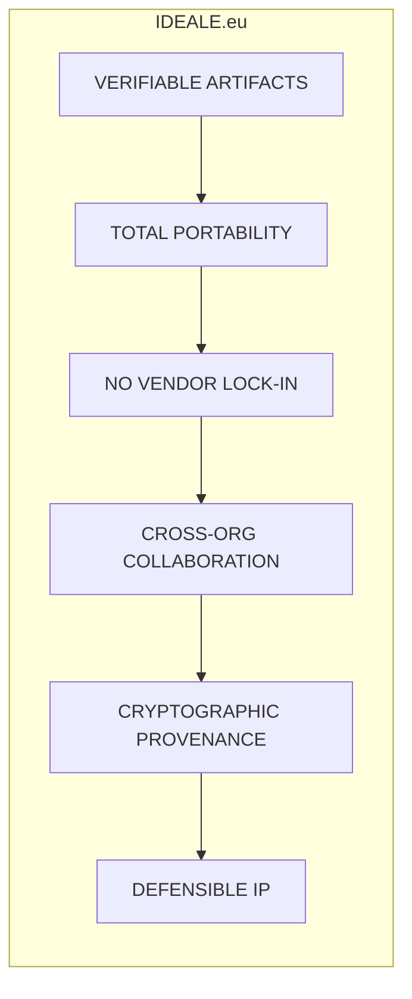

# 🇪🇺 IDEALE.eu — Verifiable Evidence & Portability for Critical Systems

**We don't build aircraft. We build the infrastructure for Europe to collaborate on critical projects with verifiable evidence, total portability, and no vendor lock-in.**

[](LICENSE)
[](standards/v0.1/)
[](standards/v0.1/provenance-chain.md)
[](standards/v0.1/artifact-portability-spec.yaml)

---

## 🔑 The Essence



### Artifact properties (what "good" looks like)

```yaml
artifact_properties:
  portable: true           # Moves across CAD/CAE/CAM/ERP/PLM
  verifiable: true         # Cryptographic hash + signature
  traceable: true          # Full change history, immutable
  vendor_neutral: true     # No tool lock-in (Dassault/Siemens/etc.)
  legally_defensible: true # Chain of custody for IP & disputes
```

---

## 🎯 What IDEALE.eu Enables

* **Any tool → Portable artifact → Any tool** (no information loss)
* **Every change → Cryptographically recorded** (court-admissible evidence)
* **Every contribution → Attributed** (optional incentives & settlements)
* **Cross-org collaboration → Safe by default** (IP protected, provenance preserved)

**Real example**

> Airbus designs in CATIA → exports IDEALE artifact (IEF).
> Safran opens in NX → modifies → signs → returns.
> Entire provenance on-chain; both IPs protected.

---

## 🧠 Architecture (what's in this repo)

```
IDEALE.eu/
├─ standards/v0.1/            # IDEALE Evidence Framework (IEF) specs
│  ├─ artifact-portability-spec.yaml
│  ├─ cryptographic-signing.md
│  ├─ cross-tool-schema.json
│  └─ provenance-chain.md
├─ evidence-engine/           # Reference implementation
│  ├─ artifact-generator/     # create/sign/verify artifacts
│  ├─ portability-layer/      # CATIA/NX ↔ neutral ↔ any
│  ├─ provenance-tracker/     # blockchain anchor, history
│  └─ ip-defender/            # ownership & legal export
├─ generative-design/         # High-fidelity outputs with provenance
│  ├─ ai-models/
│  ├─ cryptographic-binding/
│  └─ output-generation/
├─ tokenomics/                # Optional incentives & settlements
└─ integration-demos/         # Airbus↔Safran, ESA multi-contractor, defense consortium
```

> The **8 programs** live here as **demonstrations** that the infrastructure scales to extreme complexity (e.g., complete aerospace programs). They are *not* manufacturing projects — they are **evidence and portability showcases**.

---

## 🔐 Cryptographic Generative Design (pipeline)

```yaml
generative_design_pipeline:
  input:
    requirements: "<hash>"
    constraints: "<hash>"
    models: "<hash>"
  process:
    ai_generation: "cryptographically_signed"
    human_approval: "digitally_signed"
    modifications: "blockchain_recorded"
  output:
    high_fidelity_graphics: "bound-to-inputs"
    provenance_chain: "auto-generated"
    legal_defensibility: "court_admissible"
```

---

## 🤝 Collaboration Models (optional token layer)

* **Team** (single org), **Cross-org** (OEM–Tier1–Tier2), **Ad-hoc** (temporary consortia)
* Each contribution can mint **verifiable evidence, attribution, and optional compensation**.

---

## 🚀 Quickstart (for adopters)

1. **Adopt the spec**

   * Read: [`standards/v0.1/artifact-portability-spec.yaml`](./standards/v0.1/artifact-portability-spec.yaml)
   * Implement your tool adapter (or use provided portability-layer stubs)

2. **Generate a verifiable artifact**

   ```bash
   python evidence-engine/artifact-generator/create-verifiable-artifact.py \
     --input path/to/your_model \
     --out build/your_model.ief.json
   python evidence-engine/artifact-generator/sign-artifact.py \
     --in build/your_model.ief.json --key your-signing-key
   ```

3. **Verify and exchange**

   ```bash
   python evidence-engine/artifact-generator/verify-artifact.py \
     --in build/partner_model.ief.json --cert partner-cert.pem
   ```

4. **Anchor provenance (optional)**

   ```bash
   python evidence-engine/provenance-tracker/blockchain-anchor.py \
     --in build/your_model.ief.json
   ```

---

## 📂 Repository Structure

```bash
IDEALE.eu/
├── [README.md](./README.md)
├── [LICENSE](./LICENSE)
├── [.gitignore](./.gitignore)
├── [Makefile](./Makefile)
├── [CONTRIBUTING.md](./CONTRIBUTING.md)
├── [GOVERNANCE.md](./GOVERNANCE.md)
│
├── [0-STRATEGY/](./0-STRATEGY/)
│   ├── [MISSION-VISION.md](./0-STRATEGY/MISSION-VISION.md)
│   ├── [ROADMAP.md](./0-STRATEGY/ROADMAP.md)
│   ├── [STAKEHOLDERS.md](./0-STRATEGY/STAKEHOLDERS.md)
│   ├── [KPIs/](./0-STRATEGY/KPIs/)
│   └── [BUSINESS-MODELS/](./0-STRATEGY/BUSINESS-MODELS/)
│
├── [1-DIMENSIONS/](./1-DIMENSIONS/)
│   ├── [INTELLIGENCE/](./1-DIMENSIONS/INTELLIGENCE/)
│   │   ├── [README.md](./1-DIMENSIONS/INTELLIGENCE/README.md)
│   │   ├── [dimension-config.yaml](./1-DIMENSIONS/INTELLIGENCE/dimension-config.yaml)
│   │   └── [PROGRAMS/](./1-DIMENSIONS/INTELLIGENCE/PROGRAMS/)
│   ├── [DEFENSE/](./1-DIMENSIONS/DEFENSE/)
│   │   ├── [README.md](./1-DIMENSIONS/DEFENSE/README.md)
│   │   ├── [dimension-config.yaml](./1-DIMENSIONS/DEFENSE/dimension-config.yaml)
│   │   └── [PROGRAMS/](./1-DIMENSIONS/DEFENSE/PROGRAMS/)
│   ├── [ENERGY/](./1-DIMENSIONS/ENERGY/)
│   │   ├── [README.md](./1-DIMENSIONS/ENERGY/README.md)
│   │   ├── [dimension-config.yaml](./1-DIMENSIONS/ENERGY/dimension-config.yaml)
│   │   └── [PROGRAMS/](./1-DIMENSIONS/ENERGY/PROGRAMS/)
│   ├── [AEROSPACE/](./1-DIMENSIONS/AEROSPACE/)
│   │   ├── [README.md](./1-DIMENSIONS/AEROSPACE/README.md)
│   │   ├── [dimension-config.yaml](./1-DIMENSIONS/AEROSPACE/dimension-config.yaml)
│   │   └── [PROGRAMS/](./1-DIMENSIONS/AEROSPACE/PROGRAMS/)
│   ├── [LOGISTICS/](./1-DIMENSIONS/LOGISTICS/)
│   │   ├── [README.md](./1-DIMENSIONS/LOGISTICS/README.md)
│   │   ├── [dimension-config.yaml](./1-DIMENSIONS/LOGISTICS/dimension-config.yaml)
│   │   └── [PROGRAMS/](./1-DIMENSIONS/LOGISTICS/PROGRAMS/)
│   └── [ESG/](./1-DIMENSIONS/ESG/)
│       ├── [README.md](./1-DIMENSIONS/ESG/README.md)
│       ├── [dimension-config.yaml](./1-DIMENSIONS/ESG/dimension-config.yaml)
│       └── [PROGRAMS/](./1-DIMENSIONS/ESG/PROGRAMS/)
│
├── [2-PROGRAM-TEMPLATE/](./2-PROGRAM-TEMPLATE/)
│   ├── [README.md](./2-PROGRAM-TEMPLATE/README.md)
│   ├── [program-config.yaml](./2-PROGRAM-TEMPLATE/program-config.yaml)
│   ├── [program-manifest.json](./2-PROGRAM-TEMPLATE/program-manifest.json)
│   │
│   ├── [TFA/](./2-PROGRAM-TEMPLATE/TFA/)  #Top Final Algorithm/Artifact Structure
│   │   ├── [META.yaml](./2-PROGRAM-TEMPLATE/TFA/META.yaml)
│   │   ├── [VERSION](./2-PROGRAM-TEMPLATE/TFA/VERSION)
│   │   ├── [CHANGELOG.md](./2-PROGRAM-TEMPLATE/TFA/CHANGELOG.md)
│   │   │
│   │   ├── [SYSTEMS/](./2-PROGRAM-TEMPLATE/TFA/SYSTEMS/)
│   │   │   ├── [SI/](./2-PROGRAM-TEMPLATE/TFA/SYSTEMS/SI/)  #System Integration
│   │   │   │   ├── [interfaces.yaml](./2-PROGRAM-TEMPLATE/TFA/SYSTEMS/SI/interfaces.yaml)
│   │   │   │   ├── [orchestration.py](./2-PROGRAM-TEMPLATE/TFA/SYSTEMS/SI/orchestration.py)
│   │   │   │   └── tests/
│   │   │   └── [DI/](./2-PROGRAM-TEMPLATE/TFA/SYSTEMS/DI/)  #Domain Interface
│   │   │       ├── [api-spec.yaml](./2-PROGRAM-TEMPLATE/TFA/SYSTEMS/DI/api-spec.yaml)
│   │   │       ├── [contracts/](./2-PROGRAM-TEMPLATE/TFA/SYSTEMS/DI/contracts/)
│   │   │       └── [validators/](./2-PROGRAM-TEMPLATE/TFA/SYSTEMS/DI/validators/)
│   │   │
│   │   ├── [STATIONS/](./2-PROGRAM-TEMPLATE/TFA/STATIONS/)
│   │   │   └── [SE/](./2-PROGRAM-TEMPLATE/TFA/STATIONS/SE/)  #Station Envelope
│   │   │       ├── [physical-envelope.json](./2-PROGRAM-TEMPLATE/TFA/STATIONS/SE/physical-envelope.json)
│   │   │       ├── [logical-boundaries.yaml](./2-PROGRAM-TEMPLATE/TFA/STATIONS/SE/logical-boundaries.yaml)
│   │   │       └── [constraints/](./2-PROGRAM-TEMPLATE/TFA/STATIONS/SE/constraints/)
│   │   │
│   │   ├── [COMPONENTS/](./2-PROGRAM-TEMPLATE/TFA/COMPONENTS/)
│   │   │   ├── [CV/](./2-PROGRAM-TEMPLATE/TFA/COMPONENTS/CV/)  #Component Vendor
│   │   │   │   ├── [vendor-specs/](./2-PROGRAM-TEMPLATE/TFA/COMPONENTS/CV/vendor-specs/)
│   │   │   │   ├── [qualification/](./2-PROGRAM-TEMPLATE/TFA/COMPONENTS/CV/qualification/)
│   │   │   │   └── [contracts/](./2-PROGRAM-TEMPLATE/TFA/COMPONENTS/CV/contracts/)
│   │   │   ├── [CE/](./2-PROGRAM-TEMPLATE/TFA/COMPONENTS/CE/)  #Component Equipment
│   │   │   │   ├── [equipment-catalog/](./2-PROGRAM-TEMPLATE/TFA/COMPONENTS/CE/equipment-catalog/)
│   │   │   │   ├── [specifications/](./2-PROGRAM-TEMPLATE/TFA/COMPONENTS/CE/specifications/)
│   │   │   │   └── [maintenance/](./2-PROGRAM-TEMPLATE/TFA/COMPONENTS/CE/maintenance/)
│   │   │   ├── [CC/](./2-PROGRAM-TEMPLATE/TFA/COMPONENTS/CC/)  #Component Cell
│   │   │   │   ├── [cell-definitions/](./2-PROGRAM-TEMPLATE/TFA/COMPONENTS/CC/cell-definitions/)
│   │   │   │   ├── [interfaces/](./2-PROGRAM-TEMPLATE/TFA/COMPONENTS/CC/interfaces/)
│   │   │   │   └── [testing/](./2-PROGRAM-TEMPLATE/TFA/COMPONENTS/CC/testing/)
│   │   │   ├── [CI/](./2-PROGRAM-TEMPLATE/TFA/COMPONENTS/CI/)  #Component Item
│   │   │   │   ├── [item-registry/](./2-PROGRAM-TEMPLATE/TFA/COMPONENTS/CI/item-registry/)
│   │   │   │   ├── [tracking/](./2-PROGRAM-TEMPLATE/TFA/COMPONENTS/CI/tracking/)
│   │   │   │   └── [quality/](./2-PROGRAM-TEMPLATE/TFA/COMPONENTS/CI/quality/)
│   │   │   └── [CP/](./2-PROGRAM-TEMPLATE/TFA/COMPONENTS/CP/)  #Component Part
│   │   │       ├── [part-numbers/](./2-PROGRAM-TEMPLATE/TFA/COMPONENTS/CP/part-numbers/)
│   │   │       ├── [specifications/](./2-PROGRAM-TEMPLATE/TFA/COMPONENTS/CP/specifications/)
│   │   │       └── [suppliers/](./2-PROGRAM-TEMPLATE/TFA/COMPONENTS/CP/suppliers/)
│   │   │
│   │   ├── [BITS/](./2-PROGRAM-TEMPLATE/TFA/BITS/)
│   │   │   └── [CB/](./2-PROGRAM-TEMPLATE/TFA/BITS/CB/)  #Classical Bit
│   │   │       ├── [deterministic-compute/](./2-PROGRAM-TEMPLATE/TFA/BITS/CB/deterministic-compute/)
│   │   │       ├── [algorithms/](./2-PROGRAM-TEMPLATE/TFA/BITS/CB/algorithms/)
│   │   │       └── [solvers/](./2-PROGRAM-TEMPLATE/TFA/BITS/CB/solvers/)
│   │   │
│   │   ├── [QUBITS/](./2-PROGRAM-TEMPLATE/TFA/QUBITS/)
│   │   │   └── [QB/](./2-PROGRAM-TEMPLATE/TFA/QUBITS/QB/)  #Quantum Bit
│   │   │       ├── [quantum-circuits/](./2-PROGRAM-TEMPLATE/TFA/QUBITS/QB/quantum-circuits/)
│   │   │       ├── [quantum-algorithms/](./2-PROGRAM-TEMPLATE/TFA/QUBITS/QB/quantum-algorithms/)
│   │   │       └── [quantum-solvers/](./2-PROGRAM-TEMPLATE/TFA/QUBITS/QB/quantum-solvers/)
│   │   │
│   │   ├── [ELEMENTS/](./2-PROGRAM-TEMPLATE/TFA/ELEMENTS/)
│   │   │   ├── [UE/](./2-PROGRAM-TEMPLATE/TFA/ELEMENTS/UE/)  #Unit Element
│   │   │   │   ├── [fundamentals/](./2-PROGRAM-TEMPLATE/TFA/ELEMENTS/UE/fundamentals/)
│   │   │   │   └── [primitives/](./2-PROGRAM-TEMPLATE/TFA/ELEMENTS/UE/primitives/)
│   │   │   └── [FE/](./2-PROGRAM-TEMPLATE/TFA/ELEMENTS/FE/)  #Federation Entanglement
│   │   │       ├── [distributed-orchestration/](./2-PROGRAM-TEMPLATE/TFA/ELEMENTS/FE/distributed-orchestration/)
│   │   │       ├── [consensus/](./2-PROGRAM-TEMPLATE/TFA/ELEMENTS/FE/consensus/)
│   │   │       └── [coordination/](./2-PROGRAM-TEMPLATE/TFA/ELEMENTS/FE/coordination/)
│   │   │
│   │   ├── [WAVES/](./2-PROGRAM-TEMPLATE/TFA/WAVES/)
│   │   │   └── [FWD/](./2-PROGRAM-TEMPLATE/TFA/WAVES/FWD/)  #Future/Waves Dynamics
│   │   │       ├── [predictive-models/](./2-PROGRAM-TEMPLATE/TFA/WAVES/FWD/predictive-models/)
│   │   │       ├── [retrodictive-analysis/](./2-PROGRAM-TEMPLATE/TFA/WAVES/FWD/retrodictive-analysis/)
│   │   │       └── [nowcasts/](./2-PROGRAM-TEMPLATE/TFA/WAVES/FWD/nowcasts/)
│   │   │
│   │   └── [STATES/](./2-PROGRAM-TEMPLATE/TFA/STATES/)
│   │       └── [QS/](./2-PROGRAM-TEMPLATE/TFA/STATES/QS/)  #Quantum State
│   │           ├── [state-management/](./2-PROGRAM-TEMPLATE/TFA/STATES/QS/state-management/)
│   │           ├── [provenance/](./2-PROGRAM-TEMPLATE/TFA/STATES/QS/provenance/)
│   │           └── [immutable-ledger/](./2-PROGRAM-TEMPLATE/TFA/STATES/QS/immutable-ledger/)
│   │
│   ├── [MAP-SERVICES/](./2-PROGRAM-TEMPLATE/MAP-SERVICES/)  #Master Application Programs (one per domain)
│   │   ├── [MAP-AAA/](./2-PROGRAM-TEMPLATE/MAP-SERVICES/MAP-AAA/)
│   │   ├── [MAP-AAP/](./2-PROGRAM-TEMPLATE/MAP-SERVICES/MAP-AAP/)
│   │   ├── [MAP-CCC/](./2-PROGRAM-TEMPLATE/MAP-SERVICES/MAP-CCC/)
│   │   ├── [MAP-CQH/](./2-PROGRAM-TEMPLATE/MAP-SERVICES/MAP-CQH/)
│   │   ├── [MAP-DDD/](./2-PROGRAM-TEMPLATE/MAP-SERVICES/MAP-DDD/)
│   │   ├── [MAP-EDI/](./2-PROGRAM-TEMPLATE/MAP-SERVICES/MAP-EDI/)
│   │   ├── [MAP-EEE/](./2-PROGRAM-TEMPLATE/MAP-SERVICES/MAP-EEE/)
│   │   ├── [MAP-EER/](./2-PROGRAM-TEMPLATE/MAP-SERVICES/MAP-EER/)
│   │   ├── [MAP-IIF/](./2-PROGRAM-TEMPLATE/MAP-SERVICES/MAP-IIF/)
│   │   ├── [MAP-IIS/](./2-PROGRAM-TEMPLATE/MAP-SERVICES/MAP-IIS/)
│   │   ├── [MAP-LCC/](./2-PROGRAM-TEMPLATE/MAP-SERVICES/MAP-LCC/)
│   │   ├── [MAP-LIB/](./2-PROGRAM-TEMPLATE/MAP-SERVICES/MAP-LIB/)
│   │   ├── [MAP-MEC/](./2-PROGRAM-TEMPLATE/MAP-SERVICES/MAP-MEC/)
│   │   ├── [MAP-OOO/](./2-PROGRAM-TEMPLATE/MAP-SERVICES/MAP-OOO/)
│   │   └── [MAP-PPP/](./2-PROGRAM-TEMPLATE/MAP-SERVICES/MAP-PPP/)
│   │
│   ├── [MAL-SERVICES/](./2-PROGRAM-TEMPLATE/MAL-SERVICES/)  #Main Application Layers (horizontal services)
│   │   ├── [MAL-CB/](./2-PROGRAM-TEMPLATE/MAL-SERVICES/MAL-CB/)  #Classical compute service
│   │   ├── [MAL-QB/](./2-PROGRAM-TEMPLATE/MAL-SERVICES/MAL-QB/)  #Quantum compute service
│   │   ├── [MAL-UE/](./2-PROGRAM-TEMPLATE/MAL-SERVICES/MAL-UE/)  #Unit element service
│   │   ├── [MAL-FE/](./2-PROGRAM-TEMPLATE/MAL-SERVICES/MAL-FE/)  #Federation service
│   │   ├── [MAL-FWD/](./2-PROGRAM-TEMPLATE/MAL-SERVICES/MAL-FWD/)  #Wave dynamics service
│   │   └── [MAL-QS/](./2-PROGRAM-TEMPLATE/MAL-SERVICES/MAL-QS/)  #Quantum state service
│   │
│   └── [DOMAINS/](./2-PROGRAM-TEMPLATE/DOMAINS/)  #The 15 Engineering Domains
│       ├── [AAA-AIRFRAMES-AERODYNAMICS-AIRWORTHINESS/](./2-PROGRAM-TEMPLATE/DOMAINS/AAA-AIRFRAMES-AERODYNAMICS-AIRWORTHINESS/)
│       │   ├── [README.md](./2-PROGRAM-TEMPLATE/DOMAINS/AAA-AIRFRAMES-AERODYNAMICS-AIRWORTHINESS/README.md)
│       │   ├── [domain-config.yaml](./2-PROGRAM-TEMPLATE/DOMAINS/AAA-AIRFRAMES-AERODYNAMICS-AIRWORTHINESS/domain-config.yaml)
│       │   ├── [META.json](./2-PROGRAM-TEMPLATE/DOMAINS/AAA-AIRFRAMES-AERODYNAMICS-AIRWORTHINESS/META.json)
│       │   │
│       │   ├── [PLM/](./2-PROGRAM-TEMPLATE/DOMAINS/AAA-AIRFRAMES-AERODYNAMICS-AIRWORTHINESS/PLM/)  #Product Lifecycle Management
│       │   │   ├── [CAO/](./2-PROGRAM-TEMPLATE/DOMAINS/AAA-AIRFRAMES-AERODYNAMICS-AIRWORTHINESS/PLM/CAO/)  #Computer Aided Kick-Off
│       │   │   │   ├── [CON/](./2-PROGRAM-TEMPLATE/DOMAINS/AAA-AIRFRAMES-AERODYNAMICS-AIRWORTHINESS/PLM/CAO/CON/)  #Concept
│       │   │   │   │   ├── [README.md](./2-PROGRAM-TEMPLATE/DOMAINS/AAA-AIRFRAMES-AERODYNAMICS-AIRWORTHINESS/PLM/CAO/CON/README.md)
│       │   │   │   │   ├── [concept-definition.md](./2-PROGRAM-TEMPLATE/DOMAINS/AAA-AIRFRAMES-AERODYNAMICS-AIRWORTHINESS/PLM/CAO/CON/concept-definition.md)
│       │   │   │   │   ├── [stakeholder-requirements.yaml](./2-PROGRAM-TEMPLATE/DOMAINS/AAA-AIRFRAMES-AERODYNAMICS-AIRWORTHINESS/PLM/CAO/CON/stakeholder-requirements.yaml)
│       │   │   │   │   ├── [feasibility-study.pdf](./2-PROGRAM-TEMPLATE/DOMAINS/AAA-AIRFRAMES-AERODYNAMICS-AIRWORTHINESS/PLM/CAO/CON/feasibility-study.pdf)
│       │   │   │   │   ├── [trade-studies/](./2-PROGRAM-TEMPLATE/DOMAINS/AAA-AIRFRAMES-AERODYNAMICS-AIRWORTHINESS/PLM/CAO/CON/trade-studies/)
│       │   │   │   │   ├── [preliminary-design-review/](./2-PROGRAM-TEMPLATE/DOMAINS/AAA-AIRFRAMES-AERODYNAMICS-AIRWORTHINESS/PLM/CAO/CON/preliminary-design-review/)
│       │   │   │   │   └── [concept-validation/](./2-PROGRAM-TEMPLATE/DOMAINS/AAA-AIRFRAMES-AERODYNAMICS-AIRWORTHINESS/PLM/CAO/CON/concept-validation/)
│       │   │   │   ├── [REQ/](./2-PROGRAM-TEMPLATE/DOMAINS/AAA-AIRFRAMES-AERODYNAMICS-AIRWORTHINESS/PLM/CAO/REQ/)  #Requirements
│       │   │   │   │   ├── [README.md](./2-PROGRAM-TEMPLATE/DOMAINS/AAA-AIRFRAMES-AERODYNAMICS-AIRWORTHINESS/PLM/CAO/REQ/README.md)
│       │   │   │   │   ├── [requirements-matrix.xlsx](./2-PROGRAM-TEMPLATE/DOMAINS/AAA-AIRFRAMES-AERODYNAMICS-AIRWORTHINESS/PLM/CAO/REQ/requirements-matrix.xlsx)
│       │   │   │   │   ├── [functional-requirements.yaml](./2-PROGRAM-TEMPLATE/DOMAINS/AAA-AIRFRAMES-AERODYNAMICS-AIRWORTHINESS/PLM/CAO/REQ/functional-requirements.yaml)
│       │   │   │   │   ├── [non-functional-requirements.yaml](./2-PROGRAM-TEMPLATE/DOMAINS/AAA-AIRFRAMES-AERODYNAMICS-AIRWORTHINESS/PLM/CAO/REQ/non-functional-requirements.yaml)
│       │   │   │   │   ├── [safety-requirements/](./2-PROGRAM-TEMPLATE/DOMAINS/AAA-AIRFRAMES-AERODYNAMICS-AIRWORTHINESS/PLM/CAO/REQ/safety-requirements/)
│       │   │   │   │   ├── [certification-requirements/](./2-PROGRAM-TEMPLATE/DOMAINS/AAA-AIRFRAMES-AERODYNAMICS-AIRWORTHINESS/PLM/CAO/REQ/certification-requirements/)
│       │   │   │   │   ├── [performance-requirements/](./2-PROGRAM-TEMPLATE/DOMAINS/AAA-AIRFRAMES-AERODYNAMICS-AIRWORTHINESS/PLM/CAO/REQ/performance-requirements/)
│       │   │   │   │   └── [traceability-matrix/](./2-PROGRAM-TEMPLATE/DOMAINS/AAA-AIRFRAMES-AERODYNAMICS-AIRWORTHINESS/PLM/CAO/REQ/traceability-matrix/)
│       │   │   │   └── [SYS/](./2-PROGRAM-TEMPLATE/DOMAINS/AAA-AIRFRAMES-AERODYNAMICS-AIRWORTHINESS/PLM/CAO/SYS/)  #Systems
│       │   │   │       ├── [README.md](./2-PROGRAM-TEMPLATE/DOMAINS/AAA-AIRFRAMES-AERODYNAMICS-AIRWORTHINESS/PLM/CAO/SYS/README.md)
│       │   │   │       ├── [system-architecture.drawio](./2-PROGRAM-TEMPLATE/DOMAINS/AAA-AIRFRAMES-AERODYNAMICS-AIRWORTHINESS/PLM/CAO/SYS/system-architecture.drawio)
│       │   │   │       ├── [interfaces-definition.yaml](./2-PROGRAM-TEMPLATE/DOMAINS/AAA-AIRFRAMES-AERODYNAMICS-AIRWORTHINESS/PLM/CAO/SYS/interfaces-definition.yaml)
│       │   │   │       ├── [system-breakdown-structure.json](./2-PROGRAM-TEMPLATE/DOMAINS/AAA-AIRFRAMES-AERODYNAMICS-AIRWORTHINESS/PLM/CAO/SYS/system-breakdown-structure.json)
│       │   │   │       ├── [functional-allocation/](./2-PROGRAM-TEMPLATE/DOMAINS/AAA-AIRFRAMES-AERODYNAMICS-AIRWORTHINESS/PLM/CAO/SYS/functional-allocation/)
│       │   │   │       ├── [system-integration-plan/](./2-PROGRAM-TEMPLATE/DOMAINS/AAA-AIRFRAMES-AERODYNAMICS-AIRWORTHINESS/PLM/CAO/SYS/system-integration-plan/)
│       │   │   │       └── [verification-plan/](./2-PROGRAM-TEMPLATE/DOMAINS/AAA-AIRFRAMES-AERODYNAMICS-AIRWORTHINESS/PLM/CAO/SYS/verification-plan/)
│       │   │   │
│       │   │   ├── [CAD/](./2-PROGRAM-TEMPLATE/DOMAINS/AAA-AIRFRAMES-AERODYNAMICS-AIRWORTHINESS/PLM/CAD/)  #Computer Aided Design
│       │   │   │   ├── [ASSY/](./2-PROGRAM-TEMPLATE/DOMAINS/AAA-AIRFRAMES-AERODYNAMICS-AIRWORTHINESS/PLM/CAD/ASSY/)
│       │   │   │   │   ├── [README.md](./2-PROGRAM-TEMPLATE/DOMAINS/AAA-AIRFRAMES-AERODYNAMICS-AIRWORTHINESS/PLM/CAD/ASSY/README.md)
│       │   │   │   │   ├── [main-assembly.stp](./2-PROGRAM-TEMPLATE/DOMAINS/AAA-AIRFRAMES-AERODYNAMICS-AIRWORTHINESS/PLM/CAD/ASSY/main-assembly.stp)
│       │   │   │   │   ├── [sub-assemblies/](./2-PROGRAM-TEMPLATE/DOMAINS/AAA-AIRFRAMES-AERODYNAMICS-AIRWORTHINESS/PLM/CAD/ASSY/sub-assemblies/)
│       │   │   │   │   ├── [bom.json](./2-PROGRAM-TEMPLATE/DOMAINS/AAA-AIRFRAMES-AERODYNAMICS-AIRWORTHINESS/PLM/CAD/ASSY/bom.json)
│       │   │   │   │   ├── [assembly-sequences/](./2-PROGRAM-TEMPLATE/DOMAINS/AAA-AIRFRAMES-AERODYNAMICS-AIRWORTHINESS/PLM/CAD/ASSY/assembly-sequences/)
│       │   │   │   │   ├── [interference-checks/](./2-PROGRAM-TEMPLATE/DOMAINS/AAA-AIRFRAMES-AERODYNAMICS-AIRWORTHINESS/PLM/CAD/ASSY/interference-checks/)
│       │   │   │   │   └── [kinematics/](./2-PROGRAM-TEMPLATE/DOMAINS/AAA-AIRFRAMES-AERODYNAMICS-AIRWORTHINESS/PLM/CAD/ASSY/kinematics/)
│       │   │   │   ├── [PRT/](./2-PROGRAM-TEMPLATE/DOMAINS/AAA-AIRFRAMES-AERODYNAMICS-AIRWORTHINESS/PLM/CAD/PRT/)
│       │   │   │   │   ├── [parts-library/](./2-PROGRAM-TEMPLATE/DOMAINS/AAA-AIRFRAMES-AERODYNAMICS-AIRWORTHINESS/PLM/CAD/PRT/parts-library/)
│       │   │   │   │   ├── [standard-parts/](./2-PROGRAM-TEMPLATE/DOMAINS/AAA-AIRFRAMES-AERODYNAMICS-AIRWORTHINESS/PLM/CAD/PRT/standard-parts/)
│       │   │   │   │   ├── [custom-parts/](./2-PROGRAM-TEMPLATE/DOMAINS/AAA-AIRFRAMES-AERODYNAMICS-AIRWORTHINESS/PLM/CAD/PRT/custom-parts/)
│       │   │   │   │   ├── [material-specifications/](./2-PROGRAM-TEMPLATE/DOMAINS/AAA-AIRFRAMES-AERODYNAMICS-AIRWORTHINESS/PLM/CAD/PRT/material-specifications/)
│       │   │   │   │   ├── [tolerances/](./2-PROGRAM-TEMPLATE/DOMAINS/AAA-AIRFRAMES-AERODYNAMICS-AIRWORTHINESS/PLM/CAD/PRT/tolerances/)
│       │   │   │   │   └── [surface-finishes/](./2-PROGRAM-TEMPLATE/DOMAINS/AAA-AIRFRAMES-AERODYNAMICS-AIRWORTHINESS/PLM/CAD/PRT/surface-finishes/)
│       │   │   │   └── [DRW/](./2-PROGRAM-TEMPLATE/DOMAINS/AAA-AIRFRAMES-AERODYNAMICS-AIRWORTHINESS/PLM/CAD/DRW/)
│       │   │   │       ├── [2d-drawings/](./2-PROGRAM-TEMPLATE/DOMAINS/AAA-AIRFRAMES-AERODYNAMICS-AIRWORTHINESS/PLM/CAD/DRW/2d-drawings/)
│       │   │   │       ├── [technical-drawings/](./2-PROGRAM-TEMPLATE/DOMAINS/AAA-AIRFRAMES-AERODYNAMICS-AIRWORTHINESS/PLM/CAD/DRW/technical-drawings/)
│       │   │   │       ├── [annotations/](./2-PROGRAM-TEMPLATE/DOMAINS/AAA-AIRFRAMES-AERODYNAMICS-AIRWORTHINESS/PLM/CAD/DRW/annotations/)
│       │   │   │       ├── [gd&t/](./2-PROGRAM-TEMPLATE/DOMAINS/AAA-AIRFRAMES-AERODYNAMICS-AIRWORTHINESS/PLM/CAD/DRW/gd&t/)
│       │   │   │       ├── [assembly-drawings/](./2-PROGRAM-TEMPLATE/DOMAINS/AAA-AIRFRAMES-AERODYNAMICS-AIRWORTHINESS/PLM/CAD/DRW/assembly-drawings/)
│       │   │   │       └── [detail-drawings/](./2-PROGRAM-TEMPLATE/DOMAINS/AAA-AIRFRAMES-AERODYNAMICS-AIRWORTHINESS/PLM/CAD/DRW/detail-drawings/)
│       │   │   │
│       │   │   ├── [CAE/](./2-PROGRAM-TEMPLATE/DOMAINS/AAA-AIRFRAMES-AERODYNAMICS-AIRWORTHINESS/PLM/CAE/)
│       │   │   │   ├── [FEM/](./2-PROGRAM-TEMPLATE/DOMAINS/AAA-AIRFRAMES-AERODYNAMICS-AIRWORTHINESS/PLM/CAE/FEM/)
│       │   │   │   │   ├── [structural-analysis/](./2-PROGRAM-TEMPLATE/DOMAINS/AAA-AIRFRAMES-AERODYNAMICS-AIRWORTHINESS/PLM/CAE/FEM/structural-analysis/)
│       │   │   │   │   │   ├── [static/](./2-PROGRAM-TEMPLATE/DOMAINS/AAA-AIRFRAMES-AERODYNAMICS-AIRWORTHINESS/PLM/CAE/FEM/structural-analysis/static/)
│       │   │   │   │   │   ├── [dynamic/](./2-PROGRAM-TEMPLATE/DOMAINS/AAA-AIRFRAMES-AERODYNAMICS-AIRWORTHINESS/PLM/CAE/FEM/structural-analysis/dynamic/)
│       │   │   │   │   │   ├── [fatigue/](./2-PROGRAM-TEMPLATE/DOMAINS/AAA-AIRFRAMES-AERODYNAMICS-AIRWORTHINESS/PLM/CAE/FEM/structural-analysis/fatigue/)
│       │   │   │   │   │   └── [fracture/](./2-PROGRAM-TEMPLATE/DOMAINS/AAA-AIRFRAMES-AERODYNAMICS-AIRWORTHINESS/PLM/CAE/FEM/structural-analysis/fracture/)
│       │   │   │   │   ├── [thermal-analysis/](./2-PROGRAM-TEMPLATE/DOMAINS/AAA-AIRFRAMES-AERODYNAMICS-AIRWORTHINESS/PLM/CAE/FEM/thermal-analysis/)
│       │   │   │   │   ├── [modal-analysis/](./2-PROGRAM-TEMPLATE/DOMAINS/AAA-AIRFRAMES-AERODYNAMICS-AIRWORTHINESS/PLM/CAE/FEM/modal-analysis/)
│       │   │   │   │   └── [optimization/](./2-PROGRAM-TEMPLATE/DOMAINS/AAA-AIRFRAMES-AERODYNAMICS-AIRWORTHINESS/PLM/CAE/FEM/optimization/)
│       │   │   │   ├── [CFD/](./2-PROGRAM-TEMPLATE/DOMAINS/AAA-AIRFRAMES-AERODYNAMICS-AIRWORTHINESS/PLM/CAE/CFD/)
│       │   │   │   │   ├── [aerodynamics/](./2-PROGRAM-TEMPLATE/DOMAINS/AAA-AIRFRAMES-AERODYNAMICS-AIRWORTHINESS/PLM/CAE/CFD/aerodynamics/)
│       │   │   │   │   │   ├── [subsonic/](./2-PROGRAM-TEMPLATE/DOMAINS/AAA-AIRFRAMES-AERODYNAMICS-AIRWORTHINESS/PLM/CAE/CFD/aerodynamics/subsonic/)
│       │   │   │   │   │   ├── [transonic/](./2-PROGRAM-TEMPLATE/DOMAINS/AAA-AIRFRAMES-AERODYNAMICS-AIRWORTHINESS/PLM/CAE/CFD/aerodynamics/transonic/)
│       │   │   │   │   │   ├── [supersonic/](./2-PROGRAM-TEMPLATE/DOMAINS/AAA-AIRFRAMES-AERODYNAMICS-AIRWORTHINESS/PLM/CAE/CFD/aerodynamics/supersonic/)
│       │   │   │   │   │   └── [hypersonic/](./2-PROGRAM-TEMPLATE/DOMAINS/AAA-AIRFRAMES-AERODYNAMICS-AIRWORTHINESS/PLM/CAE/CFD/aerodynamics/hypersonic/)
│       │   │   │   │   ├── [thermal-flow/](./2-PROGRAM-TEMPLATE/DOMAINS/AAA-AIRFRAMES-AERODYNAMICS-AIRWORTHINESS/PLM/CAE/CFD/thermal-flow/)
│       │   │   │   │   ├── [multiphase/](./2-PROGRAM-TEMPLATE/DOMAINS/AAA-AIRFRAMES-AERODYNAMICS-AIRWORTHINESS/PLM/CAE/CFD/multiphase/)
│       │   │   │   │   └── [turbulence-models/](./2-PROGRAM-TEMPLATE/DOMAINS/AAA-AIRFRAMES-AERODYNAMICS-AIRWORTHINESS/PLM/CAE/CFD/turbulence-models/)
│       │   │   │   ├── [MBD/](./2-PROGRAM-TEMPLATE/DOMAINS/AAA-AIRFRAMES-AERODYNAMICS-AIRWORTHINESS/PLM/CAE/MBD/)
│       │   │   │   │   ├── [kinematics/](./2-PROGRAM-TEMPLATE/DOMAINS/AAA-AIRFRAMES-AERODYNAMICS-AIRWORTHINESS/PLM/CAE/MBD/kinematics/)
│       │   │   │   │   ├── [dynamics/](./2-PROGRAM-TEMPLATE/DOMAINS/AAA-AIRFRAMES-AERODYNAMICS-AIRWORTHINESS/PLM/CAE/MBD/dynamics/)
│       │   │   │   │   ├── [control-systems/](./2-PROGRAM-TEMPLATE/DOMAINS/AAA-AIRFRAMES-AERODYNAMICS-AIRWORTHINESS/PLM/CAE/MBD/control-systems/)
│       │   │   │   │   └── [actuator-models/](./2-PROGRAM-TEMPLATE/DOMAINS/AAA-AIRFRAMES-AERODYNAMICS-AIRWORTHINESS/PLM/CAE/MBD/actuator-models/)
│       │   │   │   └── [EMI/](./2-PROGRAM-TEMPLATE/DOMAINS/AAA-AIRFRAMES-AERODYNAMICS-AIRWORTHINESS/PLM/CAE/EMI/)
│       │   │   │       ├── [emc-analysis/](./2-PROGRAM-TEMPLATE/DOMAINS/AAA-AIRFRAMES-AERODYNAMICS-AIRWORTHINESS/PLM/CAE/EMI/emc-analysis/)
│       │   │   │       ├── [shielding/](./2-PROGRAM-TEMPLATE/DOMAINS/AAA-AIRFRAMES-AERODYNAMICS-AIRWORTHINESS/PLM/CAE/EMI/shielding/)
│       │   │   │       ├── [grounding/](./2-PROGRAM-TEMPLATE/DOMAINS/AAA-AIRFRAMES-AERODYNAMICS-AIRWORTHINESS/PLM/CAE/EMI/grounding/)
│       │   │   │       └── [lightning-protection/](./2-PROGRAM-TEMPLATE/DOMAINS/AAA-AIRFRAMES-AERODYNAMICS-AIRWORTHINESS/PLM/CAE/EMI/lightning-protection/)
│       │   │   │
│       │   │   ├── [CAM/](./2-PROGRAM-TEMPLATE/DOMAINS/AAA-AIRFRAMES-AERODYNAMICS-AIRWORTHINESS/PLM/CAM/)
│       │   │   │   ├── [NC/](./2-PROGRAM-TEMPLATE/DOMAINS/AAA-AIRFRAMES-AERODYNAMICS-AIRWORTHINESS/PLM/CAM/NC/)
│       │   │   │   │   ├── [g-code/](./2-PROGRAM-TEMPLATE/DOMAINS/AAA-AIRFRAMES-AERODYNAMICS-AIRWORTHINESS/PLM/CAM/NC/g-code/)
│       │   │   │   │   ├── [post-processors/](./2-PROGRAM-TEMPLATE/DOMAINS/AAA-AIRFRAMES-AERODYNAMICS-AIRWORTHINESS/PLM/CAM/NC/post-processors/)
│       │   │   │   │   └── [toolpaths/](./2-PROGRAM-TEMPLATE/DOMAINS/AAA-AIRFRAMES-AERODYNAMICS-AIRWORTHINESS/PLM/CAM/NC/toolpaths/)
│       │   │   │   ├── [APT/](./2-PROGRAM-TEMPLATE/DOMAINS/AAA-AIRFRAMES-AERODYNAMICS-AIRWORTHINESS/PLM/CAM/APT/)
│       │   │   │   │   ├── [automation-scripts/](./2-PROGRAM-TEMPLATE/DOMAINS/AAA-AIRFRAMES-AERODYNAMICS-AIRWORTHINESS/PLM/CAM/APT/automation-scripts/)
│       │   │   │   │   ├── [process-optimization/](./2-PROGRAM-TEMPLATE/DOMAINS/AAA-AIRFRAMES-AERODYNAMICS-AIRWORTHINESS/PLM/CAM/APT/process-optimization/)
│       │   │   │   │   └── [cycle-time-analysis/](./2-PROGRAM-TEMPLATE/DOMAINS/AAA-AIRFRAMES-AERODYNAMICS-AIRWORTHINESS/PLM/CAM/APT/cycle-time-analysis/)
│       │   │   │   ├── [OPR/](./2-PROGRAM-TEMPLATE/DOMAINS/AAA-AIRFRAMES-AERODYNAMICS-AIRWORTHINESS/PLM/CAM/OPR/)
│       │   │   │   │   ├── [work-instructions/](./2-PROGRAM-TEMPLATE/DOMAINS/AAA-AIRFRAMES-AERODYNAMICS-AIRWORTHINESS/PLM/CAM/OPR/work-instructions/)
│       │   │   │   │   ├── [process-sheets/](./2-PROGRAM-TEMPLATE/DOMAINS/AAA-AIRFRAMES-AERODYNAMICS-AIRWORTHINESS/PLM/CAM/OPR/process-sheets/)
│       │   │   │   │   └── [quality-plans/](./2-PROGRAM-TEMPLATE/DOMAINS/AAA-AIRFRAMES-AERODYNAMICS-AIRWORTHINESS/PLM/CAM/OPR/quality-plans/)
│       │   │   │   ├── [FIX/](./2-PROGRAM-TEMPLATE/DOMAINS/AAA-AIRFRAMES-AERODYNAMICS-AIRWORTHINESS/PLM/CAM/FIX/)
│       │   │   │   │   ├── [fixture-designs/](./2-PROGRAM-TEMPLATE/DOMAINS/AAA-AIRFRAMES-AERODYNAMICS-AIRWORTHINESS/PLM/CAM/FIX/fixture-designs/)
│       │   │   │   │   ├── [jigs/](./2-PROGRAM-TEMPLATE/DOMAINS/AAA-AIRFRAMES-AERODYNAMICS-AIRWORTHINESS/PLM/CAM/FIX/jigs/)
│       │   │   │   │   └── [templates/](./2-PROGRAM-TEMPLATE/DOMAINS/AAA-AIRFRAMES-AERODYNAMICS-AIRWORTHINESS/PLM/CAM/FIX/templates/)
│       │   │   │   ├── [TOOL/](./2-PROGRAM-TEMPLATE/DOMAINS/AAA-AIRFRAMES-AERODYNAMICS-AIRWORTHINESS/PLM/CAM/TOOL/)
│       │   │   │   │   ├── [tool-library/](./2-PROGRAM-TEMPLATE/DOMAINS/AAA-AIRFRAMES-AERODYNAMICS-AIRWORTHINESS/PLM/CAM/TOOL/tool-library/)
│       │   │   │   │   ├── [cutting-parameters/](./2-PROGRAM-TEMPLATE/DOMAINS/AAA-AIRFRAMES-AERODYNAMICS-AIRWORTHINESS/PLM/CAM/TOOL/cutting-parameters/)
│       │   │   │   │   └── [tool-wear-models/](./2-PROGRAM-TEMPLATE/DOMAINS/AAA-AIRFRAMES-AERODYNAMICS-AIRWORTHINESS/PLM/CAM/TOOL/tool-wear-models/)
│       │   │   │   └── [SET/](./2-PROGRAM-TEMPLATE/DOMAINS/AAA-AIRFRAMES-AERODYNAMICS-AIRWORTHINESS/PLM/CAM/SET/)
│       │   │   │       ├── [setup-sheets/](./2-PROGRAM-TEMPLATE/DOMAINS/AAA-AIRFRAMES-AERODYNAMICS-AIRWORTHINESS/PLM/CAM/SET/setup-sheets/)
│       │   │   │       ├── [machine-configurations/](./2-PROGRAM-TEMPLATE/DOMAINS/AAA-AIRFRAMES-AERODYNAMICS-AIRWORTHINESS/PLM/CAM/SET/machine-configurations/)
│       │   │   │       └── [calibration/](./2-PROGRAM-TEMPLATE/DOMAINS/AAA-AIRFRAMES-AERODYNAMICS-AIRWORTHINESS/PLM/CAM/SET/calibration/)
│       │   │   │
│       │   │   ├── [CAV/](./2-PROGRAM-TEMPLATE/DOMAINS/AAA-AIRFRAMES-AERODYNAMICS-AIRWORTHINESS/PLM/CAV/)  #Quality Verification & Validation
│       │   │   │   ├── [QIP/](./2-PROGRAM-TEMPLATE/DOMAINS/AAA-AIRFRAMES-AERODYNAMICS-AIRWORTHINESS/PLM/CAV/QIP/)
│       │   │   │   │   ├── [inspection-plans/](./2-PROGRAM-TEMPLATE/DOMAINS/AAA-AIRFRAMES-AERODYNAMICS-AIRWORTHINESS/PLM/CAV/QIP/inspection-plans/)
│       │   │   │   │   ├── [sampling-strategies/](./2-PROGRAM-TEMPLATE/DOMAINS/AAA-AIRFRAMES-AERODYNAMICS-AIRWORTHINESS/PLM/CAV/QIP/sampling-strategies/)
│       │   │   │   │   └── [acceptance-criteria/](./2-PROGRAM-TEMPLATE/DOMAINS/AAA-AIRFRAMES-AERODYNAMICS-AIRWORTHINESS/PLM/CAV/QIP/acceptance-criteria/)
│       │   │   │   ├── [QIF/](./2-PROGRAM-TEMPLATE/DOMAINS/AAA-AIRFRAMES-AERODYNAMICS-AIRWORTHINESS/PLM/CAV/QIF/)
│       │   │   │   │   ├── [quality-data-model/](./2-PROGRAM-TEMPLATE/DOMAINS/AAA-AIRFRAMES-AERODYNAMICS-AIRWORTHINESS/PLM/CAV/QIF/quality-data-model/)
│       │   │   │   │   ├── [measurement-resources/](./2-PROGRAM-TEMPLATE/DOMAINS/AAA-AIRFRAMES-AERODYNAMICS-AIRWORTHINESS/PLM/CAV/QIF/measurement-resources/)
│       │   │   │   │   └── [statistics/](./2-PROGRAM-TEMPLATE/DOMAINS/AAA-AIRFRAMES-AERODYNAMICS-AIRWORTHINESS/PLM/CAV/QIF/statistics/)
│       │   │   │   ├── [DMIS/](./2-PROGRAM-TEMPLATE/DOMAINS/AAA-AIRFRAMES-AERODYNAMICS-AIRWORTHINESS/PLM/CAV/DMIS/)
│       │   │   │   │   ├── [cmm-programs/](./2-PROGRAM-TEMPLATE/DOMAINS/AAA-AIRFRAMES-AERODYNAMICS-AIRWORTHINESS/PLM/CAV/DMIS/cmm-programs/)
│       │   │   │   │   ├── [measurement-routines/](./2-PROGRAM-TEMPLATE/DOMAINS/AAA-AIRFRAMES-AERODYNAMICS-AIRWORTHINESS/PLM/CAV/DMIS/measurement-routines/)
│       │   │   │   │   └── [probe-configurations/](./2-PROGRAM-TEMPLATE/DOMAINS/AAA-AIRFRAMES-AERODYNAMICS-AIRWORTHINESS/PLM/CAV/DMIS/probe-configurations/)
│       │   │   │   ├── [MEAS/](./2-PROGRAM-TEMPLATE/DOMAINS/AAA-AIRFRAMES-AERODYNAMICS-AIRWORTHINESS/PLM/CAV/MEAS/)
│       │   │   │   │   ├── [measurement-results/](./2-PROGRAM-TEMPLATE/DOMAINS/AAA-AIRFRAMES-AERODYNAMICS-AIRWORTHINESS/PLM/CAV/MEAS/measurement-results/)
│       │   │   │   │   ├── [deviation-reports/](./2-PROGRAM-TEMPLATE/DOMAINS/AAA-AIRFRAMES-AERODYNAMICS-AIRWORTHINESS/PLM/CAV/MEAS/deviation-reports/)
│       │   │   │   │   └── [trend-analysis/](./2-PROGRAM-TEMPLATE/DOMAINS/AAA-AIRFRAMES-AERODYNAMICS-AIRWORTHINESS/PLM/CAV/MEAS/trend-analysis/)
│       │   │   │   ├── [MSA/](./2-PROGRAM-TEMPLATE/DOMAINS/AAA-AIRFRAMES-AERODYNAMICS-AIRWORTHINESS/PLM/CAV/MSA/)
│       │   │   │   │   ├── [gage-r&r/](./2-PROGRAM-TEMPLATE/DOMAINS/AAA-AIRFRAMES-AERODYNAMICS-AIRWORTHINESS/PLM/CAV/MSA/gage-r&r/)
│       │   │   │   │   ├── [calibration-records/](./2-PROGRAM-TEMPLATE/DOMAINS/AAA-AIRFRAMES-AERODYNAMICS-AIRWORTHINESS/PLM/CAV/MSA/calibration-records/)
│       │   │   │   │   └── [uncertainty-analysis/](./2-PROGRAM-TEMPLATE/DOMAINS/AAA-AIRFRAMES-AERODYNAMICS-AIRWORTHINESS/PLM/CAV/MSA/uncertainty-analysis/)
│       │   │   │   └── [CERT/](./2-PROGRAM-TEMPLATE/DOMAINS/AAA-AIRFRAMES-AERODYNAMICS-AIRWORTHINESS/PLM/CAV/CERT/)
│       │   │   │       ├── [certificates/](./2-PROGRAM-TEMPLATE/DOMAINS/AAA-AIRFRAMES-AERODYNAMICS-AIRWORTHINESS/PLM/CAV/CERT/certificates/)
│       │   │   │       ├── [compliance-matrix/](./2-PROGRAM-TEMPLATE/DOMAINS/AAA-AIRFRAMES-AERODYNAMICS-AIRWORTHINESS/PLM/CAV/CERT/compliance-matrix/)
│       │   │   │       ├── [test-reports/](./2-PROGRAM-TEMPLATE/DOMAINS/AAA-AIRFRAMES-AERODYNAMICS-AIRWORTHINESS/PLM/CAV/CERT/test-reports/)
│       │   │   │       └── [regulatory-approvals/](./2-PROGRAM-TEMPLATE/DOMAINS/AAA-AIRFRAMES-AERODYNAMICS-AIRWORTHINESS/PLM/CAV/CERT/regulatory-approvals/)
│       │   │   │
│       │   │   ├── [CAI/](./2-PROGRAM-TEMPLATE/DOMAINS/AAA-AIRFRAMES-AERODYNAMICS-AIRWORTHINESS/PLM/CAI/)
│       │   │   │   ├── [INS/](./2-PROGRAM-TEMPLATE/DOMAINS/AAA-AIRFRAMES-AERODYNAMICS-AIRWORTHINESS/PLM/CAI/INS/)
│       │   │   │   │   ├── [installation-procedures/](./2-PROGRAM-TEMPLATE/DOMAINS/AAA-AIRFRAMES-AERODYNAMICS-AIRWORTHINESS/PLM/CAI/INS/installation-procedures/)
│       │   │   │   │   ├── [installation-drawings/](./2-PROGRAM-TEMPLATE/DOMAINS/AAA-AIRFRAMES-AERODYNAMICS-AIRWORTHINESS/PLM/CAI/INS/installation-drawings/)
│       │   │   │   │   └── [tooling-requirements/](./2-PROGRAM-TEMPLATE/DOMAINS/AAA-AIRFRAMES-AERODYNAMICS-AIRWORTHINESS/PLM/CAI/INS/tooling-requirements/)
│       │   │   │   ├── [INT/](./2-PROGRAM-TEMPLATE/DOMAINS/AAA-AIRFRAMES-AERODYNAMICS-AIRWORTHINESS/PLM/CAI/INT/)
│       │   │   │   │   ├── [integration-plans/](./2-PROGRAM-TEMPLATE/DOMAINS/AAA-AIRFRAMES-AERODYNAMICS-AIRWORTHINESS/PLM/CAI/INT/integration-plans/)
│       │   │   │   │   ├── [interface-control/](./2-PROGRAM-TEMPLATE/DOMAINS/AAA-AIRFRAMES-AERODYNAMICS-AIRWORTHINESS/PLM/CAI/INT/interface-control/)
│       │   │   │   │   └── [system-testing/](./2-PROGRAM-TEMPLATE/DOMAINS/AAA-AIRFRAMES-AERODYNAMICS-AIRWORTHINESS/PLM/CAI/INT/system-testing/)
│       │   │   │   └── [FIT/](./2-PROGRAM-TEMPLATE/DOMAINS/AAA-AIRFRAMES-AERODYNAMICS-AIRWORTHINESS/PLM/CAI/FIT/)
│       │   │   │       ├── [fit-checks/](./2-PROGRAM-TEMPLATE/DOMAINS/AAA-AIRFRAMES-AERODYNAMICS-AIRWORTHINESS/PLM/CAI/FIT/fit-checks/)
│       │   │   │       ├── [shimming-plans/](./2-PROGRAM-TEMPLATE/DOMAINS/AAA-AIRFRAMES-AERODYNAMICS-AIRWORTHINESS/PLM/CAI/FIT/shimming-plans/)
│       │   │   │       └── [alignment-procedures/](./2-PROGRAM-TEMPLATE/DOMAINS/AAA-AIRFRAMES-AERODYNAMICS-AIRWORTHINESS/PLM/CAI/FIT/alignment-procedures/)
│       │   │   │
│       │   │   ├── [CAS/](./2-PROGRAM-TEMPLATE/DOMAINS/AAA-AIRFRAMES-AERODYNAMICS-AIRWORTHINESS/PLM/CAS/)
│       │   │   │   ├── [AMM/](./2-PROGRAM-TEMPLATE/DOMAINS/AAA-AIRFRAMES-AERODYNAMICS-AIRWORTHINESS/PLM/CAS/AMM/)
│       │   │   │   │   ├── [scheduled-maintenance/](./2-PROGRAM-TEMPLATE/DOMAINS/AAA-AIRFRAMES-AERODYNAMICS-AIRWORTHINESS/PLM/CAS/AMM/scheduled-maintenance/)
│       │   │   │   │   ├── [unscheduled-maintenance/](./2-PROGRAM-TEMPLATE/DOMAINS/AAA-AIRFRAMES-AERODYNAMICS-AIRWORTHINESS/PLM/CAS/AMM/unscheduled-maintenance/)
│       │   │   │   │   └── [troubleshooting/](./2-PROGRAM-TEMPLATE/DOMAINS/AAA-AIRFRAMES-AERODYNAMICS-AIRWORTHINESS/PLM/CAS/AMM/troubleshooting/)
│       │   │   │   ├── [SRM/](./2-PROGRAM-TEMPLATE/DOMAINS/AAA-AIRFRAMES-AERODYNAMICS-AIRWORTHINESS/PLM/CAS/SRM/)
│       │   │   │   │   ├── [repair-schemes/](./2-PROGRAM-TEMPLATE/DOMAINS/AAA-AIRFRAMES-AERODYNAMICS-AIRWORTHINESS/PLM/CAS/SRM/repair-schemes/)
│       │   │   │   │   ├── [damage-assessment/](./2-PROGRAM-TEMPLATE/DOMAINS/AAA-AIRFRAMES-AERODYNAMICS-AIRWORTHINESS/PLM/CAS/SRM/damage-assessment/)
│       │   │   │   │   └── [repair-instructions/](./2-PROGRAM-TEMPLATE/DOMAINS/AAA-AIRFRAMES-AERODYNAMICS-AIRWORTHINESS/PLM/CAS/SRM/repair-instructions/)
│       │   │   │   ├── [IPD/](./2-PROGRAM-TEMPLATE/DOMAINS/AAA-AIRFRAMES-AERODYNAMICS-AIRWORTHINESS/PLM/CAS/IPD/)
│       │   │   │   │   ├── [parts-catalog/](./2-PROGRAM-TEMPLATE/DOMAINS/AAA-AIRFRAMES-AERODYNAMICS-AIRWORTHINESS/PLM/CAS/IPD/parts-catalog/)
│       │   │   │   │   ├── [exploded-views/](./2-PROGRAM-TEMPLATE/DOMAINS/AAA-AIRFRAMES-AERODYNAMICS-AIRWORTHINESS/PLM/CAS/IPD/exploded-views/)
│       │   │   │   │   └── [spare-parts-lists/](./2-PROGRAM-TEMPLATE/DOMAINS/AAA-AIRFRAMES-AERODYNAMICS-AIRWORTHINESS/PLM/CAS/IPD/spare-parts-lists/)
│       │   │   │   └── [EIS/](./2-PROGRAM-TEMPLATE/DOMAINS/AAA-AIRFRAMES-AERODYNAMICS-AIRWORTHINESS/PLM/CAS/EIS/)
│       │   │   │       ├── [service-bulletins/](./2-PROGRAM-TEMPLATE/DOMAINS/AAA-AIRFRAMES-AERODYNAMICS-AIRWORTHINESS/PLM/CAS/EIS/service-bulletins/)
│       │   │   │       ├── [fleet-data/](./2-PROGRAM-TEMPLATE/DOMAINS/AAA-AIRFRAMES-AERODYNAMICS-AIRWORTHINESS/PLM/CAS/EIS/fleet-data/)
│       │   │   │       └── [reliability-monitoring/](./2-PROGRAM-TEMPLATE/DOMAINS/AAA-AIRFRAMES-AERODYNAMICS-AIRWORTHINESS/PLM/CAS/EIS/reliability-monitoring/)
│       │   │   │
│       │   │   ├── [CAP/](./2-PROGRAM-TEMPLATE/DOMAINS/AAA-AIRFRAMES-AERODYNAMICS-AIRWORTHINESS/PLM/CAP/)
│       │   │   │   ├── [process-automation/](./2-PROGRAM-TEMPLATE/DOMAINS/AAA-AIRFRAMES-AERODYNAMICS-AIRWORTHINESS/PLM/CAP/process-automation/)
│       │   │   │   ├── [workflow-management/](./2-PROGRAM-TEMPLATE/DOMAINS/AAA-AIRFRAMES-AERODYNAMICS-AIRWORTHINESS/PLM/CAP/workflow-management/)
│       │   │   │   ├── [digital-twin/](./2-PROGRAM-TEMPLATE/DOMAINS/AAA-AIRFRAMES-AERODYNAMICS-AIRWORTHINESS/PLM/CAP/digital-twin/)
│       │   │   │   └── [optimization/](./2-PROGRAM-TEMPLATE/DOMAINS/AAA-AIRFRAMES-AERODYNAMICS-AIRWORTHINESS/PLM/CAP/optimization/)
│       │   │   │
│       │   │   └── [CMP/](./2-PROGRAM-TEMPLATE/DOMAINS/AAA-AIRFRAMES-AERODYNAMICS-AIRWORTHINESS/PLM/CMP/)
│       │   │       ├── [EOL/](./2-PROGRAM-TEMPLATE/DOMAINS/AAA-AIRFRAMES-AERODYNAMICS-AIRWORTHINESS/PLM/CMP/EOL/)
│       │   │       ├── [RECYCLING/](./2-PROGRAM-TEMPLATE/DOMAINS/AAA-AIRFRAMES-AERODYNAMICS-AIRWORTHINESS/PLM/CMP/RECYCLING/)
│       │   │       └── [ESG/](./2-PROGRAM-TEMPLATE/DOMAINS/AAA-AIRFRAMES-AERODYNAMICS-AIRWORTHINESS/PLM/CMP/ESG/)
│       │   │
│       │   ├── [QUANTUM_OA/](./2-PROGRAM-TEMPLATE/DOMAINS/AAA-AIRFRAMES-AERODYNAMICS-AIRWORTHINESS/QUANTUM_OA/)
│       │   │   ├── [QOX/](./2-PROGRAM-TEMPLATE/DOMAINS/AAA-AIRFRAMES-AERODYNAMICS-AIRWORTHINESS/QUANTUM_OA/QOX/)
│       │   │   ├── [MILP/](./2-PROGRAM-TEMPLATE/DOMAINS/AAA-AIRFRAMES-AERODYNAMICS-AIRWORTHINESS/QUANTUM_OA/MILP/)
│       │   │   ├── [LP/](./2-PROGRAM-TEMPLATE/DOMAINS/AAA-AIRFRAMES-AERODYNAMICS-AIRWORTHINESS/QUANTUM_OA/LP/)
│       │   │   ├── [QP/](./2-PROGRAM-TEMPLATE/DOMAINS/AAA-AIRFRAMES-AERODYNAMICS-AIRWORTHINESS/QUANTUM_OA/QP/)
│       │   │   ├── [QUBO/](./2-PROGRAM-TEMPLATE/DOMAINS/AAA-AIRFRAMES-AERODYNAMICS-AIRWORTHINESS/QUANTUM_OA/QUBO/)
│       │   │   ├── [QAOA/](./2-PROGRAM-TEMPLATE/DOMAINS/AAA-AIRFRAMES-AERODYNAMICS-AIRWORTHINESS/QUANTUM_OA/QAOA/)
│       │   │   ├── [SA/](./2-PROGRAM-TEMPLATE/DOMAINS/AAA-AIRFRAMES-AERODYNAMICS-AIRWORTHINESS/QUANTUM_OA/SA/)
│       │   │   └── [GA/](./2-PROGRAM-TEMPLATE/DOMAINS/AAA-AIRFRAMES-AERODYNAMICS-AIRWORTHINESS/QUANTUM_OA/GA/)
│       │   │
│       │   ├── [SUPPLIERS/](./2-PROGRAM-TEMPLATE/DOMAINS/AAA-AIRFRAMES-AERODYNAMICS-AIRWORTHINESS/SUPPLIERS/)
│       │   │   ├── [SERVICES/](./2-PROGRAM-TEMPLATE/DOMAINS/AAA-AIRFRAMES-AERODYNAMICS-AIRWORTHINESS/SUPPLIERS/SERVICES/)
│       │   │   └── [BIDS/](./2-PROGRAM-TEMPLATE/DOMAINS/AAA-AIRFRAMES-AERODYNAMICS-AIRWORTHINESS/SUPPLIERS/BIDS/)
│       │   │
│       │   ├── [PROCUREMENT/](./2-PROGRAM-TEMPLATE/DOMAINS/AAA-AIRFRAMES-AERODYNAMICS-AIRWORTHINESS/PROCUREMENT/)
│       │   │   └── [VENDORSCOMPONENTS/](./2-PROGRAM-TEMPLATE/DOMAINS/AAA-AIRFRAMES-AERODYNAMICS-AIRWORTHINESS/PROCUREMENT/VENDORSCOMPONENTS/)
│       │   │
│       │   ├── [PAx/](./2-PROGRAM-TEMPLATE/DOMAINS/AAA-AIRFRAMES-AERODYNAMICS-AIRWORTHINESS/PAx/)  #Packaging (artifacts)
│       │   ├── [DELs/](./2-PROGRAM-TEMPLATE/DOMAINS/AAA-AIRFRAMES-AERODYNAMICS-AIRWORTHINESS/DELs/)  #Final Check & Deliveries
│       │   ├── [policy/](./2-PROGRAM-TEMPLATE/DOMAINS/AAA-AIRFRAMES-AERODYNAMICS-AIRWORTHINESS/policy/)
│       │   └── [tests/](./2-PROGRAM-TEMPLATE/DOMAINS/AAA-AIRFRAMES-AERODYNAMICS-AIRWORTHINESS/tests/)
│       │
│       ├── [AAP-AIRPORT-ADAPTABLE-PLATFORMS/](./2-PROGRAM-TEMPLATE/DOMAINS/AAP-AIRPORT-ADAPTABLE-PLATFORMS/)
│       ├── [CCC-COCKPIT-CABIN-CARGO/](./2-PROGRAM-TEMPLATE/DOMAINS/CCC-COCKPIT-CABIN-CARGO/)
│       ├── [CQH-CRYOGENICS-QUANTUM-H2/](./2-PROGRAM-TEMPLATE/DOMAINS/CQH-CRYOGENICS-QUANTUM-H2/)
│       ├── [DDD-DRAINAGE-DEHUMIDIFICATION-DRYING/](./2-PROGRAM-TEMPLATE/DOMAINS/DDD-DRAINAGE-DEHUMIDIFICATION-DRYING/)
│       ├── [EDI-ELECTRONICS-DIGITAL-INSTRUMENTS/](./2-PROGRAM-TEMPLATE/DOMAINS/EDI-ELECTRONICS-DIGITAL-INSTRUMENTS/)
│       ├── [EEE-ELECTRICAL-ENDOTRANSPONDERS-CIRCULATION/](./2-PROGRAM-TEMPLATE/DOMAINS/EEE-ELECTRICAL-ENDOTRANSPONDERS-CIRCULATION/)
│       ├── [EER-ENVIRONMENTAL-EMISSIONS-REMEDIATION/](./2-PROGRAM-TEMPLATE/DOMAINS/EER-ENVIRONMENTAL-EMISSIONS-REMEDIATION/)
│       ├── [IIF-INDUSTRIAL-INFRASTRUCTURE-FACILITIES/](./2-PROGRAM-TEMPLATE/DOMAINS/IIF-INDUSTRIAL-INFRASTRUCTURE-FACILITIES/)
│       ├── [IIS-INFORMATION-INTELLIGENCE-SYSTEMS/](./2-PROGRAM-TEMPLATE/DOMAINS/IIS-INFORMATION-INTELLIGENCE-SYSTEMS/)
│       ├── [LCC-LINKAGES-CONTROL-COMMUNICATIONS/](./2-PROGRAM-TEMPLATE/DOMAINS/LCC-LINKAGES-CONTROL-COMMUNICATIONS/)
│       ├── [LIB-LOGISTICS-INVENTORY-BLOCKCHAIN/](./2-PROGRAM-TEMPLATE/DOMAINS/LIB-LOGISTICS-INVENTORY-BLOCKCHAIN/)
│       ├── [MEC-MECHANICAL-SYSTEMS-MODULES/](./2-PROGRAM-TEMPLATE/DOMAINS/MEC-MECHANICAL-SYSTEMS-MODULES/)
│       ├── [OOO-OS-ONTOLOGIES-OFFICE-INTERFACES/](./2-PROGRAM-TEMPLATE/DOMAINS/OOO-OS-ONTOLOGIES-OFFICE-INTERFACES/)
│       └── [PPP-PROPULSION-FUEL-SYSTEMS/](./2-PROGRAM-TEMPLATE/DOMAINS/PPP-PROPULSION-FUEL-SYSTEMS/)
│
├── [3-PROJECTS-USE-CASES/](./3-PROJECTS-USE-CASES/)
│   ├── [ASI-T2-INTELLIGENCE/](./3-PROJECTS-USE-CASES/ASI-T2-INTELLIGENCE/)
│   │   ├── [README.md](./3-PROJECTS-USE-CASES/ASI-T2-INTELLIGENCE/README.md) # ⚠️ Updated/Added
│   │   └── [DOMAINS/...] # (Structure mirrored from 2-PROGRAM-TEMPLATE, with all sub-READMEs added)
│   │
│   ├── [AMPEL360-AIR-MANNED/](./3-PROJECTS-USE-CASES/AMPEL360-AIR-MANNED/)
│   │   ├── [README.md](./3-PROJECTS-USE-CASES/AMPEL360-AIR-MANNED/README.md) # ⚠️ Updated/Added
│   │   ├── [DOMAINS/](./3-PROJECTS-USE-CASES/AMPEL360-AIR-MANNED/DOMAINS/)
│   │   │   ├── [AAA-AIRFRAMES-AERODYNAMICS-AIRWORTHINESS/](./3-PROJECTS-USE-CASES/AMPEL360-AIR-MANNED/DOMAINS/AAA-AIRFRAMES-AERODYNAMICS-AIRWORTHINESS/)
│   │   │   │   ├── [DELs/](./3-PROJECTS-USE-CASES/AMPEL360-AIR-MANNED/DOMAINS/AAA-AIRFRAMES-AERODYNAMICS-AIRWORTHINESS/DELs/)
│   │   │   │   │   └── [README.md](./3-PROJECTS-USE-CASES/AMPEL360-AIR-MANNED/DOMAINS/AAA-AIRFRAMES-AERODYNAMICS-AIRWORTHINESS/DELs/README.md) # ❌ Added
│   │   │   │   ├── [PAx/](./3-PROJECTS-USE-CASES/AMPEL360-AIR-MANNED/DOMAINS/AAA-AIRFRAMES-AERODYNAMICS-AIRWORTHINESS/PAx/)
│   │   │   │   │   └── [README.md](./3-PROJECTS-USE-CASES/AMPEL360-AIR-MANNED/DOMAINS/AAA-AIRFRAMES-AERODYNAMICS-AIRWORTHINESS/PAx/README.md) # ❌ Added
│   │   │   │   ├── [PLM/](./3-PROJECTS-USE-CASES/AMPEL360-AIR-MANNED/DOMAINS/AAA-AIRFRAMES-AERODYNAMICS-AIRWORTHINESS/PLM/)
│   │   │   │   │   ├── [CAD/](./3-PROJECTS-USE-CASES/AMPEL360-AIR-MANNED/DOMAINS/AAA-AIRFRAMES-AERODYNAMICS-AIRWORTHINESS/PLM/CAD/)
│   │   │   │   │   │   ├── [ASSY/](./3-PROJECTS-USE-CASES/AMPEL360-AIR-MANNED/DOMAINS/AAA-AIRFRAMES-AERODYNAMICS-AIRWORTHINESS/PLM/CAD/ASSY/)
│   │   │   │   │   │   │   └── [README.md](./3-PROJECTS-USE-CASES/AMPEL360-AIR-MANNED/DOMAINS/AAA-AIRFRAMES-AERODYNAMICS-AIRWORTHINESS/PLM/CAD/ASSY/README.md) # ❌ Added
│   │   │   │   │   │   │   ├── [assembly-sequences/](./3-PROJECTS-USE-CASES/AMPEL360-AIR-MANNED/DOMAINS/AAA-AIRFRAMES-AERODYNAMICS-AIRWORTHINESS/PLM/CAD/ASSY/assembly-sequences/)
│   │   │   │   │   │   │   │   └── [README.md](./3-PROJECTS-USE-CASES/AMPEL360-AIR-MANNED/DOMAINS/AAA-AIRFRAMES-AERODYNAMICS-AIRWORTHINESS/PLM/CAD/ASSY/assembly-sequences/README.md) # ❌ Added
│   │   │   │   │   │   │   ├── [interference-checks/](./3-PROJECTS-USE-CASES/AMPEL360-AIR-MANNED/DOMAINS/AAA-AIRFRAMES-AERODYNAMICS-AIRWORTHINESS/PLM/CAD/ASSY/interference-checks/)
│   │   │   │   │   │   │   │   └── [README.md](./3-PROJECTS-USE-CASES/AMPEL360-AIR-MANNED/DOMAINS/AAA-AIRFRAMES-AERODYNAMICS-AIRWORTHINESS/PLM/CAD/ASSY/interference-checks/README.md) # ❌ Added
│   │   │   │   │   │   │   ├── [kinematics/](./3-PROJECTS-USE-CASES/AMPEL360-AIR-MANNED/DOMAINS/AAA-AIRFRAMES-AERODYNAMICS-AIRWORTHINESS/PLM/CAD/ASSY/kinematics/)
│   │   │   │   │   │   │   │   └── [README.md](./3-PROJECTS-USE-CASES/AMPEL360-AIR-MANNED/DOMAINS/AAA-AIRFRAMES-AERODYNAMICS-AIRWORTHINESS/PLM/CAD/ASSY/kinematics/README.md) # ❌ Added
│   │   │   │   │   │   │   └── [sub-assemblies/](./3-PROJECTS-USE-CASES/AMPEL360-AIR-MANNED/DOMAINS/AAA-AIRFRAMES-AERODYNAMICS-AIRWORTHINESS/PLM/CAD/ASSY/sub-assemblies/)
│   │   │   │   │   │   │       └── [README.md](./3-PROJECTS-USE-CASES/AMPEL360-AIR-MANNED/DOMAINS/AAA-AIRFRAMES-AERODYNAMICS-AIRWORTHINESS/PLM/CAD/ASSY/sub-assemblies/README.md) # ❌ Added
│   │   │   │   │   │   ├── [PRT/](./3-PROJECTS-USE-CASES/AMPEL360-AIR-MANNED/DOMAINS/AAA-AIRFRAMES-AERODYNAMICS-AIRWORTHINESS/PLM/CAD/PRT/)
│   │   │   │   │   │   │   ├── [custom-parts/](./3-PROJECTS-USE-CASES/AMPEL360-AIR-MANNED/DOMAINS/AAA-AIRFRAMES-AERODYNAMICS-AIRWORTHINESS/PLM/CAD/PRT/custom-parts/)
│   │   │   │   │   │   │   │   └── [README.md](./3-PROJECTS-USE-CASES/AMPEL360-AIR-MANNED/DOMAINS/AAA-AIRFRAMES-AERODYNAMICS-AIRWORTHINESS/PLM/CAD/PRT/custom-parts/README.md) # ❌ Added
│   │   │   │   │   │   │   ├── [material-specifications/](./3-PROJECTS-USE-CASES/AMPEL360-AIR-MANNED/DOMAINS/AAA-AIRFRAMES-AERODYNAMICS-AIRWORTHINESS/PLM/CAD/PRT/material-specifications/)
│   │   │   │   │   │   │   │   └── [README.md](./3-PROJECTS-USE-CASES/AMPEL360-AIR-MANNED/DOMAINS/AAA-AIRFRAMES-AERODYNAMICS-AIRWORTHINESS/PLM/CAD/PRT/material-specifications/README.md) # ❌ Added
│   │   │   │   │   │   │   ├── [parts-library/](./3-PROJECTS-USE-CASES/AMPEL360-AIR-MANNED/DOMAINS/AAA-AIRFRAMES-AERODYNAMICS-AIRWORTHINESS/PLM/CAD/PRT/parts-library/)
│   │   │   │   │   │   │   │   └── [README.md](./3-PROJECTS-USE-CASES/AMPEL360-AIR-MANNED/DOMAINS/AAA-AIRFRAMES-AERODYNAMICS-AIRWORTHINESS/PLM/CAD/PRT/parts-library/README.md) # ❌ Added
│   │   │   │   │   │   │   ├── [standard-parts/](./3-PROJECTS-USE-CASES/AMPEL360-AIR-MANNED/DOMAINS/AAA-AIRFRAMES-AERODYNAMICS-AIRWORTHINESS/PLM/CAD/PRT/standard-parts/)
│   │   │   │   │   │   │   │   └── [README.md](./3-PROJECTS-USE-CASES/AMPEL360-AIR-MANNED/DOMAINS/AAA-AIRFRAMES-AERODYNAMICS-AIRWORTHINESS/PLM/CAD/PRT/standard-parts/README.md) # ❌ Added
│   │   │   │   │   │   │   ├── [surface-finishes/](./3-PROJECTS-USE-CASES/AMPEL360-AIR-MANNED/DOMAINS/AAA-AIRFRAMES-AERODYNAMICS-AIRWORTHINESS/PLM/CAD/PRT/surface-finishes/)
│   │   │   │   │   │   │   │   └── [README.md](./3-PROJECTS-USE-CASES/AMPEL360-AIR-MANNED/DOMAINS/AAA-AIRFRAMES-AERODYNAMICS-AIRWORTHINESS/PLM/CAD/PRT/surface-finishes/README.md) # ❌ Added
│   │   │   │   │   │   │   └── [tolerances/](./3-PROJECTS-USE-CASES/AMPEL360-AIR-MANNED/DOMAINS/AAA-AIRFRAMES-AERODYNAMICS-AIRWORTHINESS/PLM/CAD/PRT/tolerances/)
│   │   │   │   │   │   │       └── [README.md](./3-PROJECTS-USE-CASES/AMPEL360-AIR-MANNED/DOMAINS/AAA-AIRFRAMES-AERODYNAMICS-AIRWORTHINESS/PLM/CAD/PRT/tolerances/README.md) # ❌ Added
│   │   │   │   │   │   └── [DRW/](./3-PROJECTS-USE-CASES/AMPEL360-AIR-MANNED/DOMAINS/AAA-AIRFRAMES-AERODYNAMICS-AIRWORTHINESS/PLM/CAD/DRW/)
│   │   │   │   │   │       ├── [2d-drawings/](./3-PROJECTS-USE-CASES/AMPEL360-AIR-MANNED/DOMAINS/AAA-AIRFRAMES-AERODYNAMICS-AIRWORTHINESS/PLM/CAD/DRW/2d-drawings/)
│   │   │   │   │   │       │   └── [README.md](./3-PROJECTS-USE-CASES/AMPEL360-AIR-MANNED/DOMAINS/AAA-AIRFRAMES-AERODYNAMICS-AIRWORTHINESS/PLM/CAD/DRW/2d-drawings/README.md) # ❌ Added
│   │   │   │   │   │       ├── [annotations/](./3-PROJECTS-USE-CASES/AMPEL360-AIR-MANNED/DOMAINS/AAA-AIRFRAMES-AERODYNAMICS-AIRWORTHINESS/PLM/CAD/DRW/annotations/)
│   │   │   │   │   │       │   └── [README.md](./3-PROJECTS-USE-CASES/AMPEL360-AIR-MANNED/DOMAINS/AAA-AIRFRAMES-AERODYNAMICS-AIRWORTHINESS/PLM/CAD/DRW/annotations/README.md) # ❌ Added
│   │   │   │   │   │       ├── [assembly-drawings/](./3-PROJECTS-USE-CASES/AMPEL360-AIR-MANNED/DOMAINS/AAA-AIRFRAMES-AERODYNAMICS-AIRWORTHINESS/PLM/CAD/DRW/assembly-drawings/)
│   │   │   │   │   │       │   └── [README.md](./3-PROJECTS-USE-CASES/AMPEL360-AIR-MANNED/DOMAINS/AAA-AIRFRAMES-AERODYNAMICS-AIRWORTHINESS/PLM/CAD/DRW/assembly-drawings/README.md) # ❌ Added
│   │   │   │   │   │       ├── [detail-drawings/](./3-PROJECTS-USE-CASES/AMPEL360-AIR-MANNED/DOMAINS/AAA-AIRFRAMES-AERODYNAMICS-AIRWORTHINESS/PLM/CAD/DRW/detail-drawings/)
│   │   │   │   │   │       │   └── [README.md](./3-PROJECTS-USE-CASES/AMPEL360-AIR-MANNED/DOMAINS/AAA-AIRFRAMES-AERODYNAMICS-AIRWORTHINESS/PLM/CAD/DRW/detail-drawings/README.md) # ❌ Added
│   │   │   │   │   │       ├── [gd&t/](./3-PROJECTS-USE-CASES/AMPEL360-AIR-MANNED/DOMAINS/AAA-AIRFRAMES-AERODYNAMICS-AIRWORTHINESS/PLM/CAD/DRW/gd&t/)
│   │   │   │   │   │       │   └── [README.md](./3-PROJECTS-USE-CASES/AMPEL360-AIR-MANNED/DOMAINS/AAA-AIRFRAMES-AERODYNAMICS-AIRWORTHINESS/PLM/CAD/DRW/gd&t/README.md) # ❌ Added
│   │   │   │   │   │       └── [technical-drawings/](./3-PROJECTS-USE-CASES/AMPEL360-AIR-MANNED/DOMAINS/AAA-AIRFRAMES-AERODYNAMICS-AIRWORTHINESS/PLM/CAD/DRW/technical-drawings/)
│   │   │   │   │   │           └── [README.md](./3-PROJECTS-USE-CASES/AMPEL360-AIR-MANNED/DOMAINS/AAA-AIRFRAMES-AERODYNAMICS-AIRWORTHINESS/PLM/CAD/DRW/technical-drawings/README.md) # ❌ Added
│   │   │   │   │   ├── [CAE/](./3-PROJECTS-USE-CASES/AMPEL360-AIR-MANNED/DOMAINS/AAA-AIRFRAMES-AERODYNAMICS-AIRWORTHINESS/PLM/CAE/)
│   │   │   │   │   │   ├── [FEM/](./3-PROJECTS-USE-CASES/AMPEL360-AIR-MANNED/DOMAINS/AAA-AIRFRAMES-AERODYNAMICS-AIRWORTHINESS/PLM/CAE/FEM/)
│   │   │   │   │   │   │   ├── [structural-analysis/](./3-PROJECTS-USE-CASES/AMPEL360-AIR-MANNED/DOMAINS/AAA-AIRFRAMES-AERODYNAMICS-AIRWORTHINESS/PLM/CAE/FEM/structural-analysis/)
│   │   │   │   │   │   │   │   ├── [static/](./3-PROJECTS-USE-CASES/AMPEL360-AIR-MANNED/DOMAINS/AAA-AIRFRAMES-AERODYNAMICS-AIRWORTHINESS/PLM/CAE/FEM/structural-analysis/static/)
│   │   │   │   │   │   │   │   │   └── [README.md](./3-PROJECTS-USE-CASES/AMPEL360-AIR-MANNED/DOMAINS/AAA-AIRFRAMES-AERODYNAMICS-AIRWORTHINESS/PLM/CAE/FEM/structural-analysis/static/README.md) # ❌ Added
│   │   │   │   │   │   │   │   ├── [dynamic/](./3-PROJECTS-USE-CASES/AMPEL360-AIR-MANNED/DOMAINS/AAA-AIRFRAMES-AERODYNAMICS-AIRWORTHINESS/PLM/CAE/FEM/structural-analysis/dynamic/)
│   │   │   │   │   │   │   │   │   └── [README.md](./3-PROJECTS-USE-CASES/AMPEL360-AIR-MANNED/DOMAINS/AAA-AIRFRAMES-AERODYNAMICS-AIRWORTHINESS/PLM/CAE/FEM/structural-analysis/dynamic/README.md) # ❌ Added
│   │   │   │   │   │   │   │   ├── [fatigue/](./3-PROJECTS-USE-CASES/AMPEL360-AIR-MANNED/DOMAINS/AAA-AIRFRAMES-AERODYNAMICS-AIRWORTHINESS/PLM/CAE/FEM/structural-analysis/fatigue/)
│   │   │   │   │   │   │   │   │   └── [README.md](./3-PROJECTS-USE-CASES/AMPEL360-AIR-MANNED/DOMAINS/AAA-AIRFRAMES-AERODYNAMICS-AIRWORTHINESS/PLM/CAE/FEM/structural-analysis/fatigue/README.md) # ❌ Added
│   │   │   │   │   │   │   │   └── [fracture/](./3-PROJECTS-USE-CASES/AMPEL360-AIR-MANNED/DOMAINS/AAA-AIRFRAMES-AERODYNAMICS-AIRWORTHINESS/PLM/CAE/FEM/structural-analysis/fracture/)
│   │   │   │   │   │   │   │       └── [README.md](./3-PROJECTS-USE-CASES/AMPEL360-AIR-MANNED/DOMAINS/AAA-AIRFRAMES-AERODYNAMICS-AIRWORTHINESS/PLM/CAE/FEM/structural-analysis/fracture/README.md) # ❌ Added
│   │   │   │   │   │   │   ├── [thermal-analysis/](./3-PROJECTS-USE-CASES/AMPEL360-AIR-MANNED/DOMAINS/AAA-AIRFRAMES-AERODYNAMICS-AIRWORTHINESS/PLM/CAE/FEM/thermal-analysis/)
│   │   │   │   │   │   │   │   └── [README.md](./3-PROJECTS-USE-CASES/AMPEL360-AIR-MANNED/DOMAINS/AAA-AIRFRAMES-AERODYNAMICS-AIRWORTHINESS/PLM/CAE/FEM/thermal-analysis/README.md) # ❌ Added
│   │   │   │   │   │   │   ├── [modal-analysis/](./3-PROJECTS-USE-CASES/AMPEL360-AIR-MANNED/DOMAINS/AAA-AIRFRAMES-AERODYNAMICS-AIRWORTHINESS/PLM/CAE/FEM/modal-analysis/)
│   │   │   │   │   │   │   │   └── [README.md](./3-PROJECTS-USE-CASES/AMPEL360-AIR-MANNED/DOMAINS/AAA-AIRFRAMES-AERODYNAMICS-AIRWORTHINESS/PLM/CAE/FEM/modal-analysis/README.md) # ❌ Added
│   │   │   │   │   │   │   └── [optimization/](./3-PROJECTS-USE-CASES/AMPEL360-AIR-MANNED/DOMAINS/AAA-AIRFRAMES-AERODYNAMICS-AIRWORTHINESS/PLM/CAE/FEM/optimization/)
│   │   │   │   │   │   │       └── [README.md](./3-PROJECTS-USE-CASES/AMPEL360-AIR-MANNED/DOMAINS/AAA-AIRFRAMES-AERODYNAMICS-AIRWORTHINESS/PLM/CAE/FEM/optimization/README.md) # ❌ Added
│   │   │   │   │   │   ├── [CFD/](./3-PROJECTS-USE-CASES/AMPEL360-AIR-MANNED/DOMAINS/AAA-AIRFRAMES-AERODYNAMICS-AIRWORTHINESS/PLM/CAE/CFD/)
│   │   │   │   │   │   │   ├── [aerodynamics/](./3-PROJECTS-USE-CASES/AMPEL360-AIR-MANNED/DOMAINS/AAA-AIRFRAMES-AERODYNAMICS-AIRWORTHINESS/PLM/CAE/CFD/aerodynamics/)
│   │   │   │   │   │   │   │   ├── [subsonic/](./3-PROJECTS-USE-CASES/AMPEL360-AIR-MANNED/DOMAINS/AAA-AIRFRAMES-AERODYNAMICS-AIRWORTHINESS/PLM/CAE/CFD/aerodynamics/subsonic/)
│   │   │   │   │   │   │   │   │   └── [README.md](./3-PROJECTS-USE-CASES/AMPEL360-AIR-MANNED/DOMAINS/AAA-AIRFRAMES-AERODYNAMICS-AIRWORTHINESS/PLM/CAE/CFD/aerodynamics/subsonic/README.md) # ❌ Added
│   │   │   │   │   │   │   │   ├── [transonic/](./3-PROJECTS-USE-CASES/AMPEL360-AIR-MANNED/DOMAINS/AAA-AIRFRAMES-AERODYNAMICS-AIRWORTHINESS/PLM/CAE/CFD/aerodynamics/transonic/)
│   │   │   │   │   │   │   │   │   └── [README.md](./3-PROJECTS-USE-CASES/AMPEL360-AIR-MANNED/DOMAINS/AAA-AIRFRAMES-AERODYNAMICS-AIRWORTHINESS/PLM/CAE/CFD/aerodynamics/transonic/README.md) # ❌ Added
│   │   │   │   │   │   │   │   ├── [supersonic/](./3-PROJECTS-USE-CASES/AMPEL360-AIR-MANNED/DOMAINS/AAA-AIRFRAMES-AERODYNAMICS-AIRWORTHINESS/PLM/CAE/CFD/aerodynamics/supersonic/)
│   │   │   │   │   │   │   │   │   └── [README.md](./3-PROJECTS-USE-CASES/AMPEL360-AIR-MANNED/DOMAINS/AAA-AIRFRAMES-AERODYNAMICS-AIRWORTHINESS/PLM/CAE/CFD/aerodynamics/supersonic/README.md) # ❌ Added
│   │   │   │   │   │   │   │   └── [hypersonic/](./3-PROJECTS-USE-CASES/AMPEL360-AIR-MANNED/DOMAINS/AAA-AIRFRAMES-AERODYNAMICS-AIRWORTHINESS/PLM/CAE/CFD/aerodynamics/hypersonic/)
│   │   │   │   │   │   │   │       └── [README.md](./3-PROJECTS-USE-CASES/AMPEL360-AIR-MANNED/DOMAINS/AAA-AIRFRAMES-AERODYNAMICS-AIRWORTHINESS/PLM/CAE/CFD/aerodynamics/hypersonic/README.md) # ❌ Added
│   │   │   │   │   │   │   ├── [thermal-flow/](./3-PROJECTS-USE-CASES/AMPEL360-AIR-MANNED/DOMAINS/AAA-AIRFRAMES-AERODYNAMICS-AIRWORTHINESS/PLM/CAE/CFD/thermal-flow/)
│   │   │   │   │   │   │   │   └── [README.md](./3-PROJECTS-USE-CASES/AMPEL360-AIR-MANNED/DOMAINS/AAA-AIRFRAMES-AERODYNAMICS-AIRWORTHINESS/PLM/CAE/CFD/thermal-flow/README.md) # ❌ Added
│   │   │   │   │   │   │   ├── [multiphase/](./3-PROJECTS-USE-CASES/AMPEL360-AIR-MANNED/DOMAINS/AAA-AIRFRAMES-AERODYNAMICS-AIRWORTHINESS/PLM/CAE/CFD/multiphase/)
│   │   │   │   │   │   │   │   └── [README.md](./3-PROJECTS-USE-CASES/AMPEL360-AIR-MANNED/DOMAINS/AAA-AIRFRAMES-AERODYNAMICS-AIRWORTHINESS/PLM/CAE/CFD/multiphase/README.md) # ❌ Added
│   │   │   │   │   │   │   └── [turbulence-models/](./3-PROJECTS-USE-CASES/AMPEL360-AIR-MANNED/DOMAINS/AAA-AIRFRAMES-AERODYNAMICS-AIRWORTHINESS/PLM/CAE/CFD/turbulence-models/)
│   │   │   │   │   │   │       └── [README.md](./3-PROJECTS-USE-CASES/AMPEL360-AIR-MANNED/DOMAINS/AAA-AIRFRAMES-AERODYNAMICS-AIRWORTHINESS/PLM/CAE/CFD/turbulence-models/README.md) # ❌ Added
│   │   │   │   │   │   ├── [MBD/](./3-PROJECTS-USE-CASES/AMPEL360-AIR-MANNED/DOMAINS/AAA-AIRFRAMES-AERODYNAMICS-AIRWORTHINESS/PLM/CAE/MBD/)
│   │   │   │   │   │   │   ├── [actuator-models/](./3-PROJECTS-USE-CASES/AMPEL360-AIR-MANNED/DOMAINS/AAA-AIRFRAMES-AERODYNAMICS-AIRWORTHINESS/PLM/CAE/MBD/actuator-models/)
│   │   │   │   │   │   │   │   └── [README.md](./3-PROJECTS-USE-CASES/AMPEL360-AIR-MANNED/DOMAINS/AAA-AIRFRAMES-AERODYNAMICS-AIRWORTHINESS/PLM/CAE/MBD/actuator-models/README.md) # ❌ Added
│   │   │   │   │   │   │   ├── [control-systems/](./3-PROJECTS-USE-CASES/AMPEL360-AIR-MANNED/DOMAINS/AAA-AIRFRAMES-AERODYNAMICS-AIRWORTHINESS/PLM/CAE/MBD/control-systems/)
│   │   │   │   │   │   │   │   └── [README.md](./3-PROJECTS-USE-CASES/AMPEL360-AIR-MANNED/DOMAINS/AAA-AIRFRAMES-AERODYNAMICS-AIRWORTHINESS/PLM/CAE/MBD/control-systems/README.md) # ❌ Added
│   │   │   │   │   │   │   ├── [dynamics/](./3-PROJECTS-USE-CASES/AMPEL360-AIR-MANNED/DOMAINS/AAA-AIRFRAMES-AERODYNAMICS-AIRWORTHINESS/PLM/CAE/MBD/dynamics/)
│   │   │   │   │   │   │   │   └── [README.md](./3-PROJECTS-USE-CASES/AMPEL360-AIR-MANNED/DOMAINS/AAA-AIRFRAMES-AERODYNAMICS-AIRWORTHINESS/PLM/CAE/MBD/dynamics/README.md) # ❌ Added
│   │   │   │   │   │   │   └── [kinematics/](./3-PROJECTS-USE-CASES/AMPEL360-AIR-MANNED/DOMAINS/AAA-AIRFRAMES-AERODYNAMICS-AIRWORTHINESS/PLM/CAE/MBD/kinematics/)
│   │   │   │   │   │   │       └── [README.md](./3-PROJECTS-USE-CASES/AMPEL360-AIR-MANNED/DOMAINS/AAA-AIRFRAMES-AERODYNAMICS-AIRWORTHINESS/PLM/CAE/MBD/kinematics/README.md) # ❌ Added
│   │   │   │   │   │   └── [EMI/](./3-PROJECTS-USE-CASES/AMPEL360-AIR-MANNED/DOMAINS/AAA-AIRFRAMES-AERODYNAMICS-AIRWORTHINESS/PLM/CAE/EMI/)
│   │   │   │   │   │       ├── [emc-analysis/](./3-PROJECTS-USE-CASES/AMPEL360-AIR-MANNED/DOMAINS/AAA-AIRFRAMES-AERODYNAMICS-AIRWORTHINESS/PLM/CAE/EMI/emc-analysis/)
│   │   │   │   │   │       │   └── [README.md](./3-PROJECTS-USE-CASES/AMPEL360-AIR-MANNED/DOMAINS/AAA-AIRFRAMES-AERODYNAMICS-AIRWORTHINESS/PLM/CAE/EMI/emc-analysis/README.md) # ❌ Added
│   │   │   │   │   │       ├── [grounding/](./3-PROJECTS-USE-CASES/AMPEL360-AIR-MANNED/DOMAINS/AAA-AIRFRAMES-AERODYNAMICS-AIRWORTHINESS/PLM/CAE/EMI/grounding/)
│   │   │   │   │   │       │   └── [README.md](./3-PROJECTS-USE-CASES/AMPEL360-AIR-MANNED/DOMAINS/AAA-AIRFRAMES-AERODYNAMICS-AIRWORTHINESS/PLM/CAE/EMI/grounding/README.md) # ❌ Added
│   │   │   │   │   │       ├── [lightning-protection/](./3-PROJECTS-USE-CASES/AMPEL360-AIR-MANNED/DOMAINS/AAA-AIRFRAMES-AERODYNAMICS-AIRWORTHINESS/PLM/CAE/EMI/lightning-protection/)
│   │   │   │   │   │       │   └── [README.md](./3-PROJECTS-USE-CASES/AMPEL360-AIR-MANNED/DOMAINS/AAA-AIRFRAMES-AERODYNAMICS-AIRWORTHINESS/PLM/CAE/EMI/lightning-protection/README.md) # ❌ Added
│   │   │   │   │   │       └── [shielding/](./3-PROJECTS-USE-CASES/AMPEL360-AIR-MANNED/DOMAINS/AAA-AIRFRAMES-AERODYNAMICS-AIRWORTHINESS/PLM/CAE/EMI/shielding/)
│   │   │   │   │   │           └── [README.md](./3-PROJECTS-USE-CASES/AMPEL360-AIR-MANNED/DOMAINS/AAA-AIRFRAMES-AERODYNAMICS-AIRWORTHINESS/PLM/CAE/EMI/shielding/README.md) # ❌ Added
│   │   │   │   │   ├── [CAM/](./3-PROJECTS-USE-CASES/AMPEL360-AIR-MANNED/DOMAINS/AAA-AIRFRAMES-AERODYNAMICS-AIRWORTHINESS/PLM/CAM/)
│   │   │   │   │   │   ├── [NC/](./3-PROJECTS-USE-CASES/AMPEL360-AIR-MANNED/DOMAINS/AAA-AIRFRAMES-AERODYNAMICS-AIRWORTHINESS/PLM/CAM/NC/)
│   │   │   │   │   │   │   ├── [g-code/](./3-PROJECTS-USE-CASES/AMPEL360-AIR-MANNED/DOMAINS/AAA-AIRFRAMES-AERODYNAMICS-AIRWORTHINESS/PLM/CAM/NC/g-code/)
│   │   │   │   │   │   │   │   └── [README.md](./3-PROJECTS-USE-CASES/AMPEL360-AIR-MANNED/DOMAINS/AAA-AIRFRAMES-AERODYNAMICS-AIRWORTHINESS/PLM/CAM/NC/g-code/README.md) # ❌ Added
│   │   │   │   │   │   │   ├── [post-processors/](./3-PROJECTS-USE-CASES/AMPEL360-AIR-MANNED/DOMAINS/AAA-AIRFRAMES-AERODYNAMICS-AIRWORTHINESS/PLM/CAM/NC/post-processors/)
│   │   │   │   │   │   │   │   └── [README.md](./3-PROJECTS-USE-CASES/AMPEL360-AIR-MANNED/DOMAINS/AAA-AIRFRAMES-AERODYNAMICS-AIRWORTHINESS/PLM/CAM/NC/post-processors/README.md) # ❌ Added
│   │   │   │   │   │   │   └── [toolpaths/](./3-PROJECTS-USE-CASES/AMPEL360-AIR-MANNED/DOMAINS/AAA-AIRFRAMES-AERODYNAMICS-AIRWORTHINESS/PLM/CAM/NC/toolpaths/)
│   │   │   │   │   │   │       └── [README.md](./3-PROJECTS-USE-CASES/AMPEL360-AIR-MANNED/DOMAINS/AAA-AIRFRAMES-AERODYNAMICS-AIRWORTHINESS/PLM/CAM/NC/toolpaths/README.md) # ❌ Added
│   │   │   │   │   │   ├── [APT/](./3-PROJECTS-USE-CASES/AMPEL360-AIR-MANNED/DOMAINS/AAA-AIRFRAMES-AERODYNAMICS-AIRWORTHINESS/PLM/CAM/APT/)
│   │   │   │   │   │   │   ├── [automation-scripts/](./3-PROJECTS-USE-CASES/AMPEL360-AIR-MANNED/DOMAINS/AAA-AIRFRAMES-AERODYNAMICS-AIRWORTHINESS/PLM/CAM/APT/automation-scripts/)
│   │   │   │   │   │   │   │   └── [README.md](./3-PROJECTS-USE-CASES/AMPEL360-AIR-MANNED/DOMAINS/AAA-AIRFRAMES-AERODYNAMICS-AIRWORTHINESS/PLM/CAM/APT/automation-scripts/README.md) # ❌ Added
│   │   │   │   │   │   │   ├── [cycle-time-analysis/](./3-PROJECTS-USE-CASES/AMPEL360-AIR-MANNED/DOMAINS/AAA-AIRFRAMES-AERODYNAMICS-AIRWORTHINESS/PLM/CAM/APT/cycle-time-analysis/)
│   │   │   │   │   │   │   │   └── [README.md](./3-PROJECTS-USE-CASES/AMPEL360-AIR-MANNED/DOMAINS/AAA-AIRFRAMES-AERODYNAMICS-AIRWORTHINESS/PLM/CAM/APT/cycle-time-analysis/README.md) # ❌ Added
│   │   │   │   │   │   │   └── [process-optimization/](./3-PROJECTS-USE-CASES/AMPEL360-AIR-MANNED/DOMAINS/AAA-AIRFRAMES-AERODYNAMICS-AIRWORTHINESS/PLM/CAM/APT/process-optimization/)
│   │   │   │   │   │   │       └── [README.md](./3-PROJECTS-USE-CASES/AMPEL360-AIR-MANNED/DOMAINS/AAA-AIRFRAMES-AERODYNAMICS-AIRWORTHINESS/PLM/CAM/APT/process-optimization/README.md) # ❌ Added
│   │   │   │   │   │   ├── [OPR/](./3-PROJECTS-USE-CASES/AMPEL360-AIR-MANNED/DOMAINS/AAA-AIRFRAMES-AERODYNAMICS-AIRWORTHINESS/PLM/CAM/OPR/)
│   │   │   │   │   │   │   ├── [process-sheets/](./3-PROJECTS-USE-CASES/AMPEL360-AIR-MANNED/DOMAINS/AAA-AIRFRAMES-AERODYNAMICS-AIRWORTHINESS/PLM/CAM/OPR/process-sheets/)
│   │   │   │   │   │   │   │   └── [README.md](./3-PROJECTS-USE-CASES/AMPEL360-AIR-MANNED/DOMAINS/AAA-AIRFRAMES-AERODYNAMICS-AIRWORTHINESS/PLM/CAM/OPR/process-sheets/README.md) # ❌ Added
│   │   │   │   │   │   │   ├── [quality-plans/](./3-PROJECTS-USE-CASES/AMPEL360-AIR-MANNED/DOMAINS/AAA-AIRFRAMES-AERODYNAMICS-AIRWORTHINESS/PLM/CAM/OPR/quality-plans/)
│   │   │   │   │   │   │   │   └── [README.md](./3-PROJECTS-USE-CASES/AMPEL360-AIR-MANNED/DOMAINS/AAA-AIRFRAMES-AERODYNAMICS-AIRWORTHINESS/PLM/CAM/OPR/quality-plans/README.md) # ❌ Added
│   │   │   │   │   │   │   └── [work-instructions/](./3-PROJECTS-USE-CASES/AMPEL360-AIR-MANNED/DOMAINS/AAA-AIRFRAMES-AERODYNAMICS-AIRWORTHINESS/PLM/CAM/OPR/work-instructions/)
│   │   │   │   │   │   │       └── [README.md](./3-PROJECTS-USE-CASES/AMPEL360-AIR-MANNED/DOMAINS/AAA-AIRFRAMES-AERODYNAMICS-AIRWORTHINESS/PLM/CAM/OPR/work-instructions/README.md) # ❌ Added
│   │   │   │   │   │   ├── [FIX/](./3-PROJECTS-USE-CASES/AMPEL360-AIR-MANNED/DOMAINS/AAA-AIRFRAMES-AERODYNAMICS-AIRWORTHINESS/PLM/CAM/FIX/)
│   │   │   │   │   │   │   ├── [fixture-designs/](./3-PROJECTS-USE-CASES/AMPEL360-AIR-MANNED/DOMAINS/AAA-AIRFRAMES-AERODYNAMICS-AIRWORTHINESS/PLM/CAM/FIX/fixture-designs/)
│   │   │   │   │   │   │   │   └── [README.md](./3-PROJECTS-USE-CASES/AMPEL360-AIR-MANNED/DOMAINS/AAA-AIRFRAMES-AERODYNAMICS-AIRWORTHINESS/PLM/CAM/FIX/fixture-designs/README.md) # ❌ Added
│   │   │   │   │   │   │   ├── [jigs/](./3-PROJECTS-USE-CASES/AMPEL360-AIR-MANNED/DOMAINS/AAA-AIRFRAMES-AERODYNAMICS-AIRWORTHINESS/PLM/CAM/FIX/jigs/)
│   │   │   │   │   │   │   │   └── [README.md](./3-PROJECTS-USE-CASES/AMPEL360-AIR-MANNED/DOMAINS/AAA-AIRFRAMES-AERODYNAMICS-AIRWORTHINESS/PLM/CAM/FIX/jigs/README.md) # ❌ Added
│   │   │   │   │   │   │   └── [templates/](./3-PROJECTS-USE-CASES/AMPEL360-AIR-MANNED/DOMAINS/AAA-AIRFRAMES-AERODYNAMICS-AIRWORTHINESS/PLM/CAM/FIX/templates/)
│   │   │   │   │   │   │       └── [README.md](./3-PROJECTS-USE-CASES/AMPEL360-AIR-MANNED/DOMAINS/AAA-AIRFRAMES-AERODYNAMICS-AIRWORTHINESS/PLM/CAM/FIX/templates/README.md) # ❌ Added
│   │   │   │   │   │   ├── [TOOL/](./3-PROJECTS-USE-CASES/AMPEL360-AIR-MANNED/DOMAINS/AAA-AIRFRAMES-AERODYNAMICS-AIRWORTHINESS/PLM/CAM/TOOL/)
│   │   │   │   │   │   │   ├── [cutting-parameters/](./3-PROJECTS-USE-CASES/AMPEL360-AIR-MANNED/DOMAINS/AAA-AIRFRAMES-AERODYNAMICS-AIRWORTHINESS/PLM/CAM/TOOL/cutting-parameters/)
│   │   │   │   │   │   │   │   └── [README.md](./3-PROJECTS-USE-CASES/AMPEL360-AIR-MANNED/DOMAINS/AAA-AIRFRAMES-AERODYNAMICS-AIRWORTHINESS/PLM/CAM/TOOL/cutting-parameters/README.md) # ❌ Added
│   │   │   │   │   │   │   ├── [tool-library/](./3-PROJECTS-USE-CASES/AMPEL360-AIR-MANNED/DOMAINS/AAA-AIRFRAMES-AERODYNAMICS-AIRWORTHINESS/PLM/CAM/TOOL/tool-library/)
│   │   │   │   │   │   │   │   └── [README.md](./3-PROJECTS-USE-CASES/AMPEL360-AIR-MANNED/DOMAINS/AAA-AIRFRAMES-AERODYNAMICS-AIRWORTHINESS/PLM/CAM/TOOL/tool-library/README.md) # ❌ Added
│   │   │   │   │   │   │   └── [tool-wear-models/](./3-PROJECTS-USE-CASES/AMPEL360-AIR-MANNED/DOMAINS/AAA-AIRFRAMES-AERODYNAMICS-AIRWORTHINESS/PLM/CAM/TOOL/tool-wear-models/)
│   │   │   │   │   │   │       └── [README.md](./3-PROJECTS-USE-CASES/AMPEL360-AIR-MANNED/DOMAINS/AAA-AIRFRAMES-AERODYNAMICS-AIRWORTHINESS/PLM/CAM/TOOL/tool-wear-models/README.md) # ❌ Added
│   │   │   │   │   │   └── [SET/](./3-PROJECTS-USE-CASES/AMPEL360-AIR-MANNED/DOMAINS/AAA-AIRFRAMES-AERODYNAMICS-AIRWORTHINESS/PLM/CAM/SET/)
│   │   │   │   │   │       ├── [calibration/](./3-PROJECTS-USE-CASES/AMPEL360-AIR-MANNED/DOMAINS/AAA-AIRFRAMES-AERODYNAMICS-AIRWORTHINESS/PLM/CAM/SET/calibration/)
│   │   │   │   │   │       │   └── [README.md](./3-PROJECTS-USE-CASES/AMPEL360-AIR-MANNED/DOMAINS/AAA-AIRFRAMES-AERODYNAMICS-AIRWORTHINESS/PLM/CAM/SET/calibration/README.md) # ❌ Added
│   │   │   │   │   │       ├── [machine-configurations/](./3-PROJECTS-USE-CASES/AMPEL360-AIR-MANNED/DOMAINS/AAA-AIRFRAMES-AERODYNAMICS-AIRWORTHINESS/PLM/CAM/SET/machine-configurations/)
│   │   │   │   │   │       │   └── [README.md](./3-PROJECTS-USE-CASES/AMPEL360-AIR-MANNED/DOMAINS/AAA-AIRFRAMES-AERODYNAMICS-AIRWORTHINESS/PLM/CAM/SET/machine-configurations/README.md) # ❌ Added
│   │   │   │   │   │       └── [setup-sheets/](./3-PROJECTS-USE-CASES/AMPEL360-AIR-MANNED/DOMAINS/AAA-AIRFRAMES-AERODYNAMICS-AIRWORTHINESS/PLM/CAM/SET/setup-sheets/)
│   │   │   │   │   │           └── [README.md](./3-PROJECTS-USE-CASES/AMPEL360-AIR-MANNED/DOMAINS/AAA-AIRFRAMES-AERODYNAMICS-AIRWORTHINESS/PLM/CAM/SET/setup-sheets/README.md) # ❌ Added
│   │   │   │   │   ├── [CAV/](./3-PROJECTS-USE-CASES/AMPEL360-AIR-MANNED/DOMAINS/AAA-AIRFRAMES-AERODYNAMICS-AIRWORTHINESS/PLM/CAV/)
│   │   │   │   │   │   ├── [QIP/](./3-PROJECTS-USE-CASES/AMPEL360-AIR-MANNED/DOMAINS/AAA-AIRFRAMES-AERODYNAMICS-AIRWORTHINESS/PLM/CAV/QIP/)
│   │   │   │   │   │   │   ├── [acceptance-criteria/](./3-PROJECTS-USE-CASES/AMPEL360-AIR-MANNED/DOMAINS/AAA-AIRFRAMES-AERODYNAMICS-AIRWORTHINESS/PLM/CAV/QIP/acceptance-criteria/)
│   │   │   │   │   │   │   │   └── [README.md](./3-PROJECTS-USE-CASES/AMPEL360-AIR-MANNED/DOMAINS/AAA-AIRFRAMES-AERODYNAMICS-AIRWORTHINESS/PLM/CAV/QIP/acceptance-criteria/README.md) # ❌ Added
│   │   │   │   │   │   │   ├── [inspection-plans/](./3-PROJECTS-USE-CASES/AMPEL360-AIR-MANNED/DOMAINS/AAA-AIRFRAMES-AERODYNAMICS-AIRWORTHINESS/PLM/CAV/QIP/inspection-plans/)
│   │   │   │   │   │   │   │   └── [README.md](./3-PROJECTS-USE-CASES/AMPEL360-AIR-MANNED/DOMAINS/AAA-AIRFRAMES-AERODYNAMICS-AIRWORTHINESS/PLM/CAV/QIP/inspection-plans/README.md) # ❌ Added
│   │   │   │   │   │   │   └── [sampling-strategies/](./3-PROJECTS-USE-CASES/AMPEL360-AIR-MANNED/DOMAINS/AAA-AIRFRAMES-AERODYNAMICS-AIRWORTHINESS/PLM/CAV/QIP/sampling-strategies/)
│   │   │   │   │   │   │       └── [README.md](./3-PROJECTS-USE-CASES/AMPEL360-AIR-MANNED/DOMAINS/AAA-AIRFRAMES-AERODYNAMICS-AIRWORTHINESS/PLM/CAV/QIP/sampling-strategies/README.md) # ❌ Added
│   │   │   │   │   │   ├── [QIF/](./3-PROJECTS-USE-CASES/AMPEL360-AIR-MANNED/DOMAINS/AAA-AIRFRAMES-AERODYNAMICS-AIRWORTHINESS/PLM/CAV/QIF/)
│   │   │   │   │   │   │   ├── [measurement-resources/](./3-PROJECTS-USE-CASES/AMPEL360-AIR-MANNED/DOMAINS/AAA-AIRFRAMES-AERODYNAMICS-AIRWORTHINESS/PLM/CAV/QIF/measurement-resources/)
│   │   │   │   │   │   │   │   └── [README.md](./3-PROJECTS-USE-CASES/AMPEL360-AIR-MANNED/DOMAINS/AAA-AIRFRAMES-AERODYNAMICS-AIRWORTHINESS/PLM/CAV/QIF/measurement-resources/README.md) # ❌ Added
│   │   │   │   │   │   │   ├── [quality-data-model/](./3-PROJECTS-USE-CASES/AMPEL360-AIR-MANNED/DOMAINS/AAA-AIRFRAMES-AERODYNAMICS-AIRWORTHINESS/PLM/CAV/QIF/quality-data-model/)
│   │   │   │   │   │   │   │   └── [README.md](./3-PROJECTS-USE-CASES/AMPEL360-AIR-MANNED/DOMAINS/AAA-AIRFRAMES-AERODYNAMICS-AIRWORTHINESS/PLM/CAV/QIF/quality-data-model/README.md) # ❌ Added
│   │   │   │   │   │   │   └── [statistics/](./3-PROJECTS-USE-CASES/AMPEL360-AIR-MANNED/DOMAINS/AAA-AIRFRAMES-AERODYNAMICS-AIRWORTHINESS/PLM/CAV/QIF/statistics/)
│   │   │   │   │   │   │       └── [README.md](./3-PROJECTS-USE-CASES/AMPEL360-AIR-MANNED/DOMAINS/AAA-AIRFRAMES-AERODYNAMICS-AIRWORTHINESS/PLM/CAV/QIF/statistics/README.md) # ❌ Added
│   │   │   │   │   │   ├── [DMIS/](./3-PROJECTS-USE-CASES/AMPEL360-AIR-MANNED/DOMAINS/AAA-AIRFRAMES-AERODYNAMICS-AIRWORTHINESS/PLM/CAV/DMIS/)
│   │   │   │   │   │   │   ├── [cmm-programs/](./3-PROJECTS-USE-CASES/AMPEL360-AIR-MANNED/DOMAINS/AAA-AIRFRAMES-AERODYNAMICS-AIRWORTHINESS/PLM/CAV/DMIS/cmm-programs/)
│   │   │   │   │   │   │   │   └── [README.md](./3-PROJECTS-USE-CASES/AMPEL360-AIR-MANNED/DOMAINS/AAA-AIRFRAMES-AERODYNAMICS-AIRWORTHINESS/PLM/CAV/DMIS/cmm-programs/README.md) # ❌ Added
│   │   │   │   │   │   │   ├── [measurement-routines/](./3-PROJECTS-USE-CASES/AMPEL360-AIR-MANNED/DOMAINS/AAA-AIRFRAMES-AERODYNAMICS-AIRWORTHINESS/PLM/CAV/DMIS/measurement-routines/)
│   │   │   │   │   │   │   │   └── [README.md](./3-PROJECTS-USE-CASES/AMPEL360-AIR-MANNED/DOMAINS/AAA-AIRFRAMES-AERODYNAMICS-AIRWORTHINESS/PLM/CAV/DMIS/measurement-routines/README.md) # ❌ Added
│   │   │   │   │   │   │   └── [probe-configurations/](./3-PROJECTS-USE-CASES/AMPEL360-AIR-MANNED/DOMAINS/AAA-AIRFRAMES-AERODYNAMICS-AIRWORTHINESS/PLM/CAV/DMIS/probe-configurations/)
│   │   │   │   │   │   │       └── [README.md](./3-PROJECTS-USE-CASES/AMPEL360-AIR-MANNED/DOMAINS/AAA-AIRFRAMES-AERODYNAMICS-AIRWORTHINESS/PLM/CAV/DMIS/probe-configurations/README.md) # ❌ Added
│   │   │   │   │   │   ├── [MEAS/](./3-PROJECTS-USE-CASES/AMPEL360-AIR-MANNED/DOMAINS/AAA-AIRFRAMES-AERODYNAMICS-AIRWORTHINESS/PLM/CAV/MEAS/)
│   │   │   │   │   │   │   ├── [deviation-reports/](./3-PROJECTS-USE-CASES/AMPEL360-AIR-MANNED/DOMAINS/AAA-AIRFRAMES-AERODYNAMICS-AIRWORTHINESS/PLM/CAV/MEAS/deviation-reports/)
│   │   │   │   │   │   │   │   └── [README.md](./3-PROJECTS-USE-CASES/AMPEL360-AIR-MANNED/DOMAINS/AAA-AIRFRAMES-AERODYNAMICS-AIRWORTHINESS/PLM/CAV/MEAS/deviation-reports/README.md) # ❌ Added
│   │   │   │   │   │   │   ├── [measurement-results/](./3-PROJECTS-USE-CASES/AMPEL360-AIR-MANNED/DOMAINS/AAA-AIRFRAMES-AERODYNAMICS-AIRWORTHINESS/PLM/CAV/MEAS/measurement-results/)
│   │   │   │   │   │   │   │   └── [README.md](./3-PROJECTS-USE-CASES/AMPEL360-AIR-MANNED/DOMAINS/AAA-AIRFRAMES-AERODYNAMICS-AIRWORTHINESS/PLM/CAV/MEAS/measurement-results/README.md) # ❌ Added
│   │   │   │   │   │   │   └── [trend-analysis/](./3-PROJECTS-USE-CASES/AMPEL360-AIR-MANNED/DOMAINS/AAA-AIRFRAMES-AERODYNAMICS-AIRWORTHINESS/PLM/CAV/MEAS/trend-analysis/)
│   │   │   │   │   │   │       └── [README.md](./3-PROJECTS-USE-CASES/AMPEL360-AIR-MANNED/DOMAINS/AAA-AIRFRAMES-AERODYNAMICS-AIRWORTHINESS/PLM/CAV/MEAS/trend-analysis/README.md) # ❌ Added
│   │   │   │   │   │   ├── [MSA/](./3-PROJECTS-USE-CASES/AMPEL360-AIR-MANNED/DOMAINS/AAA-AIRFRAMES-AERODYNAMICS-AIRWORTHINESS/PLM/CAV/MSA/)
│   │   │   │   │   │   │   ├── [calibration-records/](./3-PROJECTS-USE-CASES/AMPEL360-AIR-MANNED/DOMAINS/AAA-AIRFRAMES-AERODYNAMICS-AIRWORTHINESS/PLM/CAV/MSA/calibration-records/)
│   │   │   │   │   │   │   │   └── [README.md](./3-PROJECTS-USE-CASES/AMPEL360-AIR-MANNED/DOMAINS/AAA-AIRFRAMES-AERODYNAMICS-AIRWORTHINESS/PLM/CAV/MSA/calibration-records/README.md) # ❌ Added
│   │   │   │   │   │   │   ├── [gage-r&r/](./3-PROJECTS-USE-CASES/AMPEL360-AIR-MANNED/DOMAINS/AAA-AIRFRAMES-AERODYNAMICS-AIRWORTHINESS/PLM/CAV/MSA/gage-r&r/)
│   │   │   │   │   │   │   │   └── [README.md](./3-PROJECTS-USE-CASES/AMPEL360-AIR-MANNED/DOMAINS/AAA-AIRFRAMES-AERODYNAMICS-AIRWORTHINESS/PLM/CAV/MSA/gage-r&r/README.md) # ❌ Added
│   │   │   │   │   │   │   └── [uncertainty-analysis/](./3-PROJECTS-USE-CASES/AMPEL360-AIR-MANNED/DOMAINS/AAA-AIRFRAMES-AERODYNAMICS-AIRWORTHINESS/PLM/CAV/MSA/uncertainty-analysis/)
│   │   │   │   │   │   │       └── [README.md](./3-PROJECTS-USE-CASES/AMPEL360-AIR-MANNED/DOMAINS/AAA-AIRFRAMES-AERODYNAMICS-AIRWORTHINESS/PLM/CAV/MSA/uncertainty-analysis/README.md) # ❌ Added
│   │   │   │   │   │   └── [CERT/](./3-PROJECTS-USE-CASES/AMPEL360-AIR-MANNED/DOMAINS/AAA-AIRFRAMES-AERODYNAMICS-AIRWORTHINESS/PLM/CAV/CERT/)
│   │   │   │   │   │       ├── [certificates/](./3-PROJECTS-USE-CASES/AMPEL360-AIR-MANNED/DOMAINS/AAA-AIRFRAMES-AERODYNAMICS-AIRWORTHINESS/PLM/CAV/CERT/certificates/)
│   │   │   │   │   │       │   └── [README.md](./3-PROJECTS-USE-CASES/AMPEL360-AIR-MANNED/DOMAINS/AAA-AIRFRAMES-AERODYNAMICS-AIRWORTHINESS/PLM/CAV/CERT/certificates/README.md) # ❌ Added
│   │   │   │   │   │       ├── [compliance-matrix/](./3-PROJECTS-USE-CASES/AMPEL360-AIR-MANNED/DOMAINS/AAA-AIRFRAMES-AERODYNAMICS-AIRWORTHINESS/PLM/CAV/CERT/compliance-matrix/)
│   │   │   │   │   │       │   └── [README.md](./3-PROJECTS-USE-CASES/AMPEL360-AIR-MANNED/DOMAINS/AAA-AIRFRAMES-AERODYNAMICS-AIRWORTHINESS/PLM/CAV/CERT/compliance-matrix/README.md) # ❌ Added
│   │   │   │   │   │       ├── [regulatory-approvals/](./3-PROJECTS-USE-CASES/AMPEL360-AIR-MANNED/DOMAINS/AAA-AIRFRAMES-AERODYNAMICS-AIRWORTHINESS/PLM/CAV/CERT/regulatory-approvals/)
│   │   │   │   │   │       │   └── [README.md](./3-PROJECTS-USE-CASES/AMPEL360-AIR-MANNED/DOMAINS/AAA-AIRFRAMES-AERODYNAMICS-AIRWORTHINESS/PLM/CAV/CERT/regulatory-approvals/README.md) # ❌ Added
│   │   │   │   │   │       └── [test-reports/](./3-PROJECTS-USE-CASES/AMPEL360-AIR-MANNED/DOMAINS/AAA-AIRFRAMES-AERODYNAMICS-AIRWORTHINESS/PLM/CAV/CERT/test-reports/)
│   │   │   │   │   │           └── [README.md](./3-PROJECTS-USE-CASES/AMPEL360-AIR-MANNED/DOMAINS/AAA-AIRFRAMES-AERODYNAMICS-AIRWORTHINESS/PLM/CAV/CERT/test-reports/README.md) # ❌ Added
│   │   │   │   │   ├── [CAI/](./3-PROJECTS-USE-CASES/AMPEL360-AIR-MANNED/DOMAINS/AAA-AIRFRAMES-AERODYNAMICS-AIRWORTHINESS/PLM/CAI/)
│   │   │   │   │   │   ├── [FIT/](./3-PROJECTS-USE-CASES/AMPEL360-AIR-MANNED/DOMAINS/AAA-AIRFRAMES-AERODYNAMICS-AIRWORTHINESS/PLM/CAI/FIT/)
│   │   │   │   │   │   │   ├── [alignment-procedures/](./3-PROJECTS-USE-CASES/AMPEL360-AIR-MANNED/DOMAINS/AAA-AIRFRAMES-AERODYNAMICS-AIRWORTHINESS/PLM/CAI/FIT/alignment-procedures/)
│   │   │   │   │   │   │   │   └── [README.md](./3-PROJECTS-USE-CASES/AMPEL360-AIR-MANNED/DOMAINS/AAA-AIRFRAMES-AERODYNAMICS-AIRWORTHINESS/PLM/CAI/FIT/alignment-procedures/README.md) # ❌ Added
│   │   │   │   │   │   │   ├── [fit-checks/](./3-PROJECTS-USE-CASES/AMPEL360-AIR-MANNED/DOMAINS/AAA-AIRFRAMES-AERODYNAMICS-AIRWORTHINESS/PLM/CAI/FIT/fit-checks/)
│   │   │   │   │   │   │   │   └── [README.md](./3-PROJECTS-USE-CASES/AMPEL360-AIR-MANNED/DOMAINS/AAA-AIRFRAMES-AERODYNAMICS-AIRWORTHINESS/PLM/CAI/FIT/fit-checks/README.md) # ❌ Added
│   │   │   │   │   │   │   └── [shimming-plans/](./3-PROJECTS-USE-CASES/AMPEL360-AIR-MANNED/DOMAINS/AAA-AIRFRAMES-AERODYNAMICS-AIRWORTHINESS/PLM/CAI/FIT/shimming-plans/)
│   │   │   │   │   │   │       └── [README.md](./3-PROJECTS-USE-CASES/AMPEL360-AIR-MANNED/DOMAINS/AAA-AIRFRAMES-AERODYNAMICS-AIRWORTHINESS/PLM/CAI/FIT/shimming-plans/README.md) # ❌ Added
│   │   │   │   │   │   ├── [INS/](./3-PROJECTS-USE-CASES/AMPEL360-AIR-MANNED/DOMAINS/AAA-AIRFRAMES-AERODYNAMICS-AIRWORTHINESS/PLM/CAI/INS/)
│   │   │   │   │   │   │   ├── [installation-drawings/](./3-PROJECTS-USE-CASES/AMPEL360-AIR-MANNED/DOMAINS/AAA-AIRFRAMES-AERODYNAMICS-AIRWORTHINESS/PLM/CAI/INS/installation-drawings/)
│   │   │   │   │   │   │   │   └── [README.md](./3-PROJECTS-USE-CASES/AMPEL360-AIR-MANNED/DOMAINS/AAA-AIRFRAMES-AERODYNAMICS-AIRWORTHINESS/PLM/CAI/INS/installation-drawings/README.md) # ❌ Added
│   │   │   │   │   │   │   ├── [installation-procedures/](./3-PROJECTS-USE-CASES/AMPEL360-AIR-MANNED/DOMAINS/AAA-AIRFRAMES-AERODYNAMICS-AIRWORTHINESS/PLM/CAI/INS/installation-procedures/)
│   │   │   │   │   │   │   │   └── [README.md](./3-PROJECTS-USE-CASES/AMPEL360-AIR-MANNED/DOMAINS/AAA-AIRFRAMES-AERODYNAMICS-AIRWORTHINESS/PLM/CAI/INS/installation-procedures/README.md) # ❌ Added
│   │   │   │   │   │   │   └── [tooling-requirements/](./3-PROJECTS-USE-CASES/AMPEL360-AIR-MANNED/DOMAINS/AAA-AIRFRAMES-AERODYNAMICS-AIRWORTHINESS/PLM/CAI/INS/tooling-requirements/)
│   │   │   │   │   │   │       └── [README.md](./3-PROJECTS-USE-CASES/AMPEL360-AIR-MANNED/DOMAINS/AAA-AIRFRAMES-AERODYNAMICS-AIRWORTHINESS/PLM/CAI/INS/tooling-requirements/README.md) # ❌ Added
│   │   │   │   │   │   └── [INT/](./3-PROJECTS-USE-CASES/AMPEL360-AIR-MANNED/DOMAINS/AAA-AIRFRAMES-AERODYNAMICS-AIRWORTHINESS/PLM/CAI/INT/)
│   │   │   │   │   │       ├── [integration-plans/](./3-PROJECTS-USE-CASES/AMPEL360-AIR-MANNED/DOMAINS/AAA-AIRFRAMES-AERODYNAMICS-AIRWORTHINESS/PLM/CAI/INT/integration-plans/)
│   │   │   │   │   │       │   └── [README.md](./3-PROJECTS-USE-CASES/AMPEL360-AIR-MANNED/DOMAINS/AAA-AIRFRAMES-AERODYNAMICS-AIRWORTHINESS/PLM/CAI/INT/integration-plans/README.md) # ❌ Added
│   │   │   │   │   │       ├── [interface-control/](./3-PROJECTS-USE-CASES/AMPEL360-AIR-MANNED/DOMAINS/AAA-AIRFRAMES-AERODYNAMICS-AIRWORTHINESS/PLM/CAI/INT/interface-control/)
│   │   │   │   │   │       │   └── [README.md](./3-PROJECTS-USE-CASES/AMPEL360-AIR-MANNED/DOMAINS/AAA-AIRFRAMES-AERODYNAMICS-AIRWORTHINESS/PLM/CAI/INT/interface-control/README.md) # ❌ Added
│   │   │   │   │   │       └── [system-testing/](./3-PROJECTS-USE-CASES/AMPEL360-AIR-MANNED/DOMAINS/AAA-AIRFRAMES-AERODYNAMICS-AIRWORTHINESS/PLM/CAI/INT/system-testing/)
│   │   │   │   │   │           └── [README.md](./3-PROJECTS-USE-CASES/AMPEL360-AIR-MANNED/DOMAINS/AAA-AIRFRAMES-AERODYNAMICS-AIRWORTHINESS/PLM/CAI/INT/system-testing/README.md) # ❌ Added
│   │   │   │   │   ├── [CAS/](./3-PROJECTS-USE-CASES/AMPEL360-AIR-MANNED/DOMAINS/AAA-AIRFRAMES-AERODYNAMICS-AIRWORTHINESS/PLM/CAS/)
│   │   │   │   │   │   ├── [AMM/](./3-PROJECTS-USE-CASES/AMPEL360-AIR-MANNED/DOMAINS/AAA-AIRFRAMES-AERODYNAMICS-AIRWORTHINESS/PLM/CAS/AMM/)
│   │   │   │   │   │   │   ├── [scheduled-maintenance/](./3-PROJECTS-USE-CASES/AMPEL360-AIR-MANNED/DOMAINS/AAA-AIRFRAMES-AERODYNAMICS-AIRWORTHINESS/PLM/CAS/AMM/scheduled-maintenance/)
│   │   │   │   │   │   │   │   └── [README.md](./3-PROJECTS-USE-CASES/AMPEL360-AIR-MANNED/DOMAINS/AAA-AIRFRAMES-AERODYNAMICS-AIRWORTHINESS/PLM/CAS/AMM/scheduled-maintenance/README.md) # ❌ Added
│   │   │   │   │   │   │   ├── [unscheduled-maintenance/](./3-PROJECTS-USE-CASES/AMPEL360-AIR-MANNED/DOMAINS/AAA-AIRFRAMES-AERODYNAMICS-AIRWORTHINESS/PLM/CAS/AMM/unscheduled-maintenance/)
│   │   │   │   │   │   │   │   └── [README.md](./3-PROJECTS-USE-CASES/AMPEL360-AIR-MANNED/DOMAINS/AAA-AIRFRAMES-AERODYNAMICS-AIRWORTHINESS/PLM/CAS/AMM/unscheduled-maintenance/README.md) # ❌ Added
│   │   │   │   │   │   │   └── [troubleshooting/](./3-PROJECTS-USE-CASES/AMPEL360-AIR-MANNED/DOMAINS/AAA-AIRFRAMES-AERODYNAMICS-AIRWORTHINESS/PLM/CAS/AMM/troubleshooting/)
│   │   │   │   │   │   │       └── [README.md](./3-PROJECTS-USE-CASES/AMPEL360-AIR-MANNED/DOMAINS/AAA-AIRFRAMES-AERODYNAMICS-AIRWORTHINESS/PLM/CAS/AMM/troubleshooting/README.md) # ❌ Added
│   │   │   │   │   │   ├── [SRM/](./3-PROJECTS-USE-CASES/AMPEL360-AIR-MANNED/DOMAINS/AAA-AIRFRAMES-AERODYNAMICS-AIRWORTHINESS/PLM/CAS/SRM/)
│   │   │   │   │   │   │   ├── [damage-assessment/](./3-PROJECTS-USE-CASES/AMPEL360-AIR-MANNED/DOMAINS/AAA-AIRFRAMES-AERODYNAMICS-AIRWORTHINESS/PLM/CAS/SRM/damage-assessment/)
│   │   │   │   │   │   │   │   └── [README.md](./3-PROJECTS-USE-CASES/AMPEL360-AIR-MANNED/DOMAINS/AAA-AIRFRAMES-AERODYNAMICS-AIRWORTHINESS/PLM/CAS/SRM/damage-assessment/README.md) # ❌ Added
│   │   │   │   │   │   │   ├── [repair-instructions/](./3-PROJECTS-USE-CASES/AMPEL360-AIR-MANNED/DOMAINS/AAA-AIRFRAMES-AERODYNAMICS-AIRWORTHINESS/PLM/CAS/SRM/repair-instructions/)
│   │   │   │   │   │   │   │   └── [README.md](./3-PROJECTS-USE-CASES/AMPEL360-AIR-MANNED/DOMAINS/AAA-AIRFRAMES-AERODYNAMICS-AIRWORTHINESS/PLM/CAS/SRM/repair-instructions/README.md) # ❌ Added
│   │   │   │   │   │   │   └── [repair-schemes/](./3-PROJECTS-USE-CASES/AMPEL360-AIR-MANNED/DOMAINS/AAA-AIRFRAMES-AERODYNAMICS-AIRWORTHINESS/PLM/CAS/SRM/repair-schemes/)
│   │   │   │   │   │   │       └── [README.md](./3-PROJECTS-USE-CASES/AMPEL360-AIR-MANNED/DOMAINS/AAA-AIRFRAMES-AERODYNAMICS-AIRWORTHINESS/PLM/CAS/SRM/repair-schemes/README.md) # ❌ Added
│   │   │   │   │   │   ├── [IPD/](./3-PROJECTS-USE-CASES/AMPEL360-AIR-MANNED/DOMAINS/AAA-AIRFRAMES-AERODYNAMICS-AIRWORTHINESS/PLM/CAS/IPD/)
│   │   │   │   │   │   │   ├── [exploded-views/](./3-PROJECTS-USE-CASES/AMPEL360-AIR-MANNED/DOMAINS/AAA-AIRFRAMES-AERODYNAMICS-AIRWORTHINESS/PLM/CAS/IPD/exploded-views/)
│   │   │   │   │   │   │   │   └── [README.md](./3-PROJECTS-USE-CASES/AMPEL360-AIR-MANNED/DOMAINS/AAA-AIRFRAMES-AERODYNAMICS-AIRWORTHINESS/PLM/CAS/IPD/exploded-views/README.md) # ❌ Added
│   │   │   │   │   │   │   ├── [parts-catalog/](./3-PROJECTS-USE-CASES/AMPEL360-AIR-MANNED/DOMAINS/AAA-AIRFRAMES-AERODYNAMICS-AIRWORTHINESS/PLM/CAS/IPD/parts-catalog/)
│   │   │   │   │   │   │   │   └── [README.md](./3-PROJECTS-USE-CASES/AMPEL360-AIR-MANNED/DOMAINS/AAA-AIRFRAMES-AERODYNAMICS-AIRWORTHINESS/PLM/CAS/IPD/parts-catalog/README.md) # ❌ Added
│   │   │   │   │   │   │   └── [spare-parts-lists/](./3-PROJECTS-USE-CASES/AMPEL360-AIR-MANNED/DOMAINS/AAA-AIRFRAMES-AERODYNAMICS-AIRWORTHINESS/PLM/CAS/IPD/spare-parts-lists/)
│   │   │   │   │   │   │       └── [README.md](./3-PROJECTS-USE-CASES/AMPEL360-AIR-MANNED/DOMAINS/AAA-AIRFRAMES-AERODYNAMICS-AIRWORTHINESS/PLM/CAS/IPD/spare-parts-lists/README.md) # ❌ Added
│   │   │   │   │   │   └── [EIS/](./3-PROJECTS-USE-CASES/AMPEL360-AIR-MANNED/DOMAINS/AAA-AIRFRAMES-AERODYNAMICS-AIRWORTHINESS/PLM/CAS/EIS/)
│   │   │   │   │   │       ├── [fleet-data/](./3-PROJECTS-USE-CASES/AMPEL360-AIR-MANNED/DOMAINS/AAA-AIRFRAMES-AERODYNAMICS-AIRWORTHINESS/PLM/CAS/EIS/fleet-data/)
│   │   │   │   │   │       │   └── [README.md](./3-PROJECTS-USE-CASES/AMPEL360-AIR-MANNED/DOMAINS/AAA-AIRFRAMES-AERODYNAMICS-AIRWORTHINESS/PLM/CAS/EIS/fleet-data/README.md) # ❌ Added
│   │   │   │   │   │       ├── [reliability-monitoring/](./3-PROJECTS-USE-CASES/AMPEL360-AIR-MANNED/DOMAINS/AAA-AIRFRAMES-AERODYNAMICS-AIRWORTHINESS/PLM/CAS/EIS/reliability-monitoring/)
│   │   │   │   │   │       │   └── [README.md](./3-PROJECTS-USE-CASES/AMPEL360-AIR-MANNED/DOMAINS/AAA-AIRFRAMES-AERODYNAMICS-AIRWORTHINESS/PLM/CAS/EIS/reliability-monitoring/README.md) # ❌ Added
│   │   │   │   │   │       └── [service-bulletins/](./3-PROJECTS-USE-CASES/AMPEL360-AIR-MANNED/DOMAINS/AAA-AIRFRAMES-AERODYNAMICS-AIRWORTHINESS/PLM/CAS/EIS/service-bulletins/)
│   │   │   │   │   │           └── [README.md](./3-PROJECTS-USE-CASES/AMPEL360-AIR-MANNED/DOMAINS/AAA-AIRFRAMES-AERODYNAMICS-AIRWORTHINESS/PLM/CAS/EIS/service-bulletins/README.md) # ❌ Added
│   │   │   │   │   ├── [CAP/](./3-PROJECTS-USE-CASES/AMPEL360-AIR-MANNED/DOMAINS/AAA-AIRFRAMES-AERODYNAMICS-AIRWORTHINESS/PLM/CAP/)
│   │   │   │   │   │   ├── [digital-twin/](./3-PROJECTS-USE-CASES/AMPEL360-AIR-MANNED/DOMAINS/AAA-AIRFRAMES-AERODYNAMICS-AIRWORTHINESS/PLM/CAP/digital-twin/)
│   │   │   │   │   │   │   └── [README.md](./3-PROJECTS-USE-CASES/AMPEL360-AIR-MANNED/DOMAINS/AAA-AIRFRAMES-AERODYNAMICS-AIRWORTHINESS/PLM/CAP/digital-twin/README.md) # ❌ Added
│   │   │   │   │   │   ├── [optimization/](./3-PROJECTS-USE-CASES/AMPEL360-AIR-MANNED/DOMAINS/AAA-AIRFRAMES-AERODYNAMICS-AIRWORTHINESS/PLM/CAP/optimization/)
│   │   │   │   │   │   │   └── [README.md](./3-PROJECTS-USE-CASES/AMPEL360-AIR-MANNED/DOMAINS/AAA-AIRFRAMES-AERODYNAMICS-AIRWORTHINESS/PLM/CAP/optimization/README.md) # ❌ Added
│   │   │   │   │   │   ├── [process-automation/](./3-PROJECTS-USE-CASES/AMPEL360-AIR-MANNED/DOMAINS/AAA-AIRFRAMES-AERODYNAMICS-AIRWORTHINESS/PLM/CAP/process-automation/)
│   │   │   │   │   │   │   └── [README.md](./3-PROJECTS-USE-CASES/AMPEL360-AIR-MANNED/DOMAINS/AAA-AIRFRAMES-AERODYNAMICS-AIRWORTHINESS/PLM/CAP/process-automation/README.md) # ❌ Added
│   │   │   │   │   │   └── [workflow-management/](./3-PROJECTS-USE-CASES/AMPEL360-AIR-MANNED/DOMAINS/AAA-AIRFRAMES-AERODYNAMICS-AIRWORTHINESS/PLM/CAP/workflow-management/)
│   │   │   │   │   │       └── [README.md](./3-PROJECTS-USE-CASES/AMPEL360-AIR-MANNED/DOMAINS/AAA-AIRFRAMES-AERODYNAMICS-AIRWORTHINESS/PLM/CAP/workflow-management/README.md) # ❌ Added
│   │   │   │   │   └── [CMP/](./3-PROJECTS-USE-CASES/AMPEL360-AIR-MANNED/DOMAINS/AAA-AIRFRAMES-AERODYNAMICS-AIRWORTHINESS/PLM/CMP/)
│   │   │   │   │       ├── [EOL/](./3-PROJECTS-USE-CASES/AMPEL360-AIR-MANNED/DOMAINS/AAA-AIRFRAMES-AERODYNAMICS-AIRWORTHINESS/PLM/CMP/EOL/)
│   │   │   │   │       │   └── [README.md](./3-PROJECTS-USE-CASES/AMPEL360-AIR-MANNED/DOMAINS/AAA-AIRFRAMES-AERODYNAMICS-AIRWORTHINESS/PLM/CMP/EOL/README.md) # ❌ Added
│   │   │   │   │       ├── [RECYCLING/](./3-PROJECTS-USE-CASES/AMPEL360-AIR-MANNED/DOMAINS/AAA-AIRFRAMES-AERODYNAMICS-AIRWORTHINESS/PLM/CMP/RECYCLING/)
│   │   │   │   │       │   └── [README.md](./3-PROJECTS-USE-CASES/AMPEL360-AIR-MANNED/DOMAINS/AAA-AIRFRAMES-AERODYNAMICS-AIRWORTHINESS/PLM/CMP/RECYCLING/README.md) # ❌ Added
│   │   │   │   │       └── [ESG/](./3-PROJECTS-USE-CASES/AMPEL360-AIR-MANNED/DOMAINS/AAA-AIRFRAMES-AERODYNAMICS-AIRWORTHINESS/PLM/CMP/ESG/)
│   │   │   │   │           └── [README.md](./3-PROJECTS-USE-CASES/AMPEL360-AIR-MANNED/DOMAINS/AAA-AIRFRAMES-AERODYNAMICS-AIRWORTHINESS/PLM/CMP/ESG/README.md) # ❌ Added
│   │   │   │   ├── [QUANTUM_OA/](./3-PROJECTS-USE-CASES/AMPEL360-AIR-MANNED/DOMAINS/AAA-AIRFRAMES-AERODYNAMICS-AIRWORTHINESS/QUANTUM_OA/)
│   │   │   │   │   ├── [GA/](./3-PROJECTS-USE-CASES/AMPEL360-AIR-MANNED/DOMAINS/AAA-AIRFRAMES-AERODYNAMICS-AIRWORTHINESS/QUANTUM_OA/GA/)
│   │   │   │   │   │   └── [README.md](./3-PROJECTS-USE-CASES/AMPEL360-AIR-MANNED/DOMAINS/AAA-AIRFRAMES-AERODYNAMICS-AIRWORTHINESS/QUANTUM_OA/GA/README.md) # ❌ Added
│   │   │   │   │   ├── [LP/](./3-PROJECTS-USE-CASES/AMPEL360-AIR-MANNED/DOMAINS/AAA-AIRFRAMES-AERODYNAMICS-AIRWORTHINESS/QUANTUM_OA/LP/)
│   │   │   │   │   │   └── [README.md](./3-PROJECTS-USE-CASES/AMPEL360-AIR-MANNED/DOMAINS/AAA-AIRFRAMES-AERODYNAMICS-AIRWORTHINESS/QUANTUM_OA/LP/README.md) # ❌ Added
│   │   │   │   │   ├── [MILP/](./3-PROJECTS-USE-CASES/AMPEL360-AIR-MANNED/DOMAINS/AAA-AIRFRAMES-AERODYNAMICS-AIRWORTHINESS/QUANTUM_OA/MILP/)
│   │   │   │   │   │   └── [README.md](./3-PROJECTS-USE-CASES/AMPEL360-AIR-MANNED/DOMAINS/AAA-AIRFRAMES-AERODYNAMICS-AIRWORTHINESS/QUANTUM_OA/MILP/README.md) # ❌ Added
│   │   │   │   │   ├── [QAOA/](./3-PROJECTS-USE-CASES/AMPEL360-AIR-MANNED/DOMAINS/AAA-AIRFRAMES-AERODYNAMICS-AIRWORTHINESS/QUANTUM_OA/QAOA/)
│   │   │   │   │   │   └── [README.md](./3-PROJECTS-USE-CASES/AMPEL360-AIR-MANNED/DOMAINS/AAA-AIRFRAMES-AERODYNAMICS-AIRWORTHINESS/QUANTUM_OA/QAOA/README.md) # ❌ Added
│   │   │   │   │   ├── [QOX/](./3-PROJECTS-USE-CASES/AMPEL360-AIR-MANNED/DOMAINS/AAA-AIRFRAMES-AERODYNAMICS-AIRWORTHINESS/QUANTUM_OA/QOX/)
│   │   │   │   │   │   └── [README.md](./3-PROJECTS-USE-CASES/AMPEL360-AIR-MANNED/DOMAINS/AAA-AIRFRAMES-AERODYNAMICS-AIRWORTHINESS/QUANTUM_OA/QOX/README.md) # ❌ Added
│   │   │   │   │   ├── [QP/](./3-PROJECTS-USE-CASES/AMPEL360-AIR-MANNED/DOMAINS/AAA-AIRFRAMES-AERODYNAMICS-AIRWORTHINESS/QUANTUM_OA/QP/)
│   │   │   │   │   │   └── [README.md](./3-PROJECTS-USE-CASES/AMPEL360-AIR-MANNED/DOMAINS/AAA-AIRFRAMES-AERODYNAMICS-AIRWORTHINESS/QUANTUM_OA/QP/README.md) # ❌ Added
│   │   │   │   │   ├── [QUBO/](./3-PROJECTS-USE-CASES/AMPEL360-AIR-MANNED/DOMAINS/AAA-AIRFRAMES-AERODYNAMICS-AIRWORTHINESS/QUANTUM_OA/QUBO/)
│   │   │   │   │   │   └── [README.md](./3-PROJECTS-USE-CASES/AMPEL360-AIR-MANNED/DOMAINS/AAA-AIRFRAMES-AERODYNAMICS-AIRWORTHINESS/QUANTUM_OA/QUBO/README.md) # ❌ Added
│   │   │   │   │   └── [SA/](./3-PROJECTS-USE-CASES/AMPEL360-AIR-MANNED/DOMAINS/AAA-AIRFRAMES-AERODYNAMICS-AIRWORTHINESS/QUANTUM_OA/SA/)
│   │   │   │   │       └── [README.md](./3-PROJECTS-USE-CASES/AMPEL360-AIR-MANNED/DOMAINS/AAA-AIRFRAMES-AERODYNAMICS-AIRWORTHINESS/QUANTUM_OA/SA/README.md) # ❌ Added
│   │   │   │   ├── [SUPPLIERS/](./3-PROJECTS-USE-CASES/AMPEL360-AIR-MANNED/DOMAINS/AAA-AIRFRAMES-AERODYNAMICS-AIRWORTHINESS/SUPPLIERS/)
│   │   │   │   │   ├── [BIDS/](./3-PROJECTS-USE-CASES/AMPEL360-AIR-MANNED/DOMAINS/AAA-AIRFRAMES-AERODYNAMICS-AIRWORTHINESS/SUPPLIERS/BIDS/)
│   │   │   │   │   │   └── [README.md](./3-PROJECTS-USE-CASES/AMPEL360-AIR-MANNED/DOMAINS/AAA-AIRFRAMES-AERODYNAMICS-AIRWORTHINESS/SUPPLIERS/BIDS/README.md) # ❌ Added
│   │   │   │   │   └── [SERVICES/](./3-PROJECTS-USE-CASES/AMPEL360-AIR-MANNED/DOMAINS/AAA-AIRFRAMES-AERODYNAMICS-AIRWORTHINESS/SUPPLIERS/SERVICES/)
│   │   │   │   │       └── [README.md](./3-PROJECTS-USE-CASES/AMPEL360-AIR-MANNED/DOMAINS/AAA-AIRFRAMES-AERODYNAMICS-AIRWORTHINESS/SUPPLIERS/SERVICES/README.md) # ❌ Added
│   │   │   │   ├── [PROCUREMENT/](./3-PROJECTS-USE-CASES/AMPEL360-AIR-MANNED/DOMAINS/AAA-AIRFRAMES-AERODYNAMICS-AIRWORTHINESS/PROCUREMENT/)
│   │   │   │   │   └── [VENDORSCOMPONENTS/](./3-PROJECTS-USE-CASES/AMPEL360-AIR-MANNED/DOMAINS/AAA-AIRFRAMES-AERODYNAMICS-AIRWORTHINESS/PROCUREMENT/VENDORSCOMPONENTS/)
│   │   │   │   │       └── [README.md](./3-PROJECTS-USE-CASES/AMPEL360-AIR-MANNED/DOMAINS/AAA-AIRFRAMES-AERODYNAMICS-AIRWORTHINESS/PROCUREMENT/VENDORSCOMPONENTS/README.md) # ❌ Added
│   │   │   │   ├── [policy/](./3-PROJECTS-USE-CASES/AMPEL360-AIR-MANNED/DOMAINS/AAA-AIRFRAMES-AERODYNAMICS-AIRWORTHINESS/policy/)
│   │   │   │   │   └── [README.md](./3-PROJECTS-USE-CASES/AMPEL360-AIR-MANNED/DOMAINS/AAA-AIRFRAMES-AERODYNAMICS-AIRWORTHINESS/policy/README.md) # ❌ Added
│   │   │   │   └── [tests/](./3-PROJECTS-USE-CASES/AMPEL360-AIR-MANNED/DOMAINS/AAA-AIRFRAMES-AERODYNAMICS-AIRWORTHINESS/tests/)
│   │   │   │       └── [README.md](./3-PROJECTS-USE-CASES/AMPEL360-AIR-MANNED/DOMAINS/AAA-AIRFRAMES-AERODYNAMICS-AIRWORTHINESS/tests/README.md) # ❌ Added
│   │   │   ├── [AAP-AIRPORT-ADAPTABLE-PLATFORMS/](./3-PROJECTS-USE-CASES/AMPEL360-AIR-MANNED/DOMAINS/AAP-AIRPORT-ADAPTABLE-PLATFORMS/)
│   │   │   │   └── [README.md](./3-PROJECTS-USE-CASES/AMPEL360-AIR-MANNED/DOMAINS/AAP-AIRPORT-ADAPTABLE-PLATFORMS/README.md) # ❌ Added
│   │   │   ├── [CCC-COCKPIT-CABIN-CARGO/](./3-PROJECTS-USE-CASES/AMPEL360-AIR-MANNED/DOMAINS/CCC-COCKPIT-CABIN-CARGO/)
│   │   │   │   └── [README.md](./3-PROJECTS-USE-CASES/AMPEL360-AIR-MANNED/DOMAINS/CCC-COCKPIT-CABIN-CARGO/README.md) # ❌ Added
│   │   │   ├── [CQH-CRYOGENICS-QUANTUM-H2/](./3-PROJECTS-USE-CASES/AMPEL360-AIR-MANNED/DOMAINS/CQH-CRYOGENICS-QUANTUM-H2/)
│   │   │   │   └── [README.md](./3-PROJECTS-USE-CASES/AMPEL360-AIR-MANNED/DOMAINS/CQH-CRYOGENICS-QUANTUM-H2/README.md) # ❌ Added
│   │   │   ├── [DDD-DRAINAGE-DEHUMIDIFICATION-DRYING/](./3-PROJECTS-USE-CASES/AMPEL360-AIR-MANNED/DOMAINS/DDD-DRAINAGE-DEHUMIDIFICATION-DRYING/)
│   │   │   │   └── [README.md](./3-PROJECTS-USE-CASES/AMPEL360-AIR-MANNED/DOMAINS/DDD-DRAINAGE-DEHUMIDIFICATION-DRYING/README.md) # ❌ Added
│   │   │   ├── [EDI-ELECTRONICS-DIGITAL-INSTRUMENTS/](./3-PROJECTS-USE-CASES/AMPEL360-AIR-MANNED/DOMAINS/EDI-ELECTRONICS-DIGITAL-INSTRUMENTS/)
│   │   │   │   └── [README.md](./3-PROJECTS-USE-CASES/AMPEL360-AIR-MANNED/DOMAINS/EDI-ELECTRONICS-DIGITAL-INSTRUMENTS/README.md) # ❌ Added
│   │   │   ├── [EEE-ELECTRICAL-ENDOTRANSPONDERS-CIRCULATION/](./3-PROJECTS-USE-CASES/AMPEL360-AIR-MANNED/DOMAINS/EEE-ELECTRICAL-ENDOTRANSPONDERS-CIRCULATION/)
│   │   │   │   └── [README.md](./3-PROJECTS-USE-CASES/AMPEL360-AIR-MANNED/DOMAINS/EEE-ELECTRICAL-ENDOTRANSPONDERS-CIRCULATION/README.md) # ❌ Added
│   │   │   ├── [EER-ENVIRONMENTAL-EMISSIONS-REMEDIATION/](./3-PROJECTS-USE-CASES/AMPEL360-AIR-MANNED/DOMAINS/EER-ENVIRONMENTAL-EMISSIONS-REMEDIATION/)
│   │   │   │   └── [README.md](./3-PROJECTS-USE-CASES/AMPEL360-AIR-MANNED/DOMAINS/EER-ENVIRONMENTAL-EMISSIONS-REMEDIATION/README.md) # ❌ Added
│   │   │   ├── [IIF-INDUSTRIAL-INFRASTRUCTURE-FACILITIES/](./3-PROJECTS-USE-CASES/AMPEL360-AIR-MANNED/DOMAINS/IIF-INDUSTRIAL-INFRASTRUCTURE-FACILITIES/)
│   │   │   │   └── [README.md](./3-PROJECTS-USE-CASES/AMPEL360-AIR-MANNED/DOMAINS/IIF-INDUSTRIAL-INFRASTRUCTURE-FACILITIES/README.md) # ❌ Added
│   │   │   ├── [IIS-INFORMATION-INTELLIGENCE-SYSTEMS/](./3-PROJECTS-USE-CASES/AMPEL360-AIR-MANNED/DOMAINS/IIS-INFORMATION-INTELLIGENCE-SYSTEMS/)
│   │   │   │   └── [README.md](./3-PROJECTS-USE-CASES/AMPEL360-AIR-MANNED/DOMAINS/IIS-INFORMATION-INTELLIGENCE-SYSTEMS/README.md) # ❌ Added
│   │   │   ├── [LCC-LINKAGES-CONTROL-COMMUNICATIONS/](./3-PROJECTS-USE-CASES/AMPEL360-AIR-MANNED/DOMAINS/LCC-LINKAGES-CONTROL-COMMUNICATIONS/)
│   │   │   │   └── [README.md](./3-PROJECTS-USE-CASES/AMPEL360-AIR-MANNED/DOMAINS/LCC-LINKAGES-CONTROL-COMMUNICATIONS/README.md) # ❌ Added
│   │   │   ├── [LIB-LOGISTICS-INVENTORY-BLOCKCHAIN/](./3-PROJECTS-USE-CASES/AMPEL360-AIR-MANNED/DOMAINS/LIB-LOGISTICS-INVENTORY-BLOCKCHAIN/)
│   │   │   │   └── [README.md](./3-PROJECTS-USE-CASES/AMPEL360-AIR-MANNED/DOMAINS/LIB-LOGISTICS-INVENTORY-BLOCKCHAIN/README.md) # ❌ Added
│   │   │   ├── [MEC-MECHANICAL-SYSTEMS-MODULES/](./3-PROJECTS-USE-CASES/AMPEL360-AIR-MANNED/DOMAINS/MEC-MECHANICAL-SYSTEMS-MODULES/)
│   │   │   │   └── [README.md](./3-PROJECTS-USE-CASES/AMPEL360-AIR-MANNED/DOMAINS/MEC-MECHANICAL-SYSTEMS-MODULES/README.md) # ❌ Added
│   │   │   ├── [OOO-OS-ONTOLOGIES-OFFICE-INTERFACES/](./3-PROJECTS-USE-CASES/AMPEL360-AIR-MANNED/DOMAINS/OOO-OS-ONTOLOGIES-OFFICE-INTERFACES/)
│   │   │   │   └── [README.md](./3-PROJECTS-USE-CASES/AMPEL360-AIR-MANNED/DOMAINS/OOO-OS-ONTOLOGIES-OFFICE-INTERFACES/README.md) # ❌ Added
│   │   │   └── [PPP-PROPULSION-FUEL-SYSTEMS/](./3-PROJECTS-USE-CASES/AMPEL360-AIR-MANNED/DOMAINS/PPP-PROPULSION-FUEL-SYSTEMS/)
│   │   │       └── [README.md](./3-PROJECTS-USE-CASES/AMPEL360-AIR-MANNED/DOMAINS/PPP-PROPULSION-FUEL-SYSTEMS/README.md) # ❌ Added
│   │   ├── [MAL-SERVICES/](./3-PROJECTS-USE-CASES/AMPEL360-AIR-MANNED/MAL-SERVICES/)
│   │   │   ├── [MAL-CB/](./3-PROJECTS-USE-CASES/AMPEL360-AIR-MANNED/MAL-SERVICES/MAL-CB/)
│   │   │   │   └── [README.md](./3-PROJECTS-USE-CASES/AMPEL360-AIR-MANNED/MAL-SERVICES/MAL-CB/README.md) # ❌ Added
│   │   │   ├── [MAL-FE/](./3-PROJECTS-USE-CASES/AMPEL360-AIR-MANNED/MAL-SERVICES/MAL-FE/)
│   │   │   │   └── [README.md](./3-PROJECTS-USE-CASES/AMPEL360-AIR-MANNED/MAL-SERVICES/MAL-FE/README.md) # ❌ Added
│   │   │   ├── [MAL-FWD/](./3-PROJECTS-USE-CASES/AMPEL360-AIR-MANNED/MAL-SERVICES/MAL-FWD/)
│   │   │   │   └── [README.md](./3-PROJECTS-USE-CASES/AMPEL360-AIR-MANNED/MAL-SERVICES/MAL-FWD/README.md) # ❌ Added
│   │   │   ├── [MAL-QB/](./3-PROJECTS-USE-CASES/AMPEL360-AIR-MANNED/MAL-SERVICES/MAL-QB/)
│   │   │   │   └── [README.md](./3-PROJECTS-USE-CASES/AMPEL360-AIR-MANNED/MAL-SERVICES/MAL-QB/README.md) # ❌ Added
│   │   │   ├── [MAL-QS/](./3-PROJECTS-USE-CASES/AMPEL360-AIR-MANNED/MAL-SERVICES/MAL-QS/)
│   │   │   │   └── [README.md](./3-PROJECTS-USE-CASES/AMPEL360-AIR-MANNED/MAL-SERVICES/MAL-QS/README.md) # ❌ Added
│   │   │   └── [MAL-UE/](./3-PROJECTS-USE-CASES/AMPEL360-AIR-MANNED/MAL-SERVICES/MAL-UE/)
│   │   │       └── [README.md](./3-PROJECTS-USE-CASES/AMPEL360-AIR-MANNED/MAL-SERVICES/MAL-UE/README.md) # ❌ Added
│   │   ├── [MAP-SERVICES/](./3-PROJECTS-USE-CASES/AMPEL360-AIR-MANNED/MAP-SERVICES/)
│   │   │   ├── [MAP-AAA/](./3-PROJECTS-USE-CASES/AMPEL360-AIR-MANNED/MAP-SERVICES/MAP-AAA/)
│   │   │   │   └── [README.md](./3-PROJECTS-USE-CASES/AMPEL360-AIR-MANNED/MAP-SERVICES/MAP-AAA/README.md) # ❌ Added
│   │   │   ├── [MAP-AAP/](./3-PROJECTS-USE-CASES/AMPEL360-AIR-MANNED/MAP-SERVICES/MAP-AAP/)
│   │   │   │   └── [README.md](./3-PROJECTS-USE-CASES/AMPEL360-AIR-MANNED/MAP-SERVICES/MAP-AAP/README.md) # ❌ Added
│   │   │   ├── [MAP-CCC/](./3-PROJECTS-USE-CASES/AMPEL360-AIR-MANNED/MAP-SERVICES/MAP-CCC/)
│   │   │   │   └── [README.md](./3-PROJECTS-USE-CASES/AMPEL360-AIR-MANNED/MAP-SERVICES/MAP-CCC/README.md) # ❌ Added
│   │   │   ├── [MAP-CQH/](./3-PROJECTS-USE-CASES/AMPEL360-AIR-MANNED/MAP-SERVICES/MAP-CQH/)
│   │   │   │   └── [README.md](./3-PROJECTS-USE-CASES/AMPEL360-AIR-MANNED/MAP-SERVICES/MAP-CQH/README.md) # ❌ Added
│   │   │   ├── [MAP-DDD/](./3-PROJECTS-USE-CASES/AMPEL360-AIR-MANNED/MAP-SERVICES/MAP-DDD/)
│   │   │   │   └── [README.md](./3-PROJECTS-USE-CASES/AMPEL360-AIR-MANNED/MAP-SERVICES/MAP-DDD/README.md) # ❌ Added
│   │   │   ├── [MAP-EDI/](./3-PROJECTS-USE-CASES/AMPEL360-AIR-MANNED/MAP-SERVICES/MAP-EDI/)
│   │   │   │   └── [README.md](./3-PROJECTS-USE-CASES/AMPEL360-AIR-MANNED/MAP-SERVICES/MAP-EDI/README.md) # ❌ Added
│   │   │   ├── [MAP-EEE/](./3-PROJECTS-USE-CASES/AMPEL360-AIR-MANNED/MAP-SERVICES/MAP-EEE/)
│   │   │   │   └── [README.md](./3-PROJECTS-USE-CASES/AMPEL360-AIR-MANNED/MAP-SERVICES/MAP-EEE/README.md) # ❌ Added
│   │   │   ├── [MAP-EER/](./3-PROJECTS-USE-CASES/AMPEL360-AIR-MANNED/MAP-SERVICES/MAP-EER/)
│   │   │   │   └── [README.md](./3-PROJECTS-USE-CASES/AMPEL360-AIR-MANNED/MAP-SERVICES/MAP-EER/README.md) # ❌ Added
│   │   │   ├── [MAP-IIF/](./3-PROJECTS-USE-CASES/AMPEL360-AIR-MANNED/MAP-SERVICES/MAP-IIF/)
│   │   │   │   └── [README.md](./3-PROJECTS-USE-CASES/AMPEL360-AIR-MANNED/MAP-SERVICES/MAP-IIF/README.md) # ❌ Added
│   │   │   ├── [MAP-IIS/](./3-PROJECTS-USE-CASES/AMPEL360-AIR-MANNED/MAP-SERVICES/MAP-IIS/)
│   │   │   │   └── [README.md](./3-PROJECTS-USE-CASES/AMPEL360-AIR-MANNED/MAP-SERVICES/MAP-IIS/README.md) # ❌ Added
│   │   │   ├── [MAP-LCC/](./3-PROJECTS-USE-CASES/AMPEL360-AIR-MANNED/MAP-SERVICES/MAP-LCC/)
│   │   │   │   └── [README.md](./3-PROJECTS-USE-CASES/AMPEL360-AIR-MANNED/MAP-SERVICES/MAP-LCC/README.md) # ❌ Added
│   │   │   ├── [MAP-LIB/](./3-PROJECTS-USE-CASES/AMPEL360-AIR-MANNED/MAP-SERVICES/MAP-LIB/)
│   │   │   │   └── [README.md](./3-PROJECTS-USE-CASES/AMPEL360-AIR-MANNED/MAP-SERVICES/MAP-LIB/README.md) # ❌ Added
│   │   │   ├── [MAP-MEC/](./3-PROJECTS-USE-CASES/AMPEL360-AIR-MANNED/MAP-SERVICES/MAP-MEC/)
│   │   │   │   └── [README.md](./3-PROJECTS-USE-CASES/AMPEL360-AIR-MANNED/MAP-SERVICES/MAP-MEC/README.md) # ❌ Added
│   │   │   ├── [MAP-OOO/](./3-PROJECTS-USE-CASES/AMPEL360-AIR-MANNED/MAP-SERVICES/MAP-OOO/)
│   │   │   │   └── [README.md](./3-PROJECTS-USE-CASES/AMPEL360-AIR-MANNED/MAP-SERVICES/MAP-OOO/README.md) # ❌ Added
│   │   │   └── [MAP-PPP/](./3-PROJECTS-USE-CASES/AMPEL360-AIR-MANNED/MAP-SERVICES/MAP-PPP/)
│   │   │       └── [README.md](./3-PROJECTS-USE-CASES/AMPEL360-AIR-MANNED/MAP-SERVICES/MAP-PPP/README.md) # ❌ Added
│   │   └── [TFA/](./3-PROJECTS-USE-CASES/AMPEL360-AIR-MANNED/TFA/)
│   │       ├── [README.md](./3-PROJECTS-USE-CASES/AMPEL360-AIR-MANNED/TFA/README.md) # ⚠️ Updated/Added
│   │       ├── [BITS/](./3-PROJECTS-USE-CASES/AMPEL360-AIR-MANNED/TFA/BITS/)
│   │       │   └── [CB/](./3-PROJECTS-USE-CASES/AMPEL360-AIR-MANNED/TFA/BITS/CB/)
│   │       │       ├── [algorithms/](./3-PROJECTS-USE-CASES/AMPEL360-AIR-MANNED/TFA/BITS/CB/algorithms/)
│   │       │       │   └── [README.md](./3-PROJECTS-USE-CASES/AMPEL360-AIR-MANNED/TFA/BITS/CB/algorithms/README.md) # ❌ Added
│   │       │       ├── [deterministic-compute/](./3-PROJECTS-USE-CASES/AMPEL360-AIR-MANNED/TFA/BITS/CB/deterministic-compute/)
│   │       │       │   └── [README.md](./3-PROJECTS-USE-CASES/AMPEL360-AIR-MANNED/TFA/BITS/CB/deterministic-compute/README.md) # ❌ Added
│   │       │       └── [solvers/](./3-PROJECTS-USE-CASES/AMPEL360-AIR-MANNED/TFA/BITS/CB/solvers/)
│   │       │           └── [README.md](./3-PROJECTS-USE-CASES/AMPEL360-AIR-MANNED/TFA/BITS/CB/solvers/README.md) # ❌ Added
│   │       ├── [COMPONENTS/](./3-PROJECTS-USE-CASES/AMPEL360-AIR-MANNED/TFA/COMPONENTS/)
│   │       │   ├── [CC/](./3-PROJECTS-USE-CASES/AMPEL360-AIR-MANNED/TFA/COMPONENTS/CC/)
│   │       │   │   ├── [cell-definitions/](./3-PROJECTS-USE-CASES/AMPEL360-AIR-MANNED/TFA/COMPONENTS/CC/cell-definitions/)
│   │       │   │   │   └── [README.md](./3-PROJECTS-USE-CASES/AMPEL360-AIR-MANNED/TFA/COMPONENTS/CC/cell-definitions/README.md) # ❌ Added
│   │       │   │   ├── [interfaces/](./3-PROJECTS-USE-CASES/AMPEL360-AIR-MANNED/TFA/COMPONENTS/CC/interfaces/)
│   │       │   │   │   └── [README.md](./3-PROJECTS-USE-CASES/AMPEL360-AIR-MANNED/TFA/COMPONENTS/CC/interfaces/README.md) # ❌ Added
│   │       │   │   └── [testing/](./3-PROJECTS-USE-CASES/AMPEL360-AIR-MANNED/TFA/COMPONENTS/CC/testing/)
│   │       │   │       └── [README.md](./3-PROJECTS-USE-CASES/AMPEL360-AIR-MANNED/TFA/COMPONENTS/CC/testing/README.md) # ❌ Added
│   │       │   ├── [CE/](./3-PROJECTS-USE-CASES/AMPEL360-AIR-MANNED/TFA/COMPONENTS/CE/)
│   │       │   │   ├── [equipment-catalog/](./3-PROJECTS-USE-CASES/AMPEL360-AIR-MANNED/TFA/COMPONENTS/CE/equipment-catalog/)
│   │       │   │   │   └── [README.md](./3-PROJECTS-USE-CASES/AMPEL360-AIR-MANNED/TFA/COMPONENTS/CE/equipment-catalog/README.md) # ❌ Added
│   │       │   │   ├── [maintenance/](./3-PROJECTS-USE-CASES/AMPEL360-AIR-MANNED/TFA/COMPONENTS/CE/maintenance/)
│   │       │   │   │   └── [README.md](./3-PROJECTS-USE-CASES/AMPEL360-AIR-MANNED/TFA/COMPONENTS/CE/maintenance/README.md) # ❌ Added
│   │       │   │   └── [specifications/](./3-PROJECTS-USE-CASES/AMPEL360-AIR-MANNED/TFA/COMPONENTS/CE/specifications/)
│   │       │   │       └── [README.md](./3-PROJECTS-USE-CASES/AMPEL360-AIR-MANNED/TFA/COMPONENTS/CE/specifications/README.md) # ❌ Added
│   │       │   ├── [CI/](./3-PROJECTS-USE-CASES/AMPEL360-AIR-MANNED/TFA/COMPONENTS/CI/)
│   │       │   │   ├── [item-registry/](./3-PROJECTS-USE-CASES/AMPEL360-AIR-MANNED/TFA/COMPONENTS/CI/item-registry/)
│   │       │   │   │   └── [README.md](./3-PROJECTS-USE-CASES/AMPEL360-AIR-MANNED/TFA/COMPONENTS/CI/item-registry/README.md) # ❌ Added
│   │       │   │   ├── [quality/](./3-PROJECTS-USE-CASES/AMPEL360-AIR-MANNED/TFA/COMPONENTS/CI/quality/)
│   │       │   │   │   └── [README.md](./3-PROJECTS-USE-CASES/AMPEL360-AIR-MANNED/TFA/COMPONENTS/CI/quality/README.md) # ❌ Added
│   │       │   │   └── [tracking/](./3-PROJECTS-USE-CASES/AMPEL360-AIR-MANNED/TFA/COMPONENTS/CI/tracking/)
│   │       │   │       └── [README.md](./3-PROJECTS-USE-CASES/AMPEL360-AIR-MANNED/TFA/COMPONENTS/CI/tracking/README.md) # ❌ Added
│   │       │   ├── [CP/](./3-PROJECTS-USE-CASES/AMPEL360-AIR-MANNED/TFA/COMPONENTS/CP/)
│   │       │   │   ├── [part-numbers/](./3-PROJECTS-USE-CASES/AMPEL360-AIR-MANNED/TFA/COMPONENTS/CP/part-numbers/)
│   │       │   │   │   └── [README.md](./3-PROJECTS-USE-CASES/AMPEL360-AIR-MANNED/TFA/COMPONENTS/CP/part-numbers/README.md) # ❌ Added
│   │       │   │   ├── [specifications/](./3-PROJECTS-USE-CASES/AMPEL360-AIR-MANNED/TFA/COMPONENTS/CP/specifications/)
│   │       │   │   │   └── [README.md](./3-PROJECTS-USE-CASES/AMPEL360-AIR-MANNED/TFA/COMPONENTS/CP/specifications/README.md) # ❌ Added
│   │       │   │   └── [suppliers/](./3-PROJECTS-USE-CASES/AMPEL360-AIR-MANNED/TFA/COMPONENTS/CP/suppliers/)
│   │       │   │       └── [README.md](./3-PROJECTS-USE-CASES/AMPEL360-AIR-MANNED/TFA/COMPONENTS/CP/suppliers/README.md) # ❌ Added
│   │       │   └── [CV/](./3-PROJECTS-USE-CASES/AMPEL360-AIR-MANNED/TFA/COMPONENTS/CV/)
│   │       │       ├── [contracts/](./3-PROJECTS-USE-CASES/AMPEL360-AIR-MANNED/TFA/COMPONENTS/CV/contracts/)
│   │       │       │   └── [README.md](./3-PROJECTS-USE-CASES/AMPEL360-AIR-MANNED/TFA/COMPONENTS/CV/contracts/README.md) # ❌ Added
│   │       │       ├── [qualification/](./3-PROJECTS-USE-CASES/AMPEL360-AIR-MANNED/TFA/COMPONENTS/CV/qualification/)
│   │       │       │   └── [README.md](./3-PROJECTS-USE-CASES/AMPEL360-AIR-MANNED/TFA/COMPONENTS/CV/qualification/README.md) # ❌ Added
│   │       │       └── [vendor-specs/](./3-PROJECTS-USE-CASES/AMPEL360-AIR-MANNED/TFA/COMPONENTS/CV/vendor-specs/)
│   │       │           └── [README.md](./3-PROJECTS-USE-CASES/AMPEL360-AIR-MANNED/TFA/COMPONENTS/CV/vendor-specs/README.md) # ❌ Added
│   │       ├── [ELEMENTS/](./3-PROJECTS-USE-CASES/AMPEL360-AIR-MANNED/TFA/ELEMENTS/)
│   │       │   ├── [FE/](./3-PROJECTS-USE-CASES/AMPEL360-AIR-MANNED/TFA/ELEMENTS/FE/)
│   │       │   │   ├── [consensus/](./3-PROJECTS-USE-CASES/AMPEL360-AIR-MANNED/TFA/ELEMENTS/FE/consensus/)
│   │       │   │   │   └── [README.md](./3-PROJECTS-USE-CASES/AMPEL360-AIR-MANNED/TFA/ELEMENTS/FE/consensus/README.md) # ❌ Added
│   │       │   │   ├── [coordination/](./3-PROJECTS-USE-CASES/AMPEL360-AIR-MANNED/TFA/ELEMENTS/FE/coordination/)
│   │       │   │   │   └── [README.md](./3-PROJECTS-USE-CASES/AMPEL360-AIR-MANNED/TFA/ELEMENTS/FE/coordination/README.md) # ❌ Added
│   │       │   │   └── [distributed-orchestration/](./3-PROJECTS-USE-CASES/AMPEL360-AIR-MANNED/TFA/ELEMENTS/FE/distributed-orchestration/)
│   │       │   │       └── [README.md](./3-PROJECTS-USE-CASES/AMPEL360-AIR-MANNED/TFA/ELEMENTS/FE/distributed-orchestration/README.md) # ❌ Added
│   │       │   └── [UE/](./3-PROJECTS-USE-CASES/AMPEL360-AIR-MANNED/TFA/ELEMENTS/UE/)
│   │       │       ├── [fundamentals/](./3-PROJECTS-USE-CASES/AMPEL360-AIR-MANNED/TFA/ELEMENTS/UE/fundamentals/)
│   │       │       │   └── [README.md](./3-PROJECTS-USE-CASES/AMPEL360-AIR-MANNED/TFA/ELEMENTS/UE/fundamentals/README.md) # ❌ Added
│   │       │       └── [primitives/](./3-PROJECTS-USE-CASES/AMPEL360-AIR-MANNED/TFA/ELEMENTS/UE/primitives/)
│   │       │           └── [README.md](./3-PROJECTS-USE-CASES/AMPEL360-AIR-MANNED/TFA/ELEMENTS/UE/primitives/README.md) # ❌ Added
│   │       ├── [QUBITS/](./3-PROJECTS-USE-CASES/AMPEL360-AIR-MANNED/TFA/QUBITS/)
│   │       │   └── [QB/](./3-PROJECTS-USE-CASES/AMPEL360-AIR-MANNED/TFA/QUBITS/QB/)
│   │       │       ├── [quantum-algorithms/](./3-PROJECTS-USE-CASES/AMPEL360-AIR-MANNED/TFA/QUBITS/QB/quantum-algorithms/)
│   │       │       │   └── [README.md](./3-PROJECTS-USE-CASES/AMPEL360-AIR-MANNED/TFA/QUBITS/QB/quantum-algorithms/README.md) # ❌ Added
│   │       │       ├── [quantum-circuits/](./3-PROJECTS-USE-CASES/AMPEL360-AIR-MANNED/TFA/QUBITS/QB/quantum-circuits/)
│   │       │       │   └── [README.md](./3-PROJECTS-USE-CASES/AMPEL360-AIR-MANNED/TFA/QUBITS/QB/quantum-circuits/README.md) # ❌ Added
│   │       │       └── [quantum-solvers/](./3-PROJECTS-USE-CASES/AMPEL360-AIR-MANNED/TFA/QUBITS/QB/quantum-solvers/)
│   │       │           └── [README.md](./3-PROJECTS-USE-CASES/AMPEL360-AIR-MANNED/TFA/QUBITS/QB/quantum-solvers/README.md) # ❌ Added
│   │       ├── [STATES/](./3-PROJECTS-USE-CASES/AMPEL360-AIR-MANNED/TFA/STATES/)
│   │       │   └── [QS/](./3-PROJECTS-USE-CASES/AMPEL360-AIR-MANNED/TFA/STATES/QS/)
│   │       │       ├── [immutable-ledger/](./3-PROJECTS-USE-CASES/AMPEL360-AIR-MANNED/TFA/STATES/QS/immutable-ledger/)
│   │       │       │   └── [README.md](./3-PROJECTS-USE-CASES/AMPEL360-AIR-MANNED/TFA/STATES/QS/immutable-ledger/README.md) # ❌ Added
│   │       │       ├── [provenance/](./3-PROJECTS-USE-CASES/AMPEL360-AIR-MANNED/TFA/STATES/QS/provenance/)
│   │       │       │   └── [README.md](./3-PROJECTS-USE-CASES/AMPEL360-AIR-MANNED/TFA/STATES/QS/provenance/README.md) # ❌ Added
│   │       │       └── [state-management/](./3-PROJECTS-USE-CASES/AMPEL360-AIR-MANNED/TFA/STATES/QS/state-management/)
│   │       │           └── [README.md](./3-PROJECTS-USE-CASES/AMPEL360-AIR-MANNED/TFA/STATES/QS/state-management/README.md) # ❌ Added
│   │       ├── [STATIONS/](./3-PROJECTS-USE-CASES/AMPEL360-AIR-MANNED/TFA/STATIONS/)
│   │       │   └── [SE/](./3-PROJECTS-USE-CASES/AMPEL360-AIR-MANNED/TFA/STATIONS/SE/)
│   │       │       ├── [README.md](./3-PROJECTS-USE-CASES/AMPEL360-AIR-MANNED/TFA/STATIONS/SE/README.md) # ⚠️ Updated/Added
│   │       │       └── [constraints/](./3-PROJECTS-USE-CASES/AMPEL360-AIR-MANNED/TFA/STATIONS/SE/constraints/)
│   │       │           └── [README.md](./3-PROJECTS-USE-CASES/AMPEL360-AIR-MANNED/TFA/STATIONS/SE/constraints/README.md) # ❌ Added
│   │       ├── [SYSTEMS/](./3-PROJECTS-USE-CASES/AMPEL360-AIR-MANNED/TFA/SYSTEMS/)
│   │       │   ├── [DI/](./3-PROJECTS-USE-CASES/AMPEL360-AIR-MANNED/TFA/SYSTEMS/DI/)
│   │       │   │   ├── [README.md](./3-PROJECTS-USE-CASES/AMPEL360-AIR-MANNED/TFA/SYSTEMS/DI/README.md) # ⚠️ Updated/Added
│   │       │   │   ├── [contracts/](./3-PROJECTS-USE-CASES/AMPEL360-AIR-MANNED/TFA/SYSTEMS/DI/contracts/)
│   │       │   │   │   └── [README.md](./3-PROJECTS-USE-CASES/AMPEL360-AIR-MANNED/TFA/SYSTEMS/DI/contracts/README.md) # ❌ Added
│   │       │   │   └── [validators/](./3-PROJECTS-USE-CASES/AMPEL360-AIR-MANNED/TFA/SYSTEMS/DI/validators/)
│   │       │   │       └── [README.md](./3-PROJECTS-USE-CASES/AMPEL360-AIR-MANNED/TFA/SYSTEMS/DI/validators/README.md) # ❌ Added
│   │       │   └── [SI/](./3-PROJECTS-USE-CASES/AMPEL360-AIR-MANNED/TFA/SYSTEMS/SI/)
│   │       │       ├── [README.md](./3-PROJECTS-USE-CASES/AMPEL360-AIR-MANNED/TFA/SYSTEMS/SI/README.md) # ⚠️ Updated/Added
│   │       │       └── [tests/](./3-PROJECTS-USE-CASES/AMPEL360-AIR-MANNED/TFA/SYSTEMS/SI/tests/)
│   │       │           └── [README.md](./3-PROJECTS-USE-CASES/AMPEL360-AIR-MANNED/TFA/SYSTEMS/SI/tests/README.md) # ❌ Added
│   │       └── [WAVES/](./3-PROJECTS-USE-CASES/AMPEL360-AIR-MANNED/TFA/WAVES/)
│   │           └── [FWD/](./3-PROJECTS-USE-CASES/AMPEL360-AIR-MANNED/TFA/WAVES/FWD/)
│   │               ├── [nowcasts/](./3-PROJECTS-USE-CASES/AMPEL360-AIR-MANNED/TFA/WAVES/FWD/nowcasts/)
│   │               │   └── [README.md](./3-PROJECTS-USE-CASES/AMPEL360-AIR-MANNED/TFA/WAVES/FWD/nowcasts/README.md) # ❌ Added
│   │               ├── [predictive-models/](./3-PROJECTS-USE-CASES/AMPEL360-AIR-MANNED/TFA/WAVES/FWD/predictive-models/)
│   │               │   └── [README.md](./3-PROJECTS-USE-CASES/AMPEL360-AIR-MANNED/TFA/WAVES/FWD/predictive-models/README.md) # ❌ Added
│   │               └── [retrodictive-analysis/](./3-PROJECTS-USE-CASES/AMPEL360-AIR-MANNED/TFA/WAVES/FWD/retrodictive-analysis/)
│   │                   └── [README.md](./3-PROJECTS-USE-CASES/AMPEL360-AIR-MANNED/TFA/WAVES/FWD/retrodictive-analysis/README.md) # ❌ Added
│   │
│   ├── [AMPEL360-SPACE-MANNED/](./3-PROJECTS-USE-CASES/AMPEL360-SPACE-MANNED/)
│   │   ├── [README.md](./3-PROJECTS-USE-CASES/AMPEL360-SPACE-MANNED/README.md) # ⚠️ Updated/Added
│   │   └── [...] # (All deep READMEs added, similar to AIR-MANNED)
│   ├── [GAIA-AIR-UNMANNED/](./3-PROJECTS-USE-CASES/GAIA-AIR-UNMANNED/)
│   │   ├── [README.md](./3-PROJECTS-USE-CASES/GAIA-AIR-UNMANNED/README.md) # ⚠️ Updated/Added
│   │   └── [...] # (All deep READMEs added)
│   ├── [GAIA-SPACE-SATELLITES/](./3-PROJECTS-USE-CASES/GAIA-SPACE-SATELLITES/)
│   │   ├── [README.md](./3-PROJECTS-USE-CASES/GAIA-SPACE-SATELLITES/README.md) # ⚠️ Updated/Added
│   │   └── [...] # (All deep READMEs added)
│   ├── [GAIA-SEA-PROBES/](./3-PROJECTS-USE-CASES/GAIA-SEA-PROBES/)
│   │   ├── [README.md](./3-PROJECTS-USE-CASES/GAIA-SEA-PROBES/README.md) # ⚠️ Updated/Added
│   │   └── [...] # (All deep READMEs added)
│   ├── [GAIA-GROUND-RETAILS/](./3-PROJECTS-USE-CASES/GAIA-GROUND-RETAILS/)
│   │   ├── [README.md](./3-PROJECTS-USE-CASES/GAIA-GROUND-RETAILS/README.md) # ⚠️ Updated/Added
│   │   └── [...] # (All deep READMEs added)
│   └── [H2-CHAIN-MRO/](./3-PROJECTS-USE-CASES/H2-CHAIN-MRO/)
│       ├── [README.md](./3-PROJECTS-USE-CASES/H2-CHAIN-MRO/README.md) # ⚠️ Updated/Added
│       └── [...] # (All deep READMEs added)
│
├── [4-RESEARCH-DEVELOPMENT/](./4-RESEARCH-DEVELOPMENT/)
│   ├── [quantum-algorithms/](./4-RESEARCH-DEVELOPMENT/quantum-algorithms/)
│   ├── [ai-ml-models/](./4-RESEARCH-DEVELOPMENT/ai-ml-models/)
│   ├── [materials-research/](./4-RESEARCH-DEVELOPMENT/materials-research/)
│   └── [sustainability-metrics/](./4-RESEARCH-DEVELOPMENT/sustainability-metrics/)
│
├── [5-ARTIFACTS-IMPLEMENTATION/](./5-ARTIFACTS-IMPLEMENTATION/)
│   ├── [python/](./5-ARTIFACTS-IMPLEMENTATION/python/)
│   ├── [rust/](./5-ARTIFACTS-IMPLEMENTATION/rust/)
│   ├── [typescript/](./5-ARTIFACTS-IMPLEMENTATION/typescript/)
│   ├── [solidity/](./5-ARTIFACTS-IMPLEMENTATION/solidity/)
│   └── [cpp/](./5-ARTIFACTS-IMPLEMENTATION/cpp/)
│
├── [6-BLOCKCHAIN-INTEGRATION/](./6-BLOCKCHAIN-INTEGRATION/)
│   ├── [UTCS/](./6-BLOCKCHAIN-INTEGRATION/UTCS/)
│   │   ├── [context.manifest.json](./6-BLOCKCHAIN-INTEGRATION/UTCS/context.manifest.json)
│   │   ├── [context.schema.json](./6-BLOCKCHAIN-INTEGRATION/UTCS/context.schema.json)
│   │   └── [links.map.json](./6-BLOCKCHAIN-INTEGRATION/UTCS/links.map.json)
│   ├── [contracts/](./6-BLOCKCHAIN-INTEGRATION/contracts/)
│   │   ├── [ProcurementContract.sol](./6-BLOCKCHAIN-INTEGRATION/contracts/ProcurementContract.sol)
│   │   ├── [EvidenceRegistry.sol](./6-BLOCKCHAIN-INTEGRATION/contracts/EvidenceRegistry.sol)
│   │   └── [SupplierQualification.sol](./6-BLOCKCHAIN-INTEGRATION/contracts/SupplierQualification.sol)
│   └── [anchoring/](./6-BLOCKCHAIN-INTEGRATION/anchoring/)
│
├── [7-GOVERNANCE-COMMUNITY/](./7-GOVERNANCE-COMMUNITY/)
│   ├── [WORKING-GROUPS/](./7-GOVERNANCE-COMMUNITY/WORKING-GROUPS/)
│   ├── [COMMITTEES/](./7-GOVERNANCE-COMMUNITY/COMMITTEES/)
│   ├── [MEETINGS/](./7-GOVERNANCE-COMMUNITY/MEETINGS/)
│   └── [DECISIONS/](./7-GOVERNANCE-COMMUNITY/DECISIONS/)
│
├── [8-RESOURCES/](./8-RESOURCES/)
│   ├── [templates/](./8-RESOURCES/templates/)
│   ├── [schemas/](./8-RESOURCES/schemas/)
│   ├── [documentation/](./8-RESOURCES/documentation/)
│   └── [training/](./8-RESOURCES/training/)
│
├── [governance/](./governance/) # NEW TOP-LEVEL STRUCTURE
│   └── [con/](./governance/con/)
│       ├── [civil/](./governance/con/civil/)
│       │   └── [programs/](./governance/con/civil/programs/)
│       │       ├── [ampel360/](./governance/con/civil/programs/ampel360/)
│       │       ├── [GAIA/](./governance/con/civil/programs/GAIA/)
│       │       └── [INFRANET/](./governance/con/civil/programs/INFRANET/)
│       └── [defense/](./governance/con/defense/)
│
├── [standards/](./standards/)
│   └── [v0.1/](./standards/v0.1/)
│       ├── [context.schema.json](./standards/v0.1/context.schema.json)
│       ├── [sbom-baseline.md](./standards/v0.1/sbom-baseline.md)
│       ├── [verify-action.yml](./standards/v0.1/verify-action.yml)
│       ├── [conformance-tests.md](./standards/v0.1/conformance-tests.md)
│       └── [implementers-guide.md](./standards/v0.1/implementers-guide.md)
│
├── [services/](./services/)
│   ├── [aqua-os-pro/](./services/aqua-os-pro/)
│   │   ├── [core/](./services/aqua-os-pro/core/)
│   │   │   └── [aqua_pro_orchestrator.py](./services/aqua-os-pro/core/aqua_pro_orchestrator.py)
│   │   ├── [schemas/](./services/aqua-os-pro/schemas/)
│   │   │   └── [route_optimization.json](./services/aqua-os-pro/schemas/route_optimization.json)
│   │   ├── [validation/](./services/aqua-os-pro/validation/)
│   │   │   └── [aqua_pro_validator.py](./services/aqua-os-pro/validation/aqua_pro_validator.py)
│   │   └── [docker-compose.yml](./services/aqua-os-pro/docker-compose.yml)
│   ├── [aqua-os-fwd/](./services/aqua-os-fwd/)
│   ├── [aqua-os-fe/](./services/aqua-os-fe/)
│   ├── [aqua-os-qs/](./services/aqua-os-qs/)
│   └── [aqua-os-common/](./services/aqua-os-common/)
│
├── [sbom/](./sbom/)
│   └── [spdx.sbom.json](./sbom/spdx.sbom.json)
│
├── [badges/](./badges/)
│   └── [verify.json](./badges/verify.json)
│
└── [.github/](./.github/)
    ├── [workflows/](./.github/workflows/)
    │   ├── [ief-verify.yml](./.github/workflows/ief-verify.yml)
    │   ├── [tfa-structure-check.yml](./.github/workflows/tfa-structure-check.yml)
    │   ├── [quantum-layers-check.yml](./.github/workflows/quantum-layers-check.yml)
    │   └── [cxp-publish.yml](./.github/workflows/cxp-publish.yml)
    └── [ISSUE_TEMPLATE/](./.github/ISSUE_TEMPLATE/)
        └── [cxp_request.yml](./.github/ISSUE_TEMPLATE/cxp_request.yml)
```

---

## 🧪 What to Try First (demos)

* [`integration-demos/airbus-safran-collaboration/`](./integration-demos/airbus-safran-collaboration/)
  Exchange artifacts across tools; sign, verify, anchor, and round-trip without lock-in.

* [`integration-demos/esa-multi-contractor/`](./integration-demos/esa-multi-contractor/)
  Requirements → design iterations → approvals with full provenance.

* [`integration-demos/defense-consortium/`](./integration-demos/defense-consortium/)
  Classified handling, need-to-know artifacts, audit trail.

---

## 📌 Roadmap (high level)

* **v0.1 (now):** Specs + reference engine + integration demos
* **v0.2:** More adapters (Siemens NX, SolidWorks, neutral formats), stronger signing flows
* **v1.0:** Certification profile for trust marks (badge tied to passing conformance)
* **After v1.0:** Managed verification service & evidence hosting

---

## 🏛️ Governance & Contribution

* See [CONTRIBUTING.md](./CONTRIBUTING.md) and [GOVERNANCE.md](./GOVERNANCE.md)
* We welcome **pilot partners** (OEMs, Tier1/2, agencies, labs).
  Open an issue titled **"Pilot: <ORG> x IDEALE.eu"** describing your toolchain and goals.

---

## 📣 One-liner

> **IDEALE.eu makes engineering artifacts portable, verifiable, and legally defensible across organizations — with cryptographic provenance and zero vendor lock-in.**

---
```
